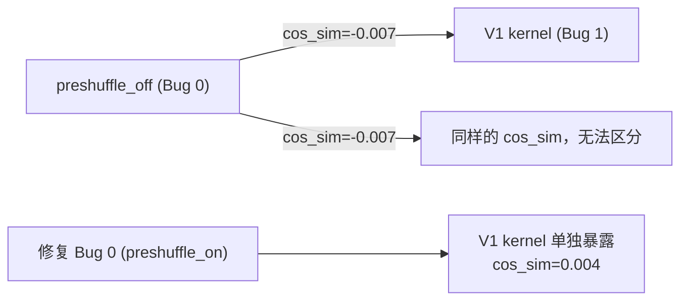

# Debugging Methodology

从 Step-3.5-Flash 系列任务中提炼的调试手段。
每种手段包含：用途、操作步骤、来自哪个任务的实际案例。

---

## 目录

1. [最小复现 + 组件隔离](#1-最小复现--组件隔离)
2. [Canary 实验](#2-canary-实验)
3. [参数 Sweep](#3-参数-sweep)
4. [Cos-sim 层级验证](#4-cos-sim-层级验证)
5. [Bug 掩盖检测](#5-bug-掩盖检测)
6. [Monkey-patch 隔离](#6-monkey-patch-隔离)
7. [对比法：分支差异定位](#7-对比法分支差异定位)
8. [Bisection（逐步开关法）](#8-bisection逐步开关法)
9. [Stale JIT Cache 识别](#9-stale-jit-cache-识别)
10. [op_test vs 生产路径区分](#10-op_test-vs-生产路径区分)

---

## 1. 最小复现 + 组件隔离

**用途**：将复杂系统中的问题定位到单个组件，排除其他变量干扰。

**操作**：
1. 写最小脚本，只调用可疑组件（单层、单 kernel）
2. 用 PyTorch reference 实现作为 ground truth
3. 对比输出（cos_sim / MAE / 直接 assertEqual）

**关键原则**：脚本越小越好，每次只改一个变量。

**案例（MoE Pipeline 修复）**：

```python
# 最小复现：单层 MoE vs PyTorch reference
import torch
from aiter import fused_moe

# aiter MoE 输出
out_aiter = fused_moe(hidden, w1, w2, ...)

# PyTorch reference（逐步计算）
gate, up = hidden @ w1.T.chunk(2, dim=-1)
out_ref  = F.silu(gate) * up @ w2.T

cos_sim = F.cosine_similarity(out_aiter.flatten(), out_ref.flatten(), dim=0)
print(f"cos_sim = {cos_sim:.6f}")  # 期望 > 0.9999
```

发现 cos_sim = -0.017，确认问题在 MoE GEMM 本身，与 attention/sampling 无关。

---

## 2. Canary 实验

**用途**：验证"某内存区域是否被写入"的假说，在断言根因前先用数据排除错误假说。

**适用场景**：怀疑有 OOB 写入、内存越界、buffer 污染时。

**操作**：
1. 在可疑内存区域写入特定 canary 值（如 `0xDEADBEEF` 或 `float('nan')`）
2. 运行被测代码
3. 检查 canary 值是否被覆盖

```python
# Canary 实验模板
CANARY = 0xDEADBEEF
a2 = torch.zeros(T * K + K + 1)  # 额外分配一个元素
a2[T * K + K] = CANARY           # 写入 canary

run_kernel(a2, ...)               # 运行 kernel

# 验证
assert a2[T * K + K].item() == CANARY, "OOB 写入！"
print("canary pristine — OOB 假说排除")
```

**案例（MoE Pipeline 修复）**：

原假说：CK kernel 会向 `a2[T*K+K]` 越界写入（Bug 2/3/4）。
Canary 实验结果：a2[T*K+K] 在 stage1 执行后仍为原始值。

**结论**：CK kernel 在 expert_id=sentinel 时跳过整个 block，不实际写入越界地址。
三处 buffer padding 修复全部不必要，在 `3771835ac` 中 revert。

> **教训**："逻辑上完整"的根因假说必须用 canary 实验验证，不能凭推理直接实施修复。

---

## 3. 参数 Sweep

**用途**：快速定位触发 bug 的边界值，缩小根因搜索范围。

**操作**：
1. 确定可疑参数（inter_dim / ctx_len / block_m 等）
2. 遍历一系列值，记录 PASS/FAIL
3. 从边界值逆推 alignment/dispatch 约束

**案例 A（TP=4/8 支持）—— inter_dim sweep**：

```python
for inter_dim in [64, 128, 160, 192, 256, 320, 384, 512]:
    try:
        run_moe(inter_dim=inter_dim)
        print(f"inter={inter_dim}: PASS")
    except RuntimeError as e:
        print(f"inter={inter_dim}: CRASH — {e}")
```

```
inter=64:  PASS    inter=128: PASS
inter=160: CRASH   inter=192: PASS
inter=256: PASS    inter=320: CRASH
inter=384: PASS    inter=512: PASS
```

边界规律：160 和 320 crash，192 和 384 pass → 推出 align=64（≤192）/ align=128（>192）。

**案例 B（Sliding Window 修复）—— context_length sweep**：

```python
for ctx in [508, 509, 510, 511, 512, 513, 514, 515, 1024]:
    cos = test_sliding_window(ctx_len=ctx)
    print(f"ctx={ctx}: cos_sim={cos:.6f}")
```

```
ctx=511: 0.999998 PASS
ctx=512: 0.998982 FAIL  ← sliding window 生效点（= window_size）
ctx=513: 0.999016 FAIL
```

精确定位：sliding window 生效后（ctx >= window_size=512）开始 FAIL，指向 mask 计算。

---

## 4. Cos-sim 层级验证

**用途**：验证 kernel 计算正确性，与端到端测试解耦。

**原则**：先做层级验证，再做端到端验证。层级 PASS 说明 kernel 正确；端到端异常是其他原因。

**阈值参考（bf16 精度）**：
| cos_sim 范围 | 含义 |
|-------------|------|
| > 0.9999 | 正常（bf16 精度上限） |
| 0.998 ~ 0.999 | 轻微偏差（可接受 or 小 bug） |
| < 0.1 | 严重错误（kernel 计算完全错误） |
| 负值 | 极严重（输出方向反转） |

**案例（SwigluStep Wiring）**：

```python
# 单层精度验证（真实权重，不同激活规模）
for M in [16, 64, 256, 1024]:
    for scale in [0.5, 2.0, 5.0]:
        cos = test_layer(layer_idx=43, M=M, scale=scale)
        print(f"M={M}, scale={scale}: cos_sim={cos:.6f}")
```

```
M=16,  scale=0.5: 0.999989 PASS
M=64,  scale=2.0: 0.999990 PASS
M=1024,scale=5.0: 0.999989 PASS  ← 深度 clamp 场景也正确
```

层级 PASS → kernel 正确。端到端的 BOS-spam 是 bf16 噪声累积，不是 kernel bug。

---

## 5. Bug 掩盖检测

**用途**：当系统有多个 bug 时，识别哪个 bug 掩盖了其他 bug。

**症状**：修复一个 bug 后，出现了另一个之前没见过的 bug。

**操作**：
1. 修复最表层的 bug
2. 用相同实验配置重测
3. 如果出现新的 FAIL，说明之前被掩盖

**案例（MoE Pipeline 修复）**：



preshuffle_off 时，V1 kernel 的错误（cos_sim=-0.007）与 Bug 0 的错误（cos_sim=-0.006）
几乎相同，无法区分。修复 Bug 0 后，V1 的 0.004 才单独出现。

**关键问题**：看到 FAIL 时，问"这个 FAIL 是否会掩盖其他 FAIL？"

---

## 6. Monkey-patch 隔离

**用途**：快速将问题定位到某个可替换组件，不需要读完所有代码。

**操作**：
1. 找到问题组件的调用入口
2. 在运行时替换为已知正确的实现（monkey-patch）
3. 问题消失 → 确认是被替换的组件导致的

**案例（Sliding Window 修复）**：

```python
# 怀疑 pa_decode_gluon Triton kernel 有问题
# monkey-patch：decode 阶段强制走 paged_attention_asm（已知正确）
import aiter.ops.attention as attn_ops
_original = attn_ops.dispatch_backend

def patched_dispatch(q, k, v, ...):
    if is_decode_phase:
        return paged_attention_asm(q, k, v, ...)  # 替换
    return _original(q, k, v, ...)

attn_ops.dispatch_backend = patched_dispatch
```

替换后 "ungi" 消失 → 确认问题在 `pa_decode_gluon` Triton kernel，
与 KV cache 管理、sliding_window 配置无关。

---

## 7. 对比法：分支差异定位

**用途**：当两段相似代码，一个正确一个错误时，通过对比找到差异。

**操作**：
1. 找到正确路径和错误路径
2. 逐行对比两者的代码差异
3. 差异处即为可疑根因

**案例（Sliding Window 修复）**：

```python
# 对比 sliding 分支 vs 非 sliding 分支
if SLIDING_WINDOW > 0:
    lower_bound = sequence_start_idx + query_token_idx[:, None] + 1  # ← 多了 +1
else:
    lower_bound = sequence_start_idx                                  # 正确

# 差异：sliding 分支多了 `query_token_idx[:, None] + 1`
# decode 时 query_token_idx=0，等效多加了 +1 → off-by-one
```

**案例（FP8 推理）**：

```python
# 对比 BF16 dispatch vs FP8 blockscale dispatch
# BF16 (gen_instances.py)：支持 block_m=16/32/64/128
# FP8 blockscale：只支持 block_m=16/32/64
# 差异：少了 128 → L904 的无条件 block_m=128 在 FP8 路径触发 TORCH_CHECK
```

---

## 8. Bisection（逐步开关法）

**用途**：当端到端结果不对，但不确定哪个组件引入了错误时，逐步开关组件找到边界。

**操作**：
1. 列出所有可能的改动/组件
2. 二分法逐步开关，每次测试 PASS/FAIL
3. 找到最小的导致 FAIL 的组件集合

**案例（SwigluStep BOS-spam 调查）**：

| Variant | 开启的 SwigluStep 层 | BOS-spam 频率 |
|---------|---------------------|--------------|
| baseline | 无 | 0/4 |
| layer-44 only | {44} | 1/4 |
| layer-43 only | {43} | 2/4 |
| 两层都开 | {43, 44} | 3/4 |

**结论**：效果叠加，与开启的层数线性相关 → bf16 噪声累积，非单点 logic bug。

---

## 9. Stale JIT Cache 识别

**用途**：排除"旧的编译缓存导致测试结果与代码不对应"的问题。

**症状**：修改了代码/CK submodule，重跑测试结果没有变化，或结果异常错误（cos_sim=0.0）。

**操作**：

```bash
# 必须同时删 .so 和 blob/ 目录（只删一个无效）
# 只删 .so：下次加载时找不到 .so，会重新触发编译，但 gen_instances.py 用 append 模式
#           写 dispatch.hpp/lookup.h，旧内容仍在 blob/ 里 → 编译出的 .so 包含旧逻辑
# 只删 blob/：下次加载时发现 .so 存在，直接 dlopen 旧 .so → 完全不重新编译

rm -f aiter/jit/module_moe_ck2stages_{variant}*.so
rm -rf aiter/jit/build/module_moe_ck2stages_{variant}*
```

**案例（SwigluStep Wiring）**：

首次运行 SwigluStep op_test，cos_sim=0.0（而不是预期的 0.999989）。
检查 .so 时间戳，发现是 Apr 21 的旧文件（当天 CK 代码更新前）。
清除后重编译（58.2s），cos_sim=0.999989 PASS。

---

## 10. op_test vs 生产路径区分

**用途**：避免"op_test 通过 → 生产路径正确"的错误假设。

**关键差异（aiter MoE kernel）**：

| 维度 | op_test 默认 | 生产路径（gfx950） |
|------|-------------|------------------|
| preshuffle | `preshuffle=True`（on） | `preshuffle=False`（off） |
| is_shuffled | True | True（ATOM 在加载时 shuffle） |
| block_m | 128（大 batch） | 64 或 128（依 token 数） |
| quant_type | no-quant（bf16） | per_1x128（FP8）或 no-quant |

**原则**：任何修改后，必须在**生产路径配置**下验证，而不只是 op_test。

**生产路径验证方法**：

```bash
# 方法 1：直接跑端到端推理（最终验证）
cd /tmp && CUDA_VISIBLE_DEVICES=0,1 python -m atom.examples.simple_inference \
  --model stepfun-ai/Step-3.5-Flash --tensor-parallel-size 2 ...

# 方法 2：op_test 指定生产路径参数
python test_moe_2stage.py \
  -q 0 -t 32 -d bf16 \    # bf16, no-quant
  -dim 4096,640 \          # tp=2 inter_dim=640
  -e 288 -k 8 \
  --preshuffle False \     # 生产路径（gfx950 走 preshuffle_off 路径）
  --is_shuffled True       # 权重已在加载时 shuffle（ATOM process_weights_after_loading）
```

---

## 速查表

| 场景 | 首选手段 |
|------|---------|
| 整体输出错误，不知道哪个组件 | Monkey-patch 隔离 → 最小复现 |
| 确认 kernel 是否正确 | Cos-sim 层级验证 |
| 某个假设的根因是否真实 | Canary 实验 |
| 找到触发 bug 的参数范围 | 参数 Sweep |
| 修复后出现新 bug | Bug 掩盖检测 |
| 两段代码一对一错 | 对比法：分支差异 |
| 端到端错但 kernel 层级对 | Bisection（逐步开关） |
| 修改代码后结果无变化 | Stale JIT Cache 清理 |
| op_test PASS 但推理仍错 | op_test vs 生产路径区分 |
