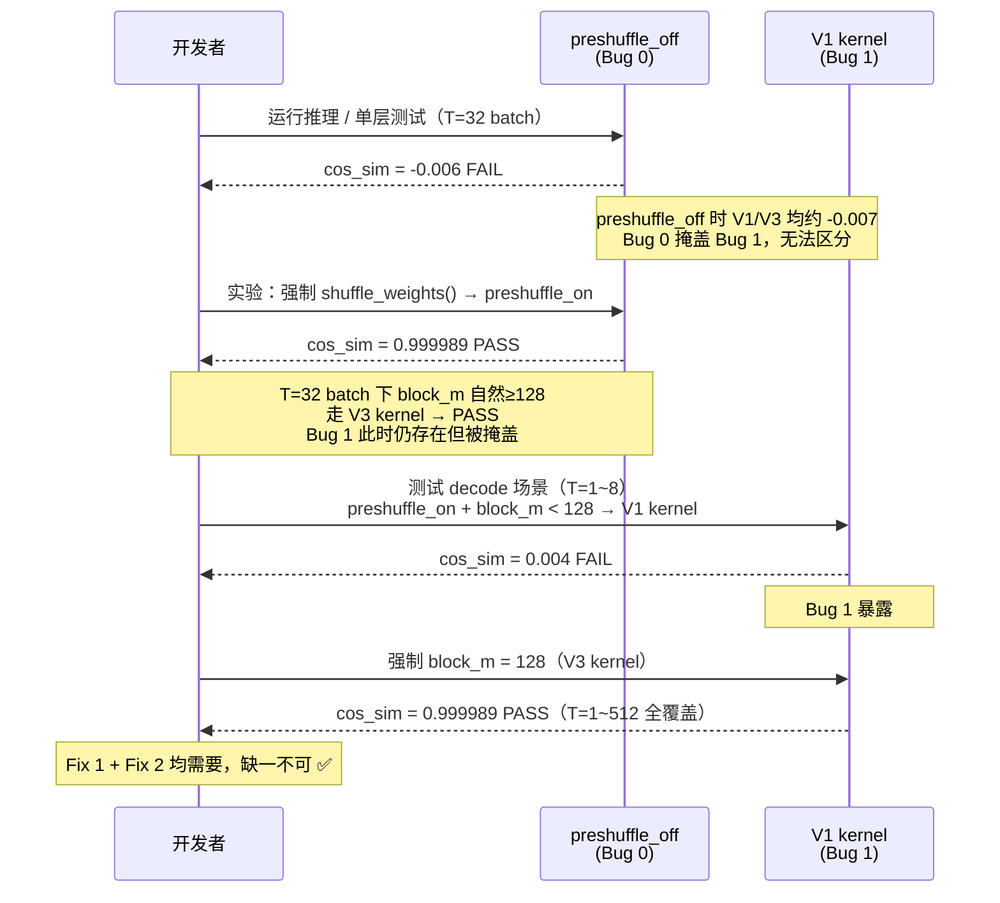

# 子任务 1：MoE Pipeline 修复

**日期**：2026-04-23
**状态**：✅ 完成
**commits**：ATOM `ec8cbe8`，aiter `68fc7d48b` + `3771835ac`

---

## 1. 背景

Step-3.5-Flash 在 gfx950 上首次运行，MoE 层输出完全错误。
单层精度验证（`test_moe_vs_hf.py`）显示 cos_sim ≈ -0.017，正常应为 ~0.9999。

```
症状：推理输出为乱码/重复 token，无法完成正常对话
复现：任意 prompt 均触发，与输入内容无关
```

---

## 2. 调查过程



### 2.1 隔离 MoE 问题

首先写最小复现脚本（`test_moe_vs_hf.py`），对比 aiter MoE 与 PyTorch reference 的单层输出：

```
cos_sim = -0.017  # 完全错误，不是小幅偏差
```

确认问题在 MoE GEMM 计算本身，与 attention 无关。

### 2.2 第一个假说：权重 shuffle

注意到 ATOM `moe.py` 中有一段注释："gfx950 不需要 shuffle"，并有显式的 skip 条件跳过 `shuffle_weights()`。

**实验**：手动强制 shuffle 权重，用 T=32 的 batch 场景重跑：
```
preshuffle_off（未 shuffle）：cos_sim = -0.006  FAIL
preshuffle_on （强制 shuffle）：cos_sim = 0.999989 PASS
配置：E=288, K=8, H=4096, I=1280, T=32
```

→ **Bug 0 确认**：preshuffle_off CK kernel 在 gfx950 上 GEMM 计算错误。

**注意**：这里 preshuffle_on 得到 0.999989 PASS，是因为 **T=32 这个 batch 大小使 `get_block_size_M()` 返回了较大的 block_m（≥128），自然走了 V3 kernel**。这只是特定测试条件下的 PASS，Bug 1（V1 kernel 在 gfx950+inter_dim>192 下的错误）此时被掩盖，尚未暴露。

### 2.3 切换 preshuffle_on 后发现第二个 bug

在 decode 场景（token 数少，如 T=1~8）下测试：`get_block_size_M()` 返回较小的 block_m（16 或 64），V1 kernel 被选中：

```
preshuffle_on + block_m<128（V1 kernel，decode 场景）：cos_sim = 0.004  FAIL
preshuffle_on + block_m=128（V3 kernel）：            cos_sim = 0.999989 PASS
条件：H=2048, I=640（tp=2）, E=288, K=8
```

→ **Bug 1 确认**：V1 CK kernel 在 gfx950 + inter_dim>192 时输出错误。

**关键观察**：
- preshuffle_off 时，V1 和 V3 的 cos_sim 均约为 -0.007（Bug 0 的错误太大，掩盖了 Bug 1 的差异），无法区分两个 bug。
- 修复 Bug 0（切换 preshuffle_on）后，大 batch 测试自然走 V3 → PASS，看似问题解决；但 decode 场景走 V1 → Bug 1 单独暴露。
- **两个 bug 都必须修复才能覆盖全部场景（batch prefill + decode）。**

### 2.4 弯路：buffer padding 假说（后被证伪）

调查过程中提出了 3 个 buffer bug 假说（Bugs 2-4），并在 `68fc7d48b` 中加入了相应的 padding 修复。

后经 canary 实验证伪：

```python
# test_moe_canary.py：在 a2[T*K+K] 写 canary 值，stage1 后检查
canary_value = 0xDEADBEEF
a2[T*K+K] = canary_value
run_stage1(...)
assert a2[T*K+K] == canary_value  # PASS：sentinel 未被覆盖
```

CK kernel 在处理 padding sentinel 时，检查 expert_id 是否为 sentinel 值，若是则跳过整个 block，**不写入越界地址**。
3 处 buffer padding 均为不必要的防御代码，在 `3771835ac` 中全部 revert。

---

## 3. 根因

### Bug 0：preshuffle_off CK kernel GEMM 计算错误（最根本）

**位置**：ATOM `atom/model_ops/moe.py`（原错误 skip 条件）

**根因**：CK `gridwise_moe_gemm.hpp` 在 NSwizzle=0（preshuffle_off）路径下，对权重矩阵内存布局解读有误，GEMM 输出完全错误。gfx950 的 MFMA 指令和 LDS 布局与 gfx942（设计 preshuffle_off 的目标架构）不同。

**ATOM 原代码的错误注释**：
```python
if get_gfx() == "gfx950":
    pass  # 错误注释：gfx950 不需要 shuffle
```

**验证数据**：
```
preshuffle_off：cos_sim = -0.006  FAIL
preshuffle_on ：cos_sim = 0.999989 PASS
配置：E=288, K=8, H=4096, I=1280, bf16, T=32
```

**为何 op_test 未发现**：`test_moe_2stage.py` 默认使用 `preshuffle=True`，始终走 preshuffle_on 路径，未覆盖生产路径（preshuffle_off）。

---

### Bug 1：V1 CK kernel 在 gfx950 + inter_dim > 192 时输出错误

**位置**：aiter `aiter/fused_moe.py` `get_2stage_cfgs()`

**两个条件的关系（重要）**：

`block_m < 128` 和 `inter_dim > 192` 是两个独立的条件，通过"V1 kernel"联系：

```
block_m < 128  ──(dispatch 映射)──→  V1 kernel 被选中（NPerBlock=64）
                                            │
                                     inter_dim > 192 时
                                     N-tile pass 次数 = inter_dim / 64 > 3
                                            │
                                     V1 在 gfx950 上出错
```

- **block_m < 128 → V1 被选中**：`gen_instances.py` 的 dispatch 表将小 block_m（16/32/64）映射到 V1 系列（NPerBlock=64），将 block_m=128/256 映射到 V3 系列（NPerBlock=128）。决定 V1/V3 的是 block_m，不是 inter_dim。
- **V1 + inter_dim > 192 → 出错**：V1 用 NPerBlock=64 去 tile N 维度（N=inter_dim），inter_dim=640 需 640/64=10 次 pass；inter_dim=192 需 192/64=3 次 pass，是边界。V1 在 gfx950 上超过 3 次 N-tile pass 时计算出错（精确 C++ 根因未查）。
- **L904 用 `inter_dim > 192` 触发 workaround**：因为只有在 inter_dim > 192 时，V1 被选中才有害；inter_dim ≤ 192 时（≤3 次 pass）V1 仍然正确，无需干预。

**验证数据**：
```
preshuffle_on + V1（block_m<128，decode 场景）：cos_sim = 0.004   FAIL
preshuffle_on + V3（block_m=128）：             cos_sim = 0.999989 PASS
条件：H=2048, I=640（tp=2 inter_dim）, E=288, K=8

边界实验：
  inter_dim=192 + V1：cos_sim ≈ 0.9999  PASS（192/64=3 次 pass，V1 安全）
  inter_dim=256 + V1：cos_sim ≈ 0.004   FAIL（256/64=4 次 pass，V1 出错）
```

---

## 4. 解决方案

### Fix 1：ATOM moe.py — 始终执行 shuffle_weights()

**文件**：`ATOM/atom/model_ops/moe.py`，`UnquantizedFusedMoEMethod.process_weights_after_loading`

```python
# 修复：删除 gfx950 skip 条件，始终调用 shuffle_weights()
shuffle_weights(layer.w13_weight, layer.w2_weight)
```

权重在模型加载阶段 shuffle（KV cache 分配之前），不额外占用推理期显存。

**注意**：曾尝试运行时 shuffle 方案（`_get_shuffled` 缓存），单层测试通过，但 tp=2 OOM
（临时 buffer ~3GB，GPU 显存已满无法分配）。必须在加载时做。

### Fix 2：aiter fused_moe.py — 强制 block_m=128 走 V3 kernel

**文件**：`aiter/aiter/fused_moe.py`，`get_2stage_cfgs()`，L904

```python
# 修复后：preshuffle_on 和 preshuffle_off 两条路径均强制 block_m=128
if not run_1stage and inter_dim > 192 and get_gfx() == "gfx950":
    block_m = 128
    if not is_shuffled and not kernelName2:
        # preshuffle_off 路径额外指定 stage2 kernel（避免回落到 V1）
        kernelName2 = "moe_ck2stages_gemm2_256x128x128x64_1x4_TypeCast_v3_Nswizzle0_Quant0_MulRoutedWeight1_B16_B16_B16"
```

---

## 5. 验证结果

**单层精度（随机权重）**：
```
cos_sim = 0.999989 ~ 0.999990
覆盖 T ∈ {1, 4, 32, 128, 512}，E=288, K=8, H=4096, I=1280
```

**单层精度（Step-3.5-Flash 真实权重 layer 10）**：
```
cos_sim = 0.999990，inter_dim=640，tp=2
```

**tp=2 端到端推理**：4 prompts，128 max_tokens，全部正常完成，无 OOM/crash。

---

## 6. 教训

| 教训 | 说明 |
|------|------|
| op_test ≠ 生产路径 | op_test 默认 preshuffle_on，生产走 preshuffle_off；两者结果完全不同 |
| 注释不等于根因 | "gfx950 不需要 shuffle" 的注释是错误的，不能信任代码注释 |
| canary 实验优先 | "逻辑完整"的根因假说必须用 canary 实验验证，Bugs 2-4 被 canary 证伪 |
| 加载时 shuffle | 运行时 shuffle 会在 GPU 显存满时 OOM，必须在加载阶段（process_weights_after_loading）做 |
| bug 掩盖 bug | Bug 0 完全掩盖了 Bug 1，单独修 Bug 0 后才能看到 Bug 1 |
