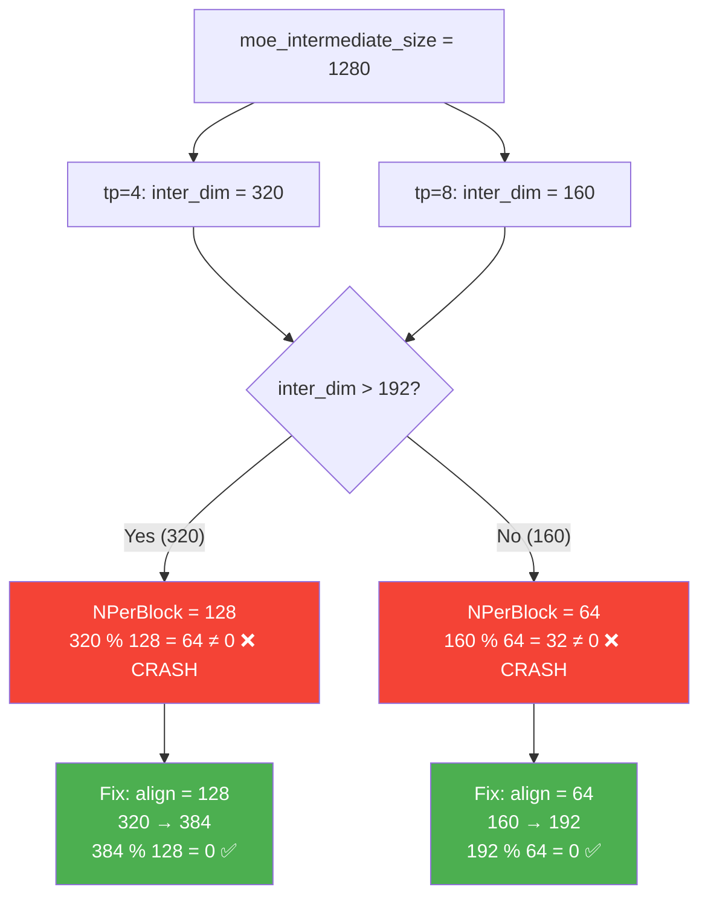

# 子任务 4：TP=4/8 支持

**日期**：2026-04-24
**状态**：tp=4 ✅，tp=8 ⚠️（GPU5 硬件异常）
**commits**：ATOM `635e59e`，aiter `7312ea166`

---

## 1. 背景

tp=2 BF16 推理跑通后，尝试 tp=4 和 tp=8。两者在 warmup 阶段均 crash：

```
RuntimeError: wrong! device_gemm with the specified compilation parameters
does not support this GEMM problem
```

Step-3.5-Flash `moe_intermediate_size=1280`，TP 分割后每卡 `inter_dim = 1280 / TP`：
- tp=4 → inter_dim = 320
- tp=8 → inter_dim = 160

---

## 2. 调查过程

### 2.1 inter_dim sweep 定位边界

写 `inter_sweep.py`，遍历不同 inter_dim 值，观察 crash/pass：

```
inter_dim=64, 128, 192, 256, 384 → PASS
inter_dim=160, 320               → CRASH（GEMM problem not supported）
```

规律：特定值 crash，不是所有小 inter_dim 都 crash。

### 2.2 追溯 kernel 源码

错误信息来自 `device_moe_gemm.hpp L431`：`K % KPerBlock != 0` 直接拒绝执行。

进一步追溯 stage1 的 N 定义：

**文件**：`aiter/csrc/ck_gemm_moe_2stages_codegen/gemm_moe_ck2stages.cu` **L98**

```cpp
int N = w1.size(1) / 2;  // N = inter_dim（半幅度，含 gate+up 的 gate 部分）
```

Stage1 GEMM 实际是：`[M, inter_dim] = A[M, hidden] @ B[hidden, inter_dim]`
- N = inter_dim（不是 2*inter_dim！关键发现）

### 2.3 分析 dispatch 约束

读 `gen_instances.py` L75-121，stage1 NPerBlock 规则：

| block_m | inter_dim 条件 | NPerBlock |
|---------|---------------|-----------|
| 32/64 | 任意 | 64 |
| 128/256 | ≤192 | 64 |
| 128/256 | >192 | 128 |

因此：
- **tp=4（inter=320>192）**：NPerBlock=128，320%128=64≠0 → CRASH
- **tp=8（inter=160≤192）**：NPerBlock=64，160%64=32≠0 → CRASH

### 2.4 方案选择

**方案 A（CK codegen 新实例）**：尝试向 dispatch 表添加 KPerBlock=32 实例，失败：

```
static assertion failed: ck::Sequence<4, 32, 8> vs ck::Sequence<4, 0, 8>
```

bf16 stage2 要求 K0_A≥8，对应 KPerBlock≥64，框架内无法支持 KPerBlock=32。

**方案 B（inter_dim padding，最终选择）**：在加载时将 inter_dim pad 到对齐值，kernel 看到的是 padded 维度。
padding 发生在 `shuffle_weights()` 前，pad 部分填零。w2（down projection）同步 pad，padded 行权重为零，对 stage2 输出贡献为零，无需显式 slice。

对齐约束推导：
- inter≤192：align=64（160→192，192%64=0 ✓）
- inter>192：align=128（320→384，384%128=0，384%64=0 ✓）

### 2.5 发现分布式 bug

tp=4/8 还额外 crash 在 all_gather 路径：

```
AssertionError: ca_comm is not None
```

**位置**：`aiter/dist/parallel_state.py` L492

**根因**：`set_custom_all_reduce(False)` 后 `ca_comm=None`，但 `_all_gather_out_place` 未检查 None。

### 2.6 tp=8 GPU5 硬件异常

代码 bug 修复后，tp=8 仍无法正常推理。隔离实验：

```bash
CUDA_VISIBLE_DEVICES=5 python -c "import torch; torch.zeros(128, device='cuda')"
# 耗时 ~700ms，其他 GPU <1ms
```

GPU5 PCIe/NUMA 配置异常（iommu=pt 缺失），tp=8 时 runner5 初始化需数小时，
导致其他 7 个 rank 在 all_reduce 永久等待。非代码问题，需系统管理员处理。

---

## 3. 根因



### 主要根因：stage1 GEMM N=inter_dim 对齐失败

**误区**：最初以为 `w1.size(1)` 就是 `2*inter_dim`（gate+up），所以 N 应为 `2*inter_dim`。
**事实**：stage1 GEMM 只做 gate 和 up 的联合 projection，N=`w1.size(1)/2`=inter_dim。

stage1 dispatch 的 NPerBlock 与 inter_dim 直接相关，320 和 160 均不满足对齐要求。

### 次要根因：ca_comm None guard 缺失

`_all_gather_out_place` 未处理 ca_comm=None 的情况，tp 多机时触发。

---

## 4. 解决方案

### Fix 1：ATOM moe.py inter_dim padding

**文件**：`ATOM/atom/model_ops/moe.py`，`UnquantizedFusedMoEMethod.process_weights_after_loading`

```python
# 在 shuffle_weights() 前 pad inter_dim
inter_dim = layer.w2_weight.shape[1]
align = 64 if inter_dim <= 192 else 128  # 注意：inter>192 必须用 128！
inter_pad = (inter_dim + align - 1) // align * align  # 160→192, 320→384

if inter_pad != inter_dim:
    # pad w13（gate+up）和 w2（down）
    layer.w13_weight = F.pad(layer.w13_weight, (0, 0, 0, inter_pad - inter_dim))
    layer.w2_weight = F.pad(layer.w2_weight, (0, inter_pad - inter_dim))
    # 更新 layer 的 inter_dim 属性
    layer.intermediate_size_per_partition = inter_pad
```

### Fix 2：aiter dist ca_comm None guard

**文件**：`aiter/aiter/dist/parallel_state.py`

```python
# 修复前
assert ca_comm is not None

# 修复后
if ca_comm is None:
    # fallback 到 NCCL（与 all_gather NCCL 路径一致）
    torch.distributed.all_gather_into_tensor(output, input, group=group)
    return
```

---

## 5. 验证结果

| 配置 | 验证方式 | 结果 |
|------|---------|------|
| tp=4 BF16 | 4 prompts，max_tokens=128 | ✅ 正常完成 |
| tp=4 BF16 | inter_dim padding 精度验证 | cos_sim 与 tp=2 一致 |
| tp=2 回归 | baseline 4 prompts | ✅ 不退化 |
| tp=8 BF16 | kernel 对齐验证（160→192 padding，192%64=0） | ✅ 对齐约束满足（未实测，GPU5 阻塞） |
| tp=8 BF16 | 端到端推理 | ⚠️ GPU5 硬件阻塞，无法完成 |

---

## 6. 教训

| 教训 | 说明 |
|------|------|
| 追到 kernel 源码确认 N 定义 | `w1.size(1)/2` 不是直觉上的 `2*inter_dim`，必须读 .cu 文件 |
| align 值取决于 inter_dim 大小 | inter>192 用 128，inter≤192 用 64；混用导致 bug |
| CK kernel 参数限制不可绕 | KPerBlock=32 bf16 框架不支持，codegen 新实例方案不可行 |
| 代码 bug 和硬件 bug 要区分 | tp=8 的阻塞是硬件问题，不是代码 bug，排查时先隔离 GPU |
| inter_dim sweep 是通用调试手段 | 快速定位边界值，明确哪些 inter_dim PASS/FAIL |
