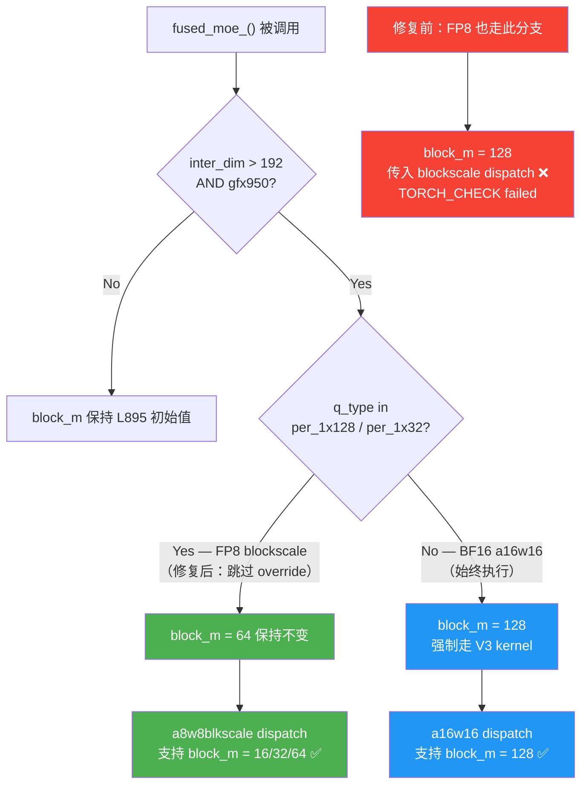

# 子任务 5：FP8 推理支持

**日期**：2026-04-24
**状态**：✅ tp=2 完成
**commits**：aiter `c38d0c9e6`，ATOM `9a67e49`

---

## 1. 背景

**模型**：`stepfun-ai/Step-3.5-Flash-FP8`（FP8 权重量化模型，非 kv_cache_dtype fp8）

量化配置（`quantization_config.json`）：
| 字段 | 值 | 含义 |
|------|----|------|
| `weight_block_size` | [128, 128] | → `QuantType.per_1x128` |
| `activation_scheme` | dynamic | 动态激活量化 |
| `fmt` | e4m3 | float8_e4m3fn |
| `quant_method` | fp8 | 走 `Fp8MoEMethod` |
| `modules_to_not_convert` | 所有 attn + shared expert + layers 0-2 | 前 3 层 dense + attn 不量化 |

MoE routed expert（layers 3-44）全部量化，走 CK `a8w8blkscale` kernel 路径。

---

## 2. 调查过程

### 2.1 代码分析（baseline 前）

读 `aiter/fused_moe.py` L895-910，发现潜在 bug：

**L904**（Bug 1 的 V1 kernel workaround）：
```python
# 原代码（对 BF16 是正确的 workaround）
if not run_1stage and inter_dim > 192 and get_gfx() == "gfx950":
    block_m = 128  # 强制选 V3 kernel
```

**a8w8blkscale dispatch 约束**（读 `gen_instances.py` L340-368 / L747-768）：
- stage1 dispatch：仅支持 block_m = 16/32/64
- stage2 dispatch：仅支持 block_m = 16/32/64
- block_m=128 → `TORCH_CHECK(false, "Unsupported block_m value for moe heuristic dispatch: 128")`

**冲突**：L904 无条件强制 block_m=128，但 blockscale dispatch 不支持此值。

**inter_dim 对齐（tp=2，inter=640）**：
- blockscale stage1 NPerBlock=128，640%128=0 ✓
- blockscale stage2 KPerBlock=128，640%128=0 ✓
- **无需 padding**（与 BF16 tp=4 不同）

### 2.2 baseline 验证

首次运行时模型正常加载，但 MoE forward 触发预期的 block_m 错误。

### 2.3 代码追踪确认调用链

```
Fp8MoEMethod.apply()
  → torch.ops.aiter.rocm_aiter_fused_moe()  [fused_experts=None, tp 路径]
  → fused_moe(quant_type=QuantType.per_1x128, ...)
  → fused_moe_()  [aiter/fused_moe.py]
  → L895: block_m=64 (per_1x128 初始值，token>32 时)
  → L904: 无条件 block_m=128 override → blockscale dispatch crash
```

### 2.4 发现第二个 bug（ATOM moe.py）

读 `ATOM/atom/model_ops/moe.py` `Fp8MoEMethod.get_fused_moe_quant_config`：

```python
# 修复前：block_quant 和 per_tensor 共用 else 分支，block_shape 硬编码 None
else:
    return fp8_w8a8_moe_quant_config(..., block_shape=None)
```

per_1x128 路径应传 `block_shape=[128, 128]`，影响 EP（Expert Parallel）路径。

---

## 3. 根因



### Bug 1（关键）：L904 block_m=128 与 blockscale dispatch 不兼容

**文件**：`aiter/aiter/fused_moe.py` L904

**根因**：L904 的 V1 kernel correctness workaround（代码注释 L900-903 明确说明针对 bf16 a16w16 kernel），
对 blockscale 路径无意义且有害——blockscale 使用完全不同的 kernel，不受 V1 bug 影响，
且其 dispatch 不支持 block_m=128。

```
TORCH_CHECK: Unsupported block_m value for moe heuristic dispatch: 128
```

### Bug 2（次要）：get_fused_moe_quant_config block_shape=None

**文件**：`ATOM/atom/model_ops/moe.py` L1761-1784

**根因**：else 分支覆盖了 per_1x128 和 per_tensor 两种情况，block_quant 路径应传入正确 block_shape。
TP 路径下此 fix 无直接影响，但 EP 路径依赖正确的 block_shape。

---

## 4. 解决方案

### Fix 1：aiter fused_moe.py — 排除 blockscale 路径

**文件**：`aiter/aiter/fused_moe.py` L904-907

```python
# 修复：排除 per_1x128/per_1x32 quant type
if not run_1stage and inter_dim > 192 and get_gfx() == "gfx950" \
        and q_type not in (QuantType.per_1x128, QuantType.per_1x32):
    block_m = 128
```

**回归安全**：BF16（q_type=a16w16）路径条件仍触发，行为不变。
FP8 blockscale 路径跳过 override，block_m 保持 L895 设置的 64。

### Fix 2：ATOM moe.py — 正确传递 block_shape

**文件**：`ATOM/atom/model_ops/moe.py` L1761-1784

```python
# 修复：拆分 else 分支
elif self.quant_type == QuantType.per_1x128:
    block_shape = [128, 128]
elif self.quant_type == QuantType.per_1x32:
    block_shape = [1, 32]
else:
    block_shape = None
return fp8_w8a8_moe_quant_config(..., block_shape=block_shape)
```

---

## 5. 验证结果

**推理命令**：
```bash
rm -rf /root/.cache/atom/* && cd /tmp && CUDA_VISIBLE_DEVICES=0,1 \
  AITER_LOG_LEVEL=WARNING \
  python -m atom.examples.simple_inference \
  --model stepfun-ai/Step-3.5-Flash-FP8 --trust-remote-code \
  --tensor-parallel-size 2 --level 0 --temperature 0 --max-tokens 1000 \
  --max-num-batched-tokens 4096 --max-num-seqs 2048
```

**性能指标**：
| 指标 | 值 |
|------|----|
| TTFT | ~91ms |
| TPOT | ~16ms |
| Kernel 路径 | CK `a8w8blkscale`，block_m=64，per_1x128 |

**输出质量（4 prompts）**：

| Prompt | tokens | 终止原因 | 结果 |
|--------|--------|---------|------|
| introduce yourself | 328 | EOS | ✅ 连贯正确，自我介绍为 Step（StepFun） |
| list all prime numbers within 100 | 480 | EOS | ✅ 正确列出 25 个质数，并自验计数 |
| 1+2+3=? | 60 | EOS | ✅ 正确回答 6 |
| 如何在一个月内增肌10公斤 | 1000 | max_tokens | ✅ 科学分析，中文流畅，在合理处截断 |

FP8 量化对输出质量无明显损失。

**JIT 模块**（已编译）：
```
aiter/jit/module_moe_ck2stages_f8_f8_preshuffle_on_b16_silu_per_1x128_mulWeightStage2.so
aiter/jit/module_moe_ck2stages_f8_f8_preshuffle_on_b16_swiglustep_per_1x128_mulWeightStage2.so
```

---

## 6. 教训

| 教训 | 说明 |
|------|------|
| 读现有 workaround 的作用域 | L904 注释清楚写了针对 bf16 a16w16，应先读注释再判断是否适用 |
| block_m 的 quant-type 依赖性 | blockscale 和 bf16 的 kernel dispatch 完全不同，不能共用同一个 block_m 逻辑 |
| FP8 不需要 inter_dim padding | blockscale KPerBlock=128=inter_dim%128，640%128=0，无需 pad（与 BF16 tp=4 不同） |
| quantization_config.json 先读 | 量化类型决定调用链（block scale vs per-tensor），影响所有后续分析 |
