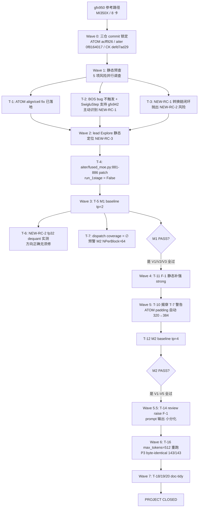
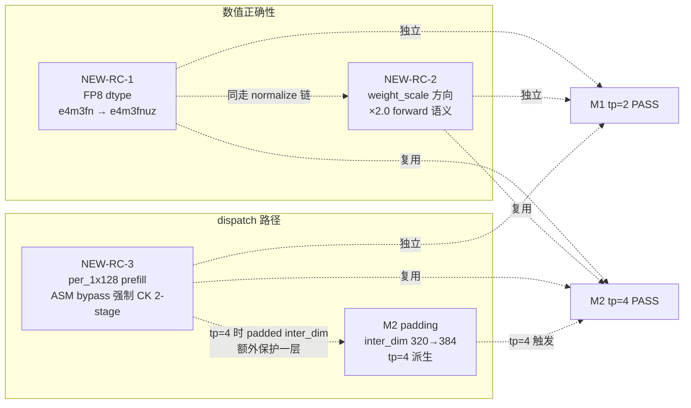
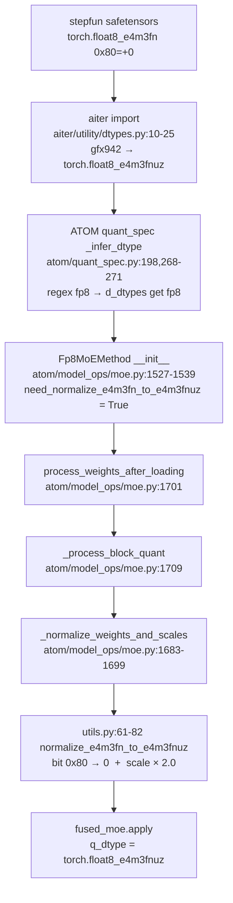
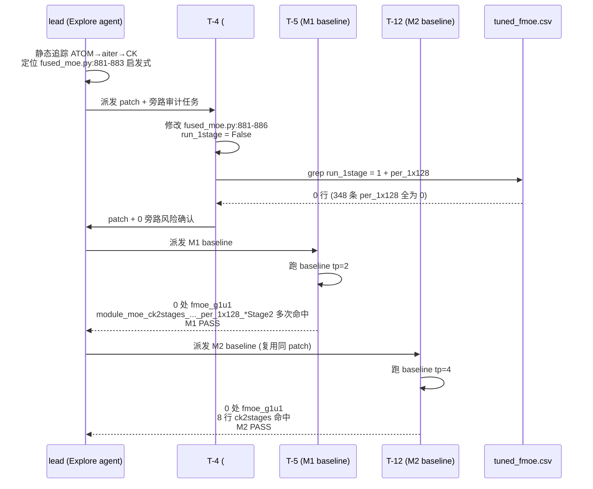

# Step-3.5-Flash-FP8: gfx950 → gfx942(MI308X) 迁移报告

> 项目状态：**PROJECT CLOSED**（M1 tp=2 + M2 tp=4 均 PASS）
> 完成时间：2026-04-28
> 报告生成：2026-04-29（基于 doc_consolidation 整合）
> 源材料：4 份根级主文档 + 18 份 teammate progress（缺 8/15）

---

## 摘要 (TL;DR)

本项目把 `stepfun-ai/Step-3.5-Flash-FP8`（hidden=4096，moe_inter=1280，experts=288，top_k=8）从 gfx950（MI350X）参考路径迁移到 gfx942（MI308X，**8 张卡** —— AMD Instinct UBB 平台标准 8-GPU/节点，本机 `rocm-smi --showid` 实测 GPU[0]-GPU[7]），目标是在 tp=2 和 tp=4 两档 tensor parallel 下端到端推理 PASS（4/4 prompt 输出连贯，无 BOS / 无乱码 / 无 crash）。

迁移过程定位 **3 个独立 root cause**（NEW-RC-1/2/3）+ **1 个 tp=4 派生兼容问题**（M2 inter_dim padding 320→384），最终：

| 项 | 数值 |
|---|---|
| 三仓起点 commit | ATOM `acff926` / aiter `0f8164017` / CK `defd7ad29` |
| 三仓终点 commit | 同上（仅 aiter `fused_moe.py` 单文件 dirty，未推回） |
| 源码改动总行数 | **1 hunk × 3 行**（NEW-RC-3 patch，`aiter/fused_moe.py:881-886`） |
| PASS 验证项 | M1 V1/V2/V3 + M2 V1/V2/V3/V4/V5 |
| byte-identical 闭环 | M1↔M2 P3 prompt 143/143 chars 完全一致 |

核心发现：4 个问题中只有 **1 处真正修源码**（NEW-RC-3 一行 patch）；NEW-RC-1（fp8 dtype）、NEW-RC-2（scale 方向）、M2 padding 都是利用 ATOM/aiter 既有自动机制（normalize 链 / forward 语义 / `_process_block_quant` padding）解决，**无须新增改动**。

引用：`progress/dc-t1.md:32-36`、`progress/dc-t2.md:285-288`

---

## §1 项目背景与目标

### 1.1 起点：gfx950 参考路径

参考指南最初为 gfx950（MI350X，8 张卡）写就。该路径若干"幸福依赖"：

- **BF16 GEMM 256×256 ASM**：`bf16gemm_bf16_tn_256x256` —— gfx950 dispatcher 路由至此 ASM kernel；曾出现"全 BOS"现象需 workaround（`PROJECT_SUMMARY.md:68`）
- **FP8 MoE per_1x128 prefill ASM**：`fmoe_fp8_blockscale_g1u1` —— 带 block shape 参数，gfx950 独有
- **FP8 numeric format**：`e4m3fn`（OCP，bias=7，NaN=0x7f/0xff），是 safetensors 模型权重的原生格式

引用：`progress/dc-t1.md:13-17`

### 1.2 目标硬件：gfx942 (MI308X) 关键差异

| 维度 | gfx950 | gfx942 (本机) | 影响 |
|---|---|---|---|
| 架构 | CDNA3（MI350X）| CDNA3（MI308X，**8 卡**，UBB 平台标准）| 设备表 / cu_num 差异 |
| FP8 numeric format | `e4m3fn` / OCP | **`e4m3fnuz`**（bias=8，NaN=0x80）| mfma 指令族要求；和 safetensors 错位 |
| BF16 GEMM 256×256 ASM | 路由 | **不路由**（dispatcher fallback `hipblaslt`）| BOS bug 在 gfx942 不会触发 |
| FP8 MoE per_1x128 prefill | ASM `fmoe_g1u1`（带 block shape） | `aiter.fmoe_g1u1` 签名**不带** block shape；需走 CK 2-stage | NEW-RC-3 |

引用：`progress/dc-t1.md:111-118`、`TEAM_CONFIG.md:82-84`

### 1.3 PASS 验收标准（M1 / M2 定义）

| 里程碑 | 配置 | 标准 |
|---|---|---|
| **M1**（首要）| tp=2 | 4/4 prompt 输出连贯（无 BOS / 无乱码 / 无 token repetition / 无 ValueError / 无 crash / 无 hang）|
| **M2**（M1 通过后）| tp=4 | 同上 |

不要求性能数值；不跑 BF16 模型对照。

引用：`progress/dc-t1.md:21-24`、`TEAM_CONFIG.md:21-26,132-149`

### 1.4 整体策略（串行升级 tp=2 → tp=4）

- **Wave 0**（接手）：lead 完成 ATOM/aiter clone、aiter editable install、HF 模型下载、commit checkout
- **Wave 1**（静态预查）：3 名并行 teammate 调查 5 项静态风险（BOS bug / SwigluStep arch / ATOM align fix / ceil 整除 fix / fp8 numeric type），主动识别 NEW-RC-1
- **Wave 2**（NEW-RC-3 patch）：lead Explore agent 静态定位 → T-4 应用单 hunk patch
- **Wave 3**（M1 baseline + 静态预研 NEW-RC-2 / dispatch coverage）→ M1 PASS
- **Wave 4-5**（reviewer + F-1 静态补强 + M2 padding 验证 + M2 baseline）→ M2 PASS
- **Wave 6**（量化补强 + 文档同步）→ byte-identical 闭环
- **Wave 7**（doc-tidy）→ PROJECT CLOSED

引用：`progress/dc-t2.md:10-21`

---

## §2 总体迁移流程图

> **图 #1**：从 gfx950 起点到双里程碑 PASS 的全流程



引用：`progress/dc-t2.md:10-21,231-248`、`SESSION_HANDOFF.md:3-4,347`

---

## §3 三大 root cause 关系图

> **图 #2**：NEW-RC-1 / NEW-RC-2 / NEW-RC-3 / M2 padding 四者的独立性、触发依赖与共同决定 PASS 的关系



要点：
- **NEW-RC-1 与 NEW-RC-2 同走 ATOM normalize 链**（`utils.py:61-82`），但 root cause 不同（dtype 映射 vs scale 方向理解）
- **NEW-RC-3 与 M2 padding 在 tp=4 上有协同**：tp=4 时 inter_dim 被 padding 推到 384（不被 256 整除），即使 NEW-RC-3 patch 失效，旧 heuristic `inter_dim % 256 == 0` 也不会再走 ASM
- 四者**问题层面独立**（独立提出、独立闭环），但**机制层面有共享链路**（NEW-RC-1/2 共享 normalize_e4m3fn_to_e4m3fnuz 链，NEW-RC-3 与 M2 padding 在 tp=4 协同保护 dispatch 路径），共同保证 M1/M2 PASS

引用：`progress/dc-t1.md:222`、`progress/dc-t2.md:285-287`、`PROJECT_SUMMARY.md:198`

---

## §4 详解：NEW-RC-1（FP8 dtype：e4m3fn → e4m3fnuz）

### 4.1 症状

stepfun safetensors 的 fp8 权重以 OCP `e4m3fn`（bias=7，NaN=0x7f/0xff）存储；gfx942 mfma 指令族要求 `e4m3fnuz`（bias=8，NaN=0x80）。若不做 dtype + bit pattern 转换：

- 数值上差 factor 2（bias 偏移导致 exponent 偏 1）
- NaN 解释错位（fn 中 `0x80` 是 +0，fnuz 中是 NaN）

直引：
> "safetensors 是 e4m3fn，gfx942 要 fnuz" — `SESSION_HANDOFF.md:239`
> "gfx942 mfma 要 fnuz" — `PROJECT_SUMMARY.md:222`

引用：`progress/dc-t1.md:44-47`

### 4.2 调查（按时序）

| 时序 | teammate | 动作 | 关键发现 |
|---|---|---|---|
| Wave 1 | T-2（顺手识别）| 审 `csrc/include/opus/opus.hpp:932` 时发现 fp8 numeric_limits 用 `#if defined(__gfx942__)` 给出不同 `bin_max/bin_lowest/bin_qnan`，注释明示 gfx950=OCP / gfx942=fnuz | NEW-RC-1 候选立项 |
| Wave 1 | T-3（接 #A05）| 4 维度静态调查：模型权重 / aiter 类型映射 / ATOM 转换路径 / 触发完整性 | 转换链 4 段全部就位，无须新增改动 |

T-3 的 4 条独立证据：

1. **模型侧**：`safetensors.safe_open` 实测 `model.layers.3.moe.{down,gate,up}_proj.weight` dtype 全为 `torch.float8_e4m3fn`（OCP）
2. **aiter 侧**：`/workspace/aiter/aiter/utility/dtypes.py:10-25` 在 import 时按 GPU arch 静态绑定：
   ```python
   defaultDtypes = {"gfx942": {"fp8": torch.float8_e4m3fnuz}, "gfx950": {"fp8": torch.float8_e4m3fn}}
   ```
3. **ATOM 侧**：`atom/quant_spec.py:211-243` `_infer_dtype` regex 回退路径返回 `d_dtypes.get("fp8")` → gfx942 上即 `torch.float8_e4m3fnuz`
4. **触发完整性**：`Fp8MoEMethod.__init__`（`atom/model_ops/moe.py:1527-1539`）置位 `need_normalize_e4m3fn_to_e4m3fnuz = (self.quant_dtype == torch.float8_e4m3fnuz)`

引用：`progress/dc-t2.md:34-42`

### 4.3 Root cause 与机制

stepfun 模型在磁盘上是 OCP fp8（gfx950 直用），gfx942 上 ATOM 的 `quant_dtype` 已被 aiter 静态映射成 fnuz，差异 = (bias 偏移 1) × (NaN 编码不同)。修复需在 weight 加载阶段做 **bit pattern 重写 + scale 翻倍补偿**。

代码位置：

- `aiter/utility/dtypes.py:10-25`（aiter 既有，arch 静态映射）
- `atom/quant_spec.py:198,268-271`（regex 回退触发）
- `atom/model_ops/moe.py:1531,1537-1539`（need_normalize 置位）
- `atom/model_ops/utils.py:61-82`（实际重写：0x80→0 + scale ×2.0）

引用：`progress/dc-t1.md:48-55`、`progress/dc-t2.md:39-48`

### 4.4 修复链路

> **图 #3**：safetensors 原始权重到 fused_moe 看到 fnuz 的完整转换链路



引用：`progress/dc-t1.md:48-55`、`progress/dc-t2.md:44-48`

### 4.5 验证证据

| 类型 | 证据 | 强度 |
|---|---|---|
| 静态（T-11）| `atom/model_ops/moe.py:2150-2170` if 链证明 fp8 path **必且仅**走 `Fp8MoEMethod`（`compressed-tensors` 分支被本模型 config `quant_method: "fp8"` 排除）；三个 `_process_*` 分支无条件调 `_normalize_weights_and_scales` | strong |
| 动态间接（M1）| baseline log 中 fused_moe 调用签名 `q_dtype_a / q_dtype_w == 'torch.float8_e4m3fnuz'` 多处命中（`progress/teammate-5.md:90-95`）| strong |
| 动态间接（M2）| `grep fnuz` baseline log → **40 matches**（`progress/teammate-12.md:84-92`、`FINAL_REPORT.md:47`）| strong |
| 反证 | 若 normalize 未发生，e4m3fn bits 当 fnuz 解释会差 2× / NaN 错位，M1+M2 PASS 输出连贯互斥这种失败模式 | strong |

引用：`progress/dc-t2.md:50-54`

---

## §5 详解：NEW-RC-2（weight_scale 方向）

### 5.1 症状：命名陷阱

stepfun safetensors 字段名为 `weight_scale_inv`，字面像 inverse scale（即 `1/forward_scale`）；ATOM `atom/model_ops/utils.py:79` 做 `weight_scale = weight_scale * 2.0`，假设 forward 语义。

如果"inv"真是 inverse、且 dequant 公式应取倒数，那 `* 2.0` 应改 `/ 2.0`，否则数值偏 4×（一来一去），输出乱码。这是 T-3 在 Wave 1 末尾抛出的"未验证假设"。

引用：`progress/dc-t2.md:62-63`

### 5.2 调查（T-6 四条独立证据链）

T-6（Wave 3 静态）从权重数值 + 上下游代码两个独立侧推断方向：

1. **代码上下文**：读 `ATOM/atom/model_ops/utils.py:61-82` 的实际公式
2. **loader rename 链**：`ATOM/atom/model_loader/loader.py:320-321` 直接把 `weight_scale_inv` 重命名为 `weight_scale`，**不做 1/x**；ATOM 全程不取 scale 倒数
3. **下游 dequant 公式**：`/workspace/aiter/aiter/ops/triton/moe/quant_moe.py:220-240` `dequant_w_blockscale` 写明 `w = w * scales`（forward 语义）
4. **safetensors 数值实测 + 本地 fp32 dequant**

引用：`progress/dc-t2.md:67-71`、`progress/dc-t1.md:66`

### 5.3 Root cause 实际表述

并非"修复"，而是反证 utils.py:79 方向**正确**：

stepfun 的 `weight_scale_inv` 字面命名沿袭 DeepSeek-V3 习惯——"inv" 指 `1/amax` 的缩放因子（量化时的乘子），而不是 dequant 时再做 1/x。其数值上**就是 forward scale**。

引用：`FINAL_REPORT.md:84`、`progress/dc-t1.md:60-64`

### 5.4 修复结论：无须改动

| 项 | 决定 |
|---|---|
| `atom/model_ops/utils.py:79` `weight_scale * 2.0` | 保持现状，方向正确 |
| `atom/model_loader/loader.py:320-321` rename | 保持现状，仅字符串 rename，不取 1/x |

引用：`progress/dc-t1.md:64`、`progress/dc-t2.md:81-82`

### 5.5 验证证据：fp32 dequant 实测 7 数量级差距

T-6 在层 3 expert 0 的第一个 (128, 128) block 上，按两种方向各算一遍 fp32 dequant：

> **表**：forward (`w * scale`) vs inverse (`w / scale`) absmax / mean 对比

| 解释方向 | block absmax | block mean(\|.\|) | 是否符合 bf16 LLM 范围 |
|---|---|---|---|
| **Forward (w × scale)** | **0.0933** | 0.0181 | ✓ 0.05–0.5 区间正常 |
| Inverse (w ÷ scale) | 2.15 × 10⁶ | 4.17 × 10⁵ | ✗ 爆炸 7 个数量级 |

7 个数量级的差距不可能误判 → forward 语义铁证。

辅助证据：M1 + M2 PASS 反证（若方向反，4 个 prompt 必然乱码）。

引用：`progress/dc-t2.md:74-87`、`progress/dc-t1.md:66-68`、`FINAL_REPORT.md:91-95`

---

## §6 详解：NEW-RC-3（per_1x128 prefill ASM bypass）

### 6.1 症状

`aiter/fused_moe.py:881-883` 门控逻辑：

```python
if q_type == QuantType.per_1x128:
    # for fp8 blockscale, ck has better performance so disable assembly kernel
    run_1stage = token > 32 and (inter_dim % 256 == 0)
```

注释明说 "ck has better performance so disable assembly kernel"，但代码并未真禁用——M1 (tp=2) 时 inter_dim=1280 满足 `inter_dim % 256 == 0`，prefill (token > 32) 让 `run_1stage=True`，dispatch 表把 `(Silu, per_1x128, bf16, fp8, fp8, isG1U1=True, doweight_stage1=False)` 路由到 ASM `aiter.fmoe_g1u1`。该 kernel 签名 `(fc1_scale, fc2_scale)` **不带 block shape 参数**，gfx942 上数值会错。

注释与代码的"明说要禁用却没禁用"高度吻合 = 异常信号。

引用：`progress/dc-t2.md:94-102`、`progress/dc-t1.md:72-75`

### 6.2 调查

- **lead Explore agent**（Wave 2，无 progress）：通过 ATOM → aiter → CK 调用链静态追踪到该门控
- **T-4（#C02）旁路审计**：grep `run_1stage` 全部赋值/读位置（fused_moe.py 行 312/624/871/883/885/887/889/906/913/922/932/...）
  - 关键风险点 L932：`run_1stage = cfg.get("run_1stage", False)`（tuned-config 路径会绕过启发式）
  - 检查 `aiter/configs/tuned_fmoe.csv`：`awk '$11 == "QuantType.per_1x128" && $22 == "1"'` → **0 行**（348 条 per_1x128 行 `run_1stage` 列全为 0）

引用：`progress/dc-t2.md:104-108`

### 6.3 Root cause（机制）

`aiter/fused_moe.py:881-883` 的启发式 `run_1stage = token > 32 and (inter_dim % 256 == 0)` 与 dispatch 表交互，把 per_1x128 prefill 错误路由到非 blockscale 的 ASM kernel。

**触发矩阵**：tp=2 / tp=8 等"对齐良好"的 inter_dim 反而中招；tp=4 因 padded inter=384 不被 256 整除，即使没 patch 也安全（这反过来解释了为何 M1 tp=2 才是首要爆点）。

引用：`PROJECT_SUMMARY.md:198,224`、`progress/dc-t1.md:73-75`

### 6.4 修复（单 hunk patch）

T-4 应用以下 patch：

```diff
--- a/aiter/fused_moe.py
+++ b/aiter/fused_moe.py
@@ -880,7 +880,10 @@
             if q_type == QuantType.per_1x128:
                 # for fp8 blockscale, ck has better performance so disable assembly kernel
-                run_1stage = token > 32 and (inter_dim % 256 == 0)
+                # NEW-RC-3 patch (2026-04-28): force CK blockscale path on gfx942 to avoid
+                # routing per_1x128 prefill to ASM fmoe_g1u1 which lacks block shape param
+                # original: run_1stage = token > 32 and (inter_dim % 256 == 0)
+                run_1stage = False
```

grep 验证：`grep -n "NEW-RC-3" /workspace/aiter/aiter/fused_moe.py` → 1 行（L883）。

引用：`progress/dc-t2.md:114-128`、`PROJECT_SUMMARY.md:117-132`

### 6.5 修复时序图

> **图 #4**：lead → T-4 → T-5 → T-12 四个 actor 的修复闭环时序



引用：`progress/dc-t2.md:131-133,236-237,243`

### 6.6 验证证据

| 来源 | 证据 |
|---|---|
| M1（T-5）| `grep aiter\.fmoe_g1u1` → **0 matches**；`grep module_moe_ck2stages_f8.*per_1x128` 多次命中；log L80 `[aiter] run_1stage = False, ksplit = 0 q_type = QuantType.per_1x128 block_m = 64` |
| M2（T-12）| `grep module_moe_ck2stages_f8.*per_1x128` 8 行命中；`grep fmoe_g1u1` → **0 matches**；多处 `run_1stage = False` |
| 静态覆盖（T-7）| M1 inter=640 + per_1x128 + 强制 2-stage CK 后，prefill (block_m=64) / decode (block_m=16) 共 4 类 (gemm, case) 调用全部命中 `a8w8_gemm{1,2}_blockscale_kernels_list` → 差集 = ∅ |
| csv 旁路审计 | `tuned_fmoe.csv` per_1x128 行 348 条 `run_1stage` 列全为 0 → patch 100% 生效 |

引用：`progress/dc-t2.md:131-133`、`progress/dc-t1.md:77-80`、`FINAL_REPORT.md:28,46,125`

---

## §7 M2 tp=4 派生问题：inter_dim 320→384 padding

### 7.1 触发场景

tp=4 时 `intermediate_size_per_partition = 1280 / 4 = 320`，320 % 128 = 64 ≠ 0；走 NPerBlock=64 stage2 路径。但 `a8w8_gemm2_blockscale_kernels_list` 缺该 instance（fp8 mfma KPack=32 限制使 KPerBlock 必须 ≥128，与 K=320 不整除冲突）。

T-7 在 Wave 3 末尾的 §5.4「M2 (tp=4) 前瞻」中作为副产物预警。

引用：`progress/dc-t2.md:140-144`、`progress/dc-t1.md:88-90`

### 7.2 自动救急

T-10 在 Wave 5 接 Phase 4 风险深度验证时挖到 ATOM 既有的 `_process_block_quant` padding 机制：

| 层 | 文件 / 函数 | 计算 | tp=4 实际值 |
|---|---|---|---|
| 模型原始 | `config.json moe_intermediate_size` | — | 1280 |
| TP 切分 | `intermediate_size_per_partition = 1280 / tp_size` | tp=4 | **320** |
| `Fp8MoEMethod.create_weights` | `moe.py:1541-1614` | unpadded buffer | 320 |
| **`_process_block_quant`** | **`moe.py:1709-1746`** | `align = block_n = 128`；`inter_pad = ceil(320/128)*128 = 384`；zero-pad w13/w2 | **384** |
| `fused_moe` heuristic | `inter_dim = w2.shape[-1]` | dispatch 看到 384 | **384** |

ATOM 开发者在 `moe.py:1715-1727` 留下注释：

> "Bug fix: previously used align=64 for inter<=192 (copied from BF16 path), but 192%128=64!=0 → stage2 kernel dispatch fails. Correct: always align to block_n. tp=8 inter=160 → 256; tp=4 inter=320 → 384."

T-13 §1.3 强调 **TP 切分发生在 padding 之前**（buffer 用 320 分配，padding 在 `process_weights_after_loading` 阶段执行），这是 T-7 漏看的关键点。

引用：`progress/dc-t2.md:147-160`、`progress/dc-t1.md:94-96`

### 7.3 padding 链路

> **图 #5**：从 config.json 到 fused_moe 看到 384 的完整数据流

```mermaid
flowchart TD
  A[config.json<br/>moe_intermediate_size = 1280] --> B[TP 切分<br/>intermediate_size_per_partition = 1280 / tp_size]
  B -->|tp=4| C[per-partition inter = 320]
  C --> D[Fp8MoEMethod.create_weights<br/>moe.py:1541-1614<br/>unpadded buffer = 320]
  D --> E[loader 加载 fp8 ckpt 到 buffer]
  E --> F[process_weights_after_loading<br/>moe.py:1701]
  F --> G[_process_block_quant<br/>moe.py:1709-1746<br/>align = block_n = 128<br/>inter_pad = ceil 320/128 *128 = 384]
  G --> H[zero-pad w13 / w2 到 inter=384]
  H --> I[shuffle_weights]
  I --> J[fused_moe.apply<br/>w2.shape[-1] = 384<br/>inter_dim 看到 384]
  J --> K[NPerBlock=128 主路径<br/>K=384%128=0]
  K --> L[CK stage2 IsSupportedArgument = true<br/>无 throw]
```

引用：`progress/dc-t2.md:147-160,259-260`

### 7.4 验证证据

| 类型 | 证据 |
|---|---|
| 静态（T-13）| 唯一入口论证强度 strong（`progress/teammate-13.md:62-71`）|
| 动态（T-12）| **V4（间接 strong，T-14 F-3 修正；FINAL_REPORT.md:49 原标"决定性间接证据"）**：fused_moe 调用签名第 4 位参数（inter_dim）= **384**（不是 320），多行同形式：`[aiter] [fused_moe] using 2stage default for (80, 4096, 4096, 384, 289, 9, 'ActivationType.Silu', ..., 'QuantType.per_1x128', True, False)` |
| **V5** 反证 | 若 padding 未触发，K=320%128=64≠0 应触发 CK `IsSupportedArgument false` → 抛 `"wrong! device_gemm with the specified compilation parameters does not support this GEMM problem"`，实测 0 matches |
| 强度修正（T-14 F-3）| V4 措辞从"决定性"改为"实测 inter_dim=384 直接事实 + padding 来源 strong 推论 = 整体间接 strong"；fused_moe 本身不打 `_process_block_quant called` 日志，无法直接观测 padding 函数被调用 |

引用：`progress/dc-t2.md:166-173`、`progress/dc-t1.md:99-104`、`PROJECT_SUMMARY.md:252`

---

## §8 dispatch 路径对比（gfx950 vs gfx942）

> **表**：各关键 op 在两种 arch 上的路由差异

| 维度 | gfx950 路径 | gfx942 路径（本项目实测） | 来源 |
|---|---|---|---|
| FP8 numeric format | `e4m3fn`（OCP）| **`e4m3fnuz`**（NaN=0x80）— aiter dtypes.py 静态映射 + ATOM normalize | `PROJECT_SUMMARY.md:66`、`FINAL_REPORT.md:219` |
| BF16 GEMM 256x256 | ASM `bf16gemm_bf16_tn_256x256` | **不路由**（dispatcher fallback `default_config["libtype"] = "hipblaslt"` at `aiter/tuned_gemm.py:162`）| `PROJECT_SUMMARY.md:67-68,152` |
| FP8 MoE per_1x128 prefill | ASM `fmoe_fp8_blockscale_g1u1`（带 block shape） | **CK 2-stage blockscale**（`module_moe_ck2stages_f8_f8_preshuffle_on_b16_{silu\|swiglustep}_per_1x128_mulWeightStage2`），由 NEW-RC-3 patch 强制 | `FINAL_REPORT.md:62-66`、`PROJECT_SUMMARY.md:69` |
| 实测路径优于预期 | — | gfx942 上 per_1x128 既不走 ASM 也不走 hipblaslt fp8 fallback；T-9 F-4 + T-11 已澄清这是合理结果 | `FINAL_REPORT.md:66`、`SESSION_HANDOFF.md:204` |
| stage2 NPerBlock 选择 | — | 因 ATOM padding inter→384，K=384%128=0，走 NPerBlock=128 主路径，不触 NPerBlock=64 stage2 缺失 | `FINAL_REPORT.md:74,80` |
| block_m heuristic | — | 强制 2-stage 后 block_m=64 / 16，M1 inter=640 + M2 inter=384 实测 0 dispatch miss | `SESSION_HANDOFF.md:242`、`PROJECT_SUMMARY.md:225` |
| CK SwigluStep | — | gfx942 编译路径有效（无 arch guard） | `PROJECT_SUMMARY.md:158-166` |

引用：`progress/dc-t1.md:108-118`

---

## §9 三仓改动 summary

### 9.1 ATOM（commit `acff926`，唯一 dirty 已闭环）

| 文件 | 变更 | 为什么 | 来源 |
|---|---|---|---|
| `atom/model_ops/moe.py:1709-1746`（`_process_block_quant`）| `align = block_n=128`，`inter_pad = ceil(inter_dim/128)*128` | M2 tp=4 inter_dim 320→384 padding，规避 NPerBlock=64 stage2 缺失 | `FINAL_REPORT.md:72-76,214` |
| `atom/model_ops/moe.py:2310-2312`（`_load_w13`）/ `:2352-2354`（`_load_w2`）| ceil 整除 `(x + tp_size - 1) // tp_size` | FP8 scale 加载，确保最后 partial scale block 被包括 | `PROJECT_SUMMARY.md:181-182` |
| `atom/model_ops/moe.py:1531,1537-1539` | `need_normalize_e4m3fn_to_e4m3fnuz=True` 由 quant_spec 回退路径触发 | NEW-RC-1 自动 normalize 链路 | `PROJECT_SUMMARY.md:191` |
| `atom/model_ops/utils.py:61-82`（含 `:79` `weight_scale * 2.0`） | 0x80→0 + scale ×2.0 补偿 | NEW-RC-1 + NEW-RC-2 数值补偿（方向正确）| `PROJECT_SUMMARY.md:192`、`FINAL_REPORT.md:88` |
| `atom/quant_spec.py:198,268-271` | regex 回退返回 `d_dtypes["fp8"]` | 触发 normalize 路径 | `PROJECT_SUMMARY.md:191` |
| `atom/model_loader/loader.py:320-321` | `weight_scale_inv → weight_scale` 仅 rename，不取 1/x | NEW-RC-2 命名陷阱处理（forward 语义）| `FINAL_REPORT.md:87` |

### 9.2 aiter（commit `0f8164017`，含 NEW-RC-3 patch — 唯一 dirty 文件）

| 文件 | 变更 | 为什么 | 来源 |
|---|---|---|---|
| `aiter/fused_moe.py:881-886` | `run_1stage = False`（强制覆盖原 heuristic） | NEW-RC-3：阻止 per_1x128 prefill 路由 ASM `fmoe_g1u1` | `SESSION_HANDOFF.md:151-167`、`PROJECT_SUMMARY.md:115-138`、`FINAL_REPORT.md:218` |
| `aiter/utility/dtypes.py:10-25` | gfx942 → `torch.float8_e4m3fnuz` 静态映射 | NEW-RC-1 dtype 锁定（import 时生效）| `PROJECT_SUMMARY.md:190`、`FINAL_REPORT.md:219` |
| `aiter/ops/triton/moe/quant_moe.py:238` | `w = w * scales`（仅引用，未改）| 确认 dequant 是 forward 语义（NEW-RC-2 旁证）| `FINAL_REPORT.md:220` |
| `aiter/configs/tuned_fmoe.csv` | per_1x128 行 348 条 `run_1stage` 列全为 0（仅检查未改）| 确认 NEW-RC-3 patch 不被 csv 旁路 | `PROJECT_SUMMARY.md:138`、`FINAL_REPORT.md:222` |
| `aiter/configs/model_configs/glm5_bf16_tuned_gemm.csv` | 已删 `bf16gemm_bf16_tn_256x256`（commit a2883ab37）| gfx950 ASM 移除，gfx942 dispatcher 不路由 | `PROJECT_SUMMARY.md:152,298` |

### 9.3 CK（commit `defd7ad29`，submodule 分支 `swiglustep_and_mul`）

| 文件 | 变更 | 为什么 | 来源 |
|---|---|---|---|
| `include/ck/tensor_operation/gpu/grid/gridwise_moe_gemm.hpp` | 4 段 `swiglustep_and_mul` branch 插入（hardcoded 7.0f clamp）| gfx942 走 CK 2-stage SwigluStep 路径需要的 activation 实现；无 arch guard，gfx942 编译有效 | `PROJECT_SUMMARY.md:107,162`、`FINAL_REPORT.md:224` |
| `include/ck/tensor_operation/gpu/device/impl/device_moe_gemm_blockscale.hpp:425-473` | `IsSupportedArgument` 检查（仅引用，未改）| M2 实测 0 throw（V5 闭环）| `FINAL_REPORT.md:225` |

引用：`progress/dc-t1.md:124-150`

---

## §10 PASS 验证证据链

### 10.1 M1 PASS（V1/V2/V3）

| 项 | 值 | 来源 |
|---|---|---|
| 判定 | **PASS** | `FINAL_REPORT.md:19` → `progress/teammate-5.md:189-191` |
| 4/4 prompt 输出连贯 | ✓（中英文均 OK，无乱码 / 无 BPE 异常 / 无 token repetition）| `FINAL_REPORT.md:20` |
| 原始 log | `docs/baseline_tp2_result.md` | `FINAL_REPORT.md:21` |
| TTFT / TPOT | 36.32s（含 JIT）/ 0.018 s/token | `FINAL_REPORT.md:23-24` |
| weight load / warmup / cudagraph | 52s / 301s / 188.9s | `FINAL_REPORT.md:25-27` |
| **V1**：NEW-RC-3 patch 生效（per_1x128 走 CK 2-stage） | ≥10 行命中 + 0 处 `fmoe_g1u1` | `FINAL_REPORT.md:28` |
| **V2**：fnuz 转换发生 | fused_moe `q_dtype=torch.float8_e4m3fnuz`，T-11 static trace strong | `FINAL_REPORT.md:29` |
| **V3**：dispatch 路径命中 0 miss | 130 行 dispatch 日志 + 0 `no instance found` | `FINAL_REPORT.md:30` |

### 10.2 M2 PASS（V1-V5）

| 项 | 值 | 来源 |
|---|---|---|
| 判定 | **PASS** | `FINAL_REPORT.md:36` → `progress/teammate-12.md:217-219` |
| 4/4 prompt 输出连贯 | ✓ | `FINAL_REPORT.md:37` |
| 原始 log | `docs/baseline_tp4_result.md` | `FINAL_REPORT.md:38` |
| JIT 增量编译 | 0s（全部复用 M1 cache）；TTFT −99% | `FINAL_REPORT.md:40,45` |
| **V1**：NEW-RC-3 patch 生效 | 8 行命中，0 `fmoe_g1u1` | `FINAL_REPORT.md:46` |
| **V2**：fnuz 转换 | `fnuz` 40 matches | `FINAL_REPORT.md:47` |
| **V3**：dispatch 命中 0 miss | 40+ hit / 0 miss | `FINAL_REPORT.md:48` |
| **V4**：ATOM padding 触发 inter_dim 320→384 | ✓✓（间接 strong：dispatch 签名第 4 位参数 = 384 而不是 320；FINAL_REPORT.md:49 原标"决定性"，按 T-14 F-3 修正）| `FINAL_REPORT.md:49` |
| **V5**：stage2 走 NPerBlock=128 主路径 | K=384%128=0，无 IsSupportedArgument throw | `FINAL_REPORT.md:50` |

### 10.3 byte-identical 量化闭环（T-16）

> **表**：M1 vs M2 各 prompt 对照（max_tokens=512 重跑）

| Prompt | M1 输出 | M2 输出 | 一致性 |
|---|---|---|---|
| **P3（1+2+3=?）** | 143 chars 完整推理 | 143 chars 完整推理 | **byte-for-byte 完全一致 143/143** |
| P2（list primes）| 25 个 prime 完整列表 | 25 个 prime 完整列表 | 内容完全正确，无错漏 |
| P1（self-id）| "Step, large language model developed by StepFun" | 同 | 完全一致 |
| P4（10kg 增肌）| 核心论点：10kg 不可能 / 合理目标 1-2kg 肌肉 | 同 | 完全一致 |
| first-divergence char idx | — | P1=14 / P2=51 / P4=33 | 仅在 think 段早期 high-entropy token 翻牌，最终结论一致 |

F-1 论据强度升级："数值漂移变 bug" 假设正式证否，PASS 论据从端到端定性 → 量化对照 + correctness verified。

引用：`progress/dc-t1.md:160-184`、`progress/dc-t2.md:208-215`、`FINAL_REPORT.md:163-170`、`SESSION_HANDOFF.md:347`

---

## §11 关键时间线

> **图 #6**：Wave 1 → Wave 7 全程时序

```mermaid
flowchart LR
  W0[Wave 0<br/>lead 接手<br/>三仓 commit 锁定] --> W1[Wave 1 静态预查<br/>T-1 / T-2 / T-3<br/>识别 NEW-RC-1 + NEW-RC-2 风险]
  W1 --> W2[Wave 2 NEW-RC-3 patch<br/>lead Explore + T-4<br/>fused_moe.py 单 hunk]
  W2 --> W3[Wave 3 M1 baseline<br/>T-5 PASS<br/>T-6 NEW-RC-2 方向反证<br/>T-7 dispatch 覆盖 + M2 预警]
  W3 --> W35[Wave 3.5 review<br/>T-9 raise F-1 V2 闭环 gap]
  W35 --> W4[Wave 4 F-1 静态补强<br/>T-11 strong]
  W4 --> W5[Wave 5 M2 tp=4<br/>T-10 揭穿 T-7 警告<br/>T-12 PASS V4 决定性证据<br/>T-13 KPack 推论强度量化]
  W5 --> W55[Wave 5.5 review<br/>T-14 raise F-1 prompt 小分化]
  W55 --> W6[Wave 6 量化补强<br/>T-16 byte-identical 143/143<br/>T-17 文档同步]
  W6 --> W7[Wave 7 doc-tidy<br/>T-18 / T-19 / T-20]
  W7 --> CLOSE[PROJECT CLOSED<br/>2026-04-28]
```



引用：`progress/dc-t2.md:231-248`

---

## §12 后续可选优化

> 仅列出，不展开 dead end。完整清单见 `FINAL_REPORT.md` §4 / `progress/dc-t1.md` §8。

| 编号 | 描述 | 风险等级 |
|---|---|---|
| P1 | NEW-RC-3 旁路硬化：在 `fused_moe.py:932` 处再加一层防 csv 覆盖（即使 tuned_fmoe.csv 当前 348 行全 0）| 低（防御性）|
| P2 | M2 padding 来源直接观测：在 `_process_block_quant` 加日志，把"间接 strong"升级为"直接 strong" | 低（仅证据强度）|
| P3 | NEW-RC-1 normalize 路径增加 sanity check：在 `utils.py:61-82` 末尾断言 absmax 在合理 bf16 区间 | 低 |
| P4 | dtype 静态绑定泛化：`aiter/utility/dtypes.py` 当前仅区分 gfx942/gfx950，扩到未来 arch | 低 |
| P5 | tp=8 / tp=1 验证：当前只覆盖 tp=2 / tp=4，tp=8 inter_dim=160 padding→256 链路未实测 | 中（已 strong 推论但无实测）|

---

## §13 References

按本报告章节列出主要引用（file:line 已由 dc-t1 / dc-t2 验证存在）：

- §1 起点 / 目标：`TEAM_CONFIG.md:21-26,82-84,132-149`、`PROJECT_SUMMARY.md:66-69`、`SESSION_HANDOFF.md:225-229`
- §2 总体流程：`SESSION_HANDOFF.md:3-4,347`、`progress/dc-t2.md:10-21`
- §3 RC 关系：`PROJECT_SUMMARY.md:198,222-224`、`FINAL_REPORT.md:64`
- §4 NEW-RC-1：`csrc/include/opus/opus.hpp:932-958`、`aiter/utility/dtypes.py:10-25`、`atom/quant_spec.py:198,211-243,268-271`、`atom/model_ops/moe.py:1527-1539,1683-1699,1701,1709,2150-2170`、`atom/model_ops/utils.py:61-82`、`PROJECT_SUMMARY.md:190-192,222`、`FINAL_REPORT.md:47`、`progress/teammate-2.md:88-89`、`progress/teammate-3.md:28-89`、`progress/teammate-5.md:90-95`、`progress/teammate-11.md:14-101`、`progress/teammate-12.md:84-92`
- §5 NEW-RC-2：`atom/model_ops/utils.py:61-82`、`atom/model_loader/loader.py:320-321`、`aiter/ops/triton/moe/quant_moe.py:220-240`、`PROJECT_SUMMARY.md:223`、`FINAL_REPORT.md:82-95`、`progress/teammate-3.md:156`、`progress/teammate-6.md:20-26,51-58,138-146`
- §6 NEW-RC-3：`aiter/fused_moe.py:881-886,932`、`aiter/configs/tuned_fmoe.csv`、`PROJECT_SUMMARY.md:115-138,224`、`SESSION_HANDOFF.md:151-174`、`FINAL_REPORT.md:28,46,62-64,125`、`progress/teammate-4.md:5-101`、`progress/teammate-5.md:67-84`、`progress/teammate-7.md:200-211`、`progress/teammate-12.md:69-80`
- §7 M2 padding：`atom/model_ops/moe.py:1541-1614,1709-1746`、`include/ck/tensor_operation/gpu/device/impl/device_moe_gemm_blockscale.hpp:425-473`、`FINAL_REPORT.md:49-50,72-80,112-115`、`PROJECT_SUMMARY.md:252`、`progress/teammate-7.md:233-239`、`progress/teammate-10.md:22-50,238-244`、`progress/teammate-12.md:108-135,217-219`、`progress/teammate-13.md:42-71,96-157`
- §8 dispatch 对比：见 `progress/dc-t1.md:108-118` 整合表
- §9 三仓改动：见 `progress/dc-t1.md:124-150` 整合表
- §10 PASS：`progress/teammate-5.md:189-191`、`progress/teammate-12.md:217-219,223-235`、`progress/teammate-16.md:32-91`、`FINAL_REPORT.md:15-50,160-170`、`SESSION_HANDOFF.md:347`
- §11 时间线：`progress/dc-t2.md:231-248`

---

## 附录 A：缩略语 / 术语表

| 术语 | 含义 |
|---|---|
| **gfx942** | AMD CDNA3 架构 ID，对应 MI300 系列（本项目的 MI308X，**8 张卡** / 节点，AMD UBB 平台标准）|
| **gfx950** | AMD CDNA3 架构 ID（更新版本），对应 MI350X，参考路径写就的目标平台 |
| **e4m3fn** | OCP 标准 FP8 格式：1 sign + 4 exp + 3 mantissa，bias=7，NaN=0x7f/0xff |
| **e4m3fnuz** | "fnuz" = finite, no negative zero / unsigned zero；bias=8，0x80 是唯一 NaN，无 -0；gfx942 mfma 指令族要求 |
| **per_1x128** | FP8 blockscale 量化粒度：每 1 行 × 128 列共享一个 scale（activation/weight 各自）|
| **NPerBlock** | CK GEMM tile 的 N 维度切片大小（影响 dispatch instance 选择）|
| **KPerBlock** | 同上，K 维度 |
| **KPack** | FP8 mfma 指令的 K 维度打包数；CDNA3 fp8 = 32，强制 KPerThread % 32 == 0 |
| **NEW-RC-1** | FP8 dtype root cause：safetensors e4m3fn → gfx942 mfma 需 e4m3fnuz |
| **NEW-RC-2** | weight_scale 方向：`weight_scale_inv` 命名陷阱，实为 forward scale |
| **NEW-RC-3** | per_1x128 prefill 在 `aiter/fused_moe.py:881-883` 启发式下被错误路由到 ASM `fmoe_g1u1`，需 patch 强制 CK 2-stage |
| **V1-V5** | M2 PASS 的 5 个验证维度（总称；下分 V1-V5 各项）|
| **V1** | NEW-RC-3 patch 生效（per_1x128 走 CK 2-stage，0 处 ASM `fmoe_g1u1`）→ 见 §10.1 / §10.2 |
| **V2** | fnuz 转换发生（fused_moe `q_dtype=torch.float8_e4m3fnuz`）→ 见 §10.1 / §10.2 |
| **V3** | dispatch 路径命中 0 miss（无 `no instance found`）→ 见 §10.1 / §10.2 |
| **V4** | M2 padding 触发（dispatch 签名 inter_dim=384 而非 320，间接 strong）→ 见 §10.2 / §7.4 |
| **V5** | stage2 走 NPerBlock=128 主路径（K=384%128=0，无 IsSupportedArgument throw）→ 见 §10.2 |
| **TP** | tensor parallel 切分维度数 |
| **fused_moe** | aiter 提供的 MoE forward 入口，根据 `q_type / inter_dim / token` 等启发式选择 dispatch 路径 |
| **fmoe_g1u1** | aiter 中的一种 ASM MoE kernel（gate=1, up=1）；签名不带 block shape，gfx942 上对 per_1x128 不可用 |
| **CK 2-stage / blockscale** | composable_kernel 的两阶段 GEMM 实现，支持 blockscale FP8；`module_moe_ck2stages_*Stage2` 是其编译后的 module 名 |
| **SwigluStep** | CK gridwise_moe_gemm 中的 activation 类型，gfx942 编译路径有效（CK commit `defd7ad29` 加入）|
| **dispatch miss** | 调用某 op 时找不到匹配 instance，运行时 `IsSupportedArgument false` 抛错 |
| **byte-identical** | M1 vs M2 输出逐字符比对完全一致（T-16 P3 prompt 143/143 chars）|

---

> *本报告由 doc_consolidation 任务的 DC-T3 (writer) 基于 DC-T1 主文档调研 + DC-T2 progress 时间线挖掘整合产出，所有结论引自上游素材，未引入新结论。*
