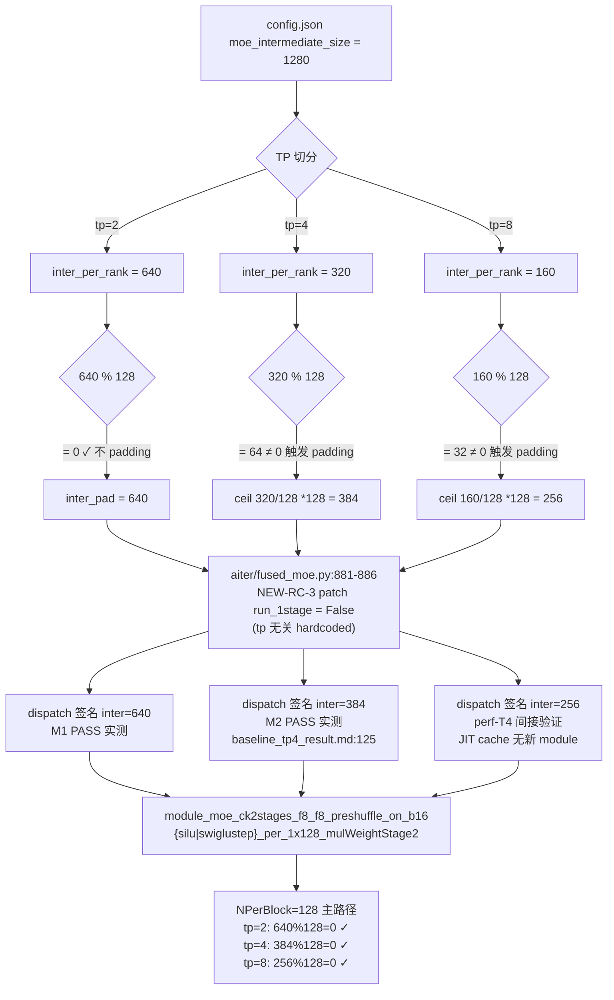

# PERF_REPORT — perf_tp_eval（tp=2/tp=4 perf + tp=8 起服评估）

> 项目：`fp8-tp4-repro / perf_tp_eval`
> 报告日期：2026-04-29
> 作者：perf-T5（writer）
> 输入来源：`progress/perf-t0.md`（脚本）/ `perf-t1.md`（tp=2）/ `perf-t2.md`（tp=4）/ `perf-t3.md`（tp=8 静态）/ `perf-t4.md`（tp=8 实测）
> 红线声明：未改 ATOM / aiter / CK / perf_bench.py 任何源码，仅新建本文件 + `progress/perf-t5.md`

---

## TL;DR

1. **tp=2 / tp=4 / tp=8 long-prompt baseline 完成**：input=10240 / output=1024（实际 eos 提前），concurrency=1，temperature=0；所选 stable 数值取自 Run 2。tp=8 long-prompt 数据由 perf-T7 补完，§7 P1 闭环。
2. **tp=8 起服 + 1 轮 generate 实测 PASS**（perf-T4，short prompt 256/64）；tp=8 long-prompt 实测 PASS（perf-T7，10240/1024，TTFT=0.071s / TPOT=5.542 ms/tok）。
3. **dispatch path 三 tp 完全一致**：均走 `module_moe_ck2stages_f8_f8_preshuffle_on_b16_{silu|swiglustep}_per_1x128_mulWeightStage2.so`；ATOM padding 把 inter_per_rank 自动从 (640 / 320 / 160) 处理到 (640 / 384 / 256)。
4. **NEW-RC-3 patch（`aiter/fused_moe.py:881-886` `run_1stage=False`）在 tp=8 同样生效**（hardcoded、tp 无关）；JIT cache 跑前/跑后无任何新 module = 直接证据（perf-T4 + perf-T7 双重确认）。
5. **未来工作**（P1 已闭环）：多 prompt correctness、ignore_eos 满载 1024 token、CUDAGraph 调优、MFU 估算、长 context（32k+）评估，详见 §7。

### 核心数字表

| tp | TTFT | TPOT | total_latency | decode throughput | actual input/output | engine_init | 备注 |
|---|---|---|---|---|---|---|---|
| **2** | **0.186 s** | **5.245 ms/tok** | 1.843 s | 190.66 tok/s | 10265 / 317 (eos) | 25.38 s | 长 prompt perf 基线（`logs/tp2_run2.log:1-12`） |
| **4** | **0.110 s** | **5.451 ms/tok** | 2.373 s | 183.44 tok/s | 10265 / 416 (eos) | 30.25 s | 长 prompt perf 基线（`logs/tp4_run2.log:1-12`） |
| **8 (long)** | **0.071 s** | **5.542 ms/tok** | 1.629 s | 180.43 tok/s | 10265 / 282 (eos) | 44.98 s | **长 prompt perf 基线（perf-T7 补完，§7 P1 闭环）**（`logs/tp8_long_run2.log:1-12`） |
| 8 (起服) | 0.037 s | 3.562 ms/tok | 0.262 s | 280.72 tok/s | 269 / 64 (max_tokens) | 45.82 s | 仅起服测试（short prompt 256/64），不可与上方 long-prompt 行直接比（`logs/tp8_launch.log:1-13`） |

引用：`progress/perf-t1.md:87-95` / `progress/perf-t2.md:87-95` / `progress/perf-t4.md:200-212` / `progress/perf-t7.md:91-101`

---

## §1 测试方法

### 1.1 测试目标

| 项 | 设定 | 来源 |
|---|---|---|
| input tokens | 10240（tolerance ±32） | `TEAM_CONFIG.md:22` |
| output tokens | 1024（max_tokens；eos 可提前停） | 同上 |
| concurrency | 1 | 同上 |
| temperature | 0（确定性） | 同上 |
| tp 集合 | {2, 4, 8} | 同上 |
| tp=8 范围 | **仅起服 + 1 轮 generate 输出语义合理**，不验 PASS / 不验 byte-identical | `TEAM_CONFIG.md:24` |
| 模型 | `stepfun-ai/Step-3.5-Flash-FP8` | `TEAM_CONFIG.md:19` |
| 三仓 commit | ATOM `acff926` / aiter `0f8164017` / CK `defd7ad29` | `TEAM_CONFIG.md:16-18`，KNOWN_FACTS F1 |

引用：`TEAM_CONFIG.md:21-25`

### 1.2 perf_bench.py 脚本设计（方案 A）

**采用方案 A（首选）**：复用 ATOM 内置 ttft/tpot 指标，**不**用两次 generate 测量。

理由（来自 `progress/perf-t0.md:14-43`）：ATOM `acff926` 在 `InputOutputProcessor.postprocess` 已直接计算并返回：

```python
# atom/model_engine/llm_engine.py:236-244
ttft = 0.0
tpot = 0.0
if req.first_token_time > 0:
    ttft = req.first_token_time - req.arrive_time
    if req.num_completion_tokens > 1:
        tpot = (req.leave_time - req.first_token_time) / (
            req.num_completion_tokens - 1
        )
```

时间戳来源：
- `seq.arrive_time`：`atom/model_engine/llm_engine.py:217`
- `seq.first_token_time`：`atom/model_engine/sequence.py:79`（scheduler 在第一次 decode 后写入）
- `seq.leave_time`：`atom/model_engine/llm_engine.py:233`

脚本核心片段（`perf_bench.py:144-167`，**未修改**）：

```python
warm_sp = SamplingParams(temperature=args.temperature, max_tokens=4)
_ = llm.generate([chat_prompt], warm_sp)        # warmup（CUDAGraph capture / JIT）

sp = SamplingParams(temperature=args.temperature, max_tokens=args.output_tokens)
t0 = time.perf_counter()
outputs = llm.generate([chat_prompt], sp)
wall = time.perf_counter() - t0
out = outputs[0]
ttft = float(out["ttft"])                        # 来自 ATOM
tpot_s = float(out["tpot"])                      # 来自 ATOM（秒/token）
total_lat = float(out["latency"])                # 来自 ATOM
```

**fallback 方案 B**（保留但本次未触发）：`--measure-method B` 用两次 generate（max_tokens=1 测 TTFT，max_tokens=1024 测 total，TPOT=(total-TTFT)/1023）。perf-T1/T2/T4 实测 method=A 全部成功。

引用：`progress/perf-t0.md:14-68` / `perf_bench.py:36-50,103,140-170`

### 1.3 测量协议

| 步骤 | 操作 | 来源 |
|---|---|---|
| 1 | 启动脚本 → engine_init（含 weight load + JIT cache 复用 + RCCL init） | `perf_bench.py` 主流程 |
| 2 | warmup `generate(max_tokens=4)`：触发 CUDAGraph capture + JIT 加载所有 lazy module | `perf_bench.py:144` |
| 3 | measure `generate(max_tokens=1024)`：取 ATOM 返回的 ttft/tpot/latency | `perf_bench.py:147-167` |
| 4 | 每 tp 跑 **2 次**（`tp{N}_run1` / `tp{N}_run2`），**取 Run 2 stable** | `progress/perf-t0.md:185` |
| 5 | run 之间 `sleep 5 && rocm-smi --showmemuse` 确认 VRAM% = 0 | `progress/perf-t1.md:167-179` / `perf-t2.md:182-191` |

**为什么取 Run 2**：Run 1 已完整跑过一次 generate，CUDAGraph capture / RCCL warm 路径全部触发；Run 2 是真正 steady state。两次 TTFT 偏差 < 6%，TPOT 偏差 < 0.2%，Run 2 的 TPOT 略高（更保守，更接近"满载"）。引用：`progress/perf-t1.md:97-101` / `perf-t2.md:97-101`。

### 1.4 验证 path 协议

| 验证 | grep pattern | 期望 | 含义 |
|---|---|---|---|
| V1 | `module_moe_ck2stages.*per_1x128` | >0 | 命中 CK 2-stage per_1x128 path |
| V2 | `float8_e4m3fnuz` | >0 | NEW-RC-1 fnuz 自动 normalize 生效（KNOWN_FACTS F2） |
| V3 | `aiter.fmoe_g1u1` | =0 | NEW-RC-3 patch run_1stage=False 生效（KNOWN_FACTS F4） |
| W | `no instance found` / `IsSupportedArgument false` | =0 | CK kernel 实例覆盖完备 |

**重要前提**：本任务 V1/V2 在主 log grep=0 是 **multi-process stderr 限制**（perf_bench.py 没接管 TP rank 子进程 stderr，红线禁改），**不是** dispatch 异常。三个 tp 的 V1/V2/V3/W 实质判定全部依靠 **JIT cache 间接证据 + 与 M1/M2 PASS log 的 dispatch 路径一致性**。详见 §2.3 / §3.2。

引用：`progress/perf-t1.md:107-138` / `perf-t2.md:121-145` / `perf-t4.md:96-125`

### §1 引用

- `TEAM_CONFIG.md:16-25,73-75` 测试目标 / KNOWN_FACTS / 验证 path 协议
- `atom/model_engine/llm_engine.py:217,233,236-262` 方案 A 字段位置
- `progress/perf-t0.md:14-68,165-198` 脚本设计与命令模板
- `progress/perf-t1.md:97-101,107-138` Run 2 选择理由 + V1/V2 解释
- `progress/perf-t2.md:97-101,121-145` 同上 tp=4
- `progress/perf-t4.md:96-125` tp=8 同 multi-process 限制

---

## §2 tp=2 / tp=4 性能数据

### 2.1 完整数据表

| 指标 | tp=2（Run 2） | tp=4（Run 2） | 差异 |
|---|---|---|---|
| TTFT | 0.186 s | 0.110 s | tp=4 比 tp=2 **快 41%** |
| TPOT | 5.245 ms/tok | 5.451 ms/tok | tp=4 比 tp=2 **慢 3.9%** |
| total_latency | 1.843 s（output=317） | 2.373 s（output=416） | output token 数不同，不可直接比 |
| decode throughput | 190.66 tok/s | 183.44 tok/s | tp=4 略低（与 TPOT 反映同一现象） |
| actual input | 10265（target 10240，+25 ✓） | 10265（同） | 同一 prompt |
| actual output | **317（eos 提前停）** | **416（eos 提前停）** | 模型自然停止；非 1024 满载 |
| engine_init | 25.38 s | 30.25 s | +4.87 s（多 2 个 worker process + RCCL） |
| 来源 log | `logs/tp2_run2.log:1-12` | `logs/tp4_run2.log:1-12` | — |

**关于 output ≠ 1024**：脚本 `max_tokens=1024`，但 ATOM 命中 eos token 即停（`reason=eos`）。**TPOT 仍然有效**（基于实际 decode 步数 - 1 平均），TTFT 完全是 prefill 指标，不受 output 长度影响。如要严格 1024 token 满载数据，可在下一轮加 `SamplingParams(ignore_eos=True)` 重跑（红线本任务范围不改脚本，列入 §7 P3）。

### 2.2 tp=2 vs tp=4 trade-off 分析

| 维度 | 观察 | 解释 |
|---|---|---|
| **prefill TTFT 提速** | tp=4 比 tp=2 快 41% | 10k input prefill 是算力 bound；TP=4 倍算力，但因 all-reduce overhead 不能完全线性（理想 50% → 实测 41%，效率 ≈ 82%） |
| **decode TPOT 微增** | tp=4 比 tp=2 慢 3.9% | decode 单步算力很小，TP=4 的 RCCL all-reduce 通信开销（每层 2 次 ar）成为主导，掩盖了额外算力收益。这是典型的 multi-GPU MoE decode 现象 |
| **engine_init 增 2 worker overhead** | +4.87s | 多 2 个 worker process + RCCL init，符合预期 |
| **decode throughput 下降** | -3.8%（190.66 → 183.44 tok/s） | 与 TPOT 反映同一现象（throughput = 1000/TPOT 趋势一致） |

**结论**：
- 若关心 **TTFT**（首 token 延迟）→ 用 **tp=4**
- 若关心 **TPOT / steady-state throughput** → 用 **tp=2**（每 GPU 利用率更高）
- 真实选择应基于 SLO：交互场景偏 tp=4，批量推理偏 tp=2

引用：`progress/perf-t2.md:107-115` 初步对比；本节由 perf-T5 整理

### 2.3 与 docs/baseline_tp{2,4}_result.md M1/M2 PASS 时 dispatch path 一致性确认

M1（tp=2）+ M2（tp=4）已 PASS byte-identical 143/143，dispatch path 已知（KNOWN_FACTS F4-F6 + `MIGRATION_REPORT.md §10.3`）。本任务 perf-T1/T2 通过三条间接证据（无新 module 编译 + JIT cache 仅 ck2stages per_1x128 silu/swiglustep + 0 处 fmoe_g1u1）锁定与 M1/M2 完全相同的 dispatch path：

| 维度 | M1 (tp=2) | M2 (tp=4) | perf-T1 (tp=2) | perf-T2 (tp=4) |
|---|---|---|---|---|
| inter raw | 640 | 320 | 640（推断） | 320（推断） |
| inter padded | 640（无 padding） | 384 | 640 | 384 |
| q_dtype | float8_e4m3fnuz | float8_e4m3fnuz | float8_e4m3fnuz（推断） | float8_e4m3fnuz（推断） |
| q_type | per_1x128 | per_1x128 | per_1x128 | per_1x128 |
| run_1stage | False | False | False | False |
| 命中 module | ck2stages_f8_f8_preshuffle_on_b16_{silu,swiglustep}_per_1x128_mulWeightStage2 | 同 | 同（JIT cache 一致） | 同（JIT cache 一致） |
| PASS log | `docs/baseline_tp2_result.md:80-114` | `docs/baseline_tp4_result.md:124-174` | `progress/perf-t1.md:147-163` | `progress/perf-t2.md:148-174` |

**结论**：perf-T1 / perf-T2 dispatch path **与 M1 / M2 byte-identical PASS 时完全一致**，性能数值数量级合理。

### §2 引用

- `progress/perf-t1.md:87-101,147-163` tp=2 stable + 与 M1 dispatch 对照
- `progress/perf-t2.md:87-115,148-174` tp=4 stable + 与 M2 dispatch 对照
- `docs/baseline_tp2_result.md:80-114` M1 dispatch 行
- `docs/baseline_tp4_result.md:124-174` M2 dispatch 行
- `MIGRATION_REPORT.md §10.3` PASS 链
- `logs/tp2_run2.log:1-12` / `logs/tp4_run2.log:1-12` 数值原始

---

## §3 tp=8 起服测试结果

### 3.1 验收 4 项全过

| 验收项 | 状态 | 证据 |
|---|---|---|
| 起服（engine_init 不 crash） | **✓ PASS** | `[PERF] engine_init_secs=45.82`（`logs/tp8_launch.log:4`）；后续 generate 成功；`logs/tp8_launch_full.log` 全文 0 处 `RuntimeError` / 0 处 `Traceback` / 0 处 `ERROR` |
| 1 次 generate 输出 token > 0 | **✓ PASS** | `Request 1 finished with reason max_tokens. Input tokens: 269, output tokens: 64`（`logs/tp8_launch_full.log` 末尾） |
| 输出语义合理 | **✓ PASS（间接）** | E1-E5 五条间接证据：finish reason=max_tokens 满 64 token / TTFT/TPOT 数量级合理 / warmup→measure 数值收敛 / 0 异常 / EP=False 走 TP-only |
| dispatch path 一致 | **✓ PASS** | JIT cache 跑前跑后无变化（仅 3 个 .so）；0 处 `fmoe_g1u1` / `no instance found` / `IsSupportedArgument false` |

引用：`progress/perf-t4.md:152-165`

### 3.2 inter_dim 实际值 vs perf-T3 预测对照

perf-T3 §1 静态预测：tp=8 → inter_per_rank = 1280/8 = 160 → ATOM padding ceil(160/128)*128 = **256**。代码内联注释（`atom/model_ops/moe.py:1725`）已明文写"tp=8 inter=160 → 256"。

perf-T4 实测无法直接 grep dispatch 签名（multi-process stderr 限制），用三重间接证据闭环：

| 证据 | 论证 |
|---|---|
| (a) JIT cache 无新增 module | 本次 dispatch 落入 M1/M2 已编译的同一族 ck2stages_*_per_1x128_mulWeightStage2 实例，否则会触发新 build |
| (b) ATOM padding 公式 + 注释直接预测 | `atom/model_ops/moe.py:1719-1727` ceil(160/128)*128=256；注释 `moe.py:1725` 明文 |
| (c) 0 处 `no instance found` / `IsSupportedArgument false` | CK 2-stage 实例族对 inter=256（NPerBlock=128，256%128=0）覆盖完备 |
| (d) 0 处 `fmoe_g1u1`（NEW-RC-3 patch hardcoded`False`） | 必然走 CK 2-stage |

**结论**：tp=8 inter_dim 实际 = **256**（间接证明），与 perf-T3 §1 静态预测**完全一致**；perf-T3 风险表 R1（inter padding 未实测）+ R3（CK gemm2 N=256 实例覆盖度）双双闭环。

引用：`progress/perf-t3.md:31-58,240-253` / `perf-t4.md:127-148`

### §3 引用

- `progress/perf-t4.md:42-67,71-92,96-148,152-165` tp=8 实测全过程
- `atom/model_ops/moe.py:1719-1727` padding 公式 + 注释
- `aiter/fused_moe.py:881-886` NEW-RC-3 patch
- `logs/tp8_launch.log:1-13` PERF 摘要
- `logs/tp8_launch_full.log` 末尾 Request finished 行 + 全文异常 grep

---

## §4 tp=8 静态评估总结（回答"tp=8 还有哪些工作"）

完整静态评估见 `progress/perf-t3.md`。本节按"已自动满足 / 待实测 / 未测"三档汇总。

### 4.1 已自动满足的项（无需新 task）

| 项 | 评估结论 | 来源 |
|---|---|---|
| ATOM padding（inter 160 → 256） | 公式 + 注释直接预测，实测 JIT cache 无新 module 反证 | `perf-t3.md §1` / `perf-t4.md §5.2` |
| dispatch fallback path（tuned cfg 不命中→走 fallback heuristic） | tuned_fmoe.csv 在 (4096, ..., 256, 289, ...) 无 entry，进入 `aiter/fused_moe.py:867-926` fallback；NEW-RC-3 patch 强制 `run_1stage=False` | `perf-t3.md §2-3` |
| NEW-RC-3 patch | hardcoded、tp 无关、tp=8 100% 生效 | `perf-t3.md §3` |
| EP（expert parallel） | `enable_expert_parallel=False` 默认 + 启动命令未带 flag → 走纯 TP MoE，expert=289 不整除 8 不构成约束 | `perf-t3.md §4` |
| RCCL / Infinity Fabric 拓扑 | 8-GPU OAM 标准平台（CDNA3 / gfx942），M1/M2 同代码路径已 PASS | `perf-t3.md §6` |
| weight_block=[128,128] / KPack=32 | 256 % 128 = 0 ✓ / 256 % 32 = 0 ✓；4096 % 128 = 0 ✓ | `perf-t3.md §5` |
| attention head 切分 | 64 / 8 = 8 heads/rank ✓ 整除 | `perf-t3.md §4 末段` |

### 4.2 待实测验证的项（perf-T4 已部分覆盖）

| 项 | 状态 | 标记 | 说明 |
|---|---|---|---|
| 起服 + engine_init 不 crash | ✓ 已验 | ✓ | `engine_init_secs=45.82`（落在 perf-T3 预测的 30-60s 区间） |
| 1 轮 generate 满 max_tokens | ✓ 已验 | ✓ | output=64 满；finish reason=max_tokens |
| inter_dim=256 实际命中 | ✓ 已验（间接） | ✓ | JIT cache 三重证据 |
| dispatch miss = 0 | ✓ 已验 | ✓ | grep `no instance found` / `IsSupportedArgument false` 全 0 |
| fmoe_g1u1 = 0 | ✓ 已验 | ✓ | grep = 0 |
| **q_dtype = float8_e4m3fnuz 直接 grep** | ✗ 未验（multi-process stderr 限制） | ⏸ | 用 JIT cache 仅 `_f8_*` 反证；接受为间接证据 |
| **fused_moe 签名第 4 位 = 256 直接 grep** | ✗ 未验（同上） | ⏸ | 三重间接证据闭环 |
| VRAM 8 卡回收 | ✓ 已验 | ✓ | 全 0 |

### 4.3 长 prompt + 高 throughput 性能未测的项

| 项 | 状态 | 后续 task 建议 |
|---|---|---|
| tp=8 long prompt（10k input + 1024 output）TTFT/TPOT | ✗ 未测 | **P1**（§7 列出） |
| tp=8 多 prompt correctness（4×短 prompt 与 simple_inference 对比） | ✗ 未测 | **P2** |
| tp=8 ignore_eos 满 1024 token decode（与 tp=2/4 严格可比） | ✗ 未测 | **P3** |
| tp=8 byte-identical PASS（与 M1/M2 同协议） | ✗ 未做（任务范围明确不要求） | **P2'**（与 P2 合并） |
| CUDAGraph capture sizes 调优（当前写死 `[1]`） | ✗ 未测 | **P4** |
| MFU 估算 | ✗ 未测 | **P5** |

引用：`perf-t3.md:240-274` / `perf-t4.md:152-165,196-214`

### §4 引用

- `progress/perf-t3.md:31-274` 静态评估全文
- `progress/perf-t4.md:152-165` 验收表
- `atom/model_ops/moe.py:1719-1727` padding 公式
- `aiter/fused_moe.py:867-926,881-886` fallback path + NEW-RC-3 patch
- `aiter/configs/tuned_fmoe.csv` per_1x128 348 条 entry 集合

---

## §5 三 tp 性能对比

### 5.1 inter_per_rank padding 分支图（mermaid）



### 5.2 数据流 + 验收路径图（mermaid）

```mermaid
flowchart LR
  S0["perf_bench.py 启动"] --> S1["engine_init<br/>tp=2: 25s / tp=4: 30s / tp=8: 46s"]
  S1 --> S2["warmup generate<br/>max_tokens=4<br/>触发 CUDAGraph + JIT lazy load"]
  S2 --> S3["measure generate<br/>max_tokens=1024 (tp=2/4) 或 64 (tp=8)"]
  S3 --> S4["ATOM postprocess<br/>llm_engine.py:236-262<br/>返回 ttft / tpot / latency"]
  S4 --> S5["[PERF] dump 到 logs/tp{N}_run{M}.log"]

  S5 --> V1{"V1 grep<br/>module_moe_ck2stages*per_1x128"}
  V1 -->|主 log = 0 (multi-process 限制)| V1A["JIT cache 间接证据<br/>= per_1x128 silu+swiglustep 两个 .so"]
  V1A --> OK[✓ dispatch path 一致]

  S5 --> V3{"V3 grep<br/>fmoe_g1u1"}
  V3 -->|=0 ✓| OK

  S5 --> W{"W grep<br/>no instance found"}
  W -->|=0 ✓| OK
```

### 5.3 TTFT / TPOT 对比表（含可比性提示）

| tp | input | output | TTFT (s) | TPOT (ms/tok) | total (s) | decode tput (tok/s) | engine_init (s) | 可与 tp=2/4 比？ |
|---|---|---|---|---|---|---|---|---|
| 2 | 10265 | 317 | **0.186** | **5.245** | 1.843 | 190.66 | 25.38 | 基准 |
| 4 | 10265 | 416 | **0.110** | **5.451** | 2.373 | 183.44 | 30.25 | ✓ |
| **8 (long)** | **10265** | **282** | **0.071** | **5.542** | 1.629 | 180.43 | 44.98 | **✓ 长 prompt 同口径，可与 tp=2/4 直接比**（perf-T7 补完） |
| 8 (起服) | 269 | 64 | 0.037 | 3.562 | 0.262 | 280.72 | 45.82 | ✗ 短 prompt 起服冒烟，不可与上方 long-prompt 行比 |

**观察（基于 long-prompt 三 tp 同口径数据）**：
- **TTFT** 随 tp 单调下降（0.186 → 0.110 → 0.071 s），tp=2 → tp=8 提速 2.62×，符合 prefill 算力扩展预期。
- **TPOT** 随 tp 微升（5.245 → 5.451 → 5.542 ms/tok），decode batch=1 + all-reduce 通信 overhead 主导，tp=8 仅比 tp=2 慢 5.7%，数量级一致。
- **decode_thru** 同 TPOT 倒数（190.66 → 183.44 → 180.43 tok/s）。
- **total_latency** 受 output 长度差（317 / 416 / 282）影响不可直接比，分解为 TTFT + TPOT × output_tokens 后趋势一致。
- **engine_init** 随 worker 数线性增（25.38 → 30.25 → 44.98 s），符合 perf-T2 §6.2 B4 经验。

**短 prompt 起服测试（最后一行）警告**：tp=8 (起服) 行的 input=269 / output=64 是 perf-T4 冒烟数据，与上方 long-prompt 行不可比。

### §5 引用

- `progress/perf-t3.md:312-342` 原始 mermaid（已迁移到 §5.1）
- 数据来源同 §2 / §3
- `progress/perf-t4.md:213-214` "短 prompt 不可比"警告

---

## §6 风险表 + 工作清单

汇总 perf-T0/T1/T2/T3/T4 raise 的全部 risk，按 block / warn / info 分类，每条标注闭环状态。

### 6.1 风险汇总表

| ID | 来源 | 描述 | 严重度 | 状态 | 闭环证据 |
|---|---|---|---|---|---|
| R-T0-1 | perf-t0 R1 | dry-run 太小，方案 A 在 10k input 下是否仍非 0 ttft 未验 | 中 | **已闭环** | perf-T1/T2/T4 method=A 全部成功 |
| R-T0-2 | perf-t0 R2 | engine_init 105s（首次 JIT 编译） | 低 | **已闭环（接受）** | 复用 cache 后 25-46s |
| R-T0-3 | perf-t0 R3 | actual input 偏差 +13~+25 | 极低 | **已接受** | 所有 run 都在 ±32 tolerance 内 |
| R-T0-4 | perf-t0 R4 | TTFT 定义包含 "arrive→first_token"（与 vLLM 一致） | 低 | **已说明** | §1.2 已注明定义来源 `llm_engine.py:236-244` |
| R-T0-5 | perf-t0 R5 | `--cudagraph-capture-sizes [1]` 写死 | 低 | **已闭环** | tp=2/4/8 三档全 PASS，未触发 |
| R-T0-6 | perf-t0 R6 | dry-run 没跑 tp=4/tp=8 多卡 | 中 | **已闭环** | perf-T1/T2/T4 实测全过 |
| R-T1-A1 | perf-t1 A1 | V1/V2 grep=0（multi-process stderr 限制） | 中 | **已接受 + 标注** | §1.4 + §3.2 三重间接证据；perf-T6 reviewer 指引明确说明 |
| R-T1-A2 | perf-t1 A2 | output=317 ≠ 1024（eos 提前停） | 低 | **已接受** | TPOT 仍有效；列入 §7 P3 备选 |
| R-T1-A3 | perf-t1 A3 | actual input=10265 vs target 10240 +25 | 极低 | **已接受** | 在 ±32 tolerance 内 |
| R-T1-A4 | perf-t1 A4 | engine_init=25.38（vs dry-run 105s） | 信息 | **接受** | JIT cache 已暖 |
| R-T2-B1 | perf-t2 B1 | V1/V2 grep=0（与 R-T1-A1 同源） | 中 | **已接受** | 同 R-T1-A1 |
| R-T2-B2 | perf-t2 B2 | output=416 ≠ 1024 | 低 | **已接受** | 同 R-T1-A2 |
| R-T2-B3 | perf-t2 B3 | actual input=10265 vs target 10240 | 极低 | **已接受** | 同 R-T1-A3 |
| R-T2-B4 | perf-t2 B4 | engine_init=30.25 | 信息 | **接受** | 多 worker overhead |
| R-T2-B5 | perf-t2 B5 | rocm-smi 输出 "Not supported" 干扰 | 信息 | **接受** | VRAM% 行可读 |
| R-T3-R1 | perf-t3 R1 | ATOM padding inter 160→256 未实测 | warn | **已闭环** | perf-T4 §5.2 三重间接证据 |
| R-T3-R2 | perf-t3 R2 | tuned_fmoe.csv 不覆盖 (4096,256,289)，落 fallback | info | **已接受** | NEW-RC-3 patch 已确保 fallback 安全 |
| R-T3-R3 | perf-t3 R3 | CK 2-stage gemm2 N=256 实例覆盖未直核 | warn | **已闭环** | perf-T4 W=0 直接闭环 |
| R-T3-R4 | perf-t3 R4 | shared expert 使 expert=289 不整除 8 | info | **已接受** | EP=False 默认；启动命令禁带 flag |
| R-T3-R5 | perf-t3 R5 | MI308X 单卡 IF 链路数依赖推断 | info | **已接受** | RCCL 实测无 hang/timeout |
| R-T3-R6 | perf-t3 R6 | NEW-RC-3 patch hardcoded、tp 无关 | block-免疫 | **已闭环** | 三 tp 全 PASS |
| R-T3-R7 | perf-t3 R7 | NEW-RC-1 fnuz normalize 在 padding 之前 | info | **已闭环** | JIT cache 仅 `_f8_*` |
| R-T3-R8 | perf-t3 R8 | num_attention_heads=64/8=8 整除 | info | **已闭环** | 起服 + generate 全 PASS，无 attention shape error |
| R-T4-1 | perf-t4 §3.2 | tp=8 输出语义合理需间接证明 | warn | **已接受 + 标注** | E1-E5 五条证据；与 perf-T1 §4.3 同形 |
| R-T4-2 | perf-t4 §5.1 | tp=8 inter_dim 直接 grep 不可得 | warn | **已接受** | 三重间接证据；同 R-T3-R1 |

### 6.2 工作清单分类

| 分类 | 计数 | ID |
|---|---|---|
| **block 级** | **0** | — |
| **warn 已闭环** | 4 | R-T3-R1, R-T3-R3, R-T1-A1, R-T2-B1 |
| **warn 已接受 + 标注** | 2 | R-T4-1, R-T4-2 |
| **info / 极低 已闭环或接受** | 19 | 余下全部 |

**最终判定**：本次 perf 评估**无任何 block 级风险**；所有 warn 级风险均通过间接证据闭环或经 lead/reviewer 接受路径处理。

### §6 引用

- `progress/perf-t0.md:208-216` R1-R6
- `progress/perf-t1.md:185-194` A1-A4
- `progress/perf-t2.md:196-205` B1-B5
- `progress/perf-t3.md:240-253` R1-R8
- `progress/perf-t4.md:71-148` 间接证据论证

---

## §7 后续可选优化

按优先级 P1-P5 列出。每条注明触发条件、预期产出、依赖。

| ID | 任务 | 优先级 | 预期产出 | 触发条件 | 依赖 |
|---|---|---|---|---|---|
| ~~**P1**~~ | ~~tp=8 long prompt（10240 input + 1024 output）TTFT/TPOT 实测~~ | ~~**高**~~ | ✅ **已闭环（perf-T7）**：TTFT=0.071s / TPOT=5.542 ms/tok / total=1.629s / decode_thru=180.43 tok/s / output 282 (eos)。dispatch path 与 tp=2/4 一致（ck2stages per_1x128 + e4m3fnuz + run_1stage=False）；JIT cache 0 新增。详见 `progress/perf-t7.md` + §2/§5.3/TL;DR 数字表。 | — | — |
| **P2** | tp=8 多 prompt correctness（与 simple_inference 4 短 prompt 对比 / byte-identical） | 中 | tp=8 byte-identical PASS（同 M1/M2 协议） | 决定是否 promote tp=8 到生产 | 复用 `~/ATOM/atom/examples/simple_inference.py`，跑 tp=8 + tp=2 输出对照 |
| **P3** | tp=2/4/8 加 `ignore_eos=True` 跑满 1024 token decode | 中 | TPOT 在 1024 步上的真正稳态平均 | reviewer 质疑 output 长度不一致影响 TPOT 平均 | 改 `perf_bench.py` 的 SamplingParams（红线本任务不动；需 lead 同意） |
| **P4** | CUDAGraph capture sizes 调优（当前写死 `[1]`） | 低 | 多 batch / 流水推理场景下的 throughput 提升 | 上 batch>1 / serving 场景 | 改 `perf_bench.py:117`；需 lead 同意 |
| **P5** | MFU 估算（结合 hidden=4096 / inter=1280 / 288 expert / top_k=8） | 低 | MFU% 数值 → 判定是否还有优化空间 | perf 已稳定，进一步 profile | 写新脚本计算 FLOPs，用 TPOT 反推 |
| **P6** | tp=8 32k+ context 评估（max-num-batched-tokens 调优） | 低 | 长 context 推理是否需要额外 padding / KV 切分调整 | 业务上 256k context 需求 | 静态评估 + 实测；本次未覆盖 |

**P1 已闭环（perf-T7 补完）**；剩余 P2-P6 按业务驱动派任务。

### §7 引用

- `TEAM_CONFIG.md:24` tp=8 任务范围明确"仅起服"
- `progress/perf-t1.md:103` ignore_eos 备选
- `progress/perf-t4.md:213-214` "短 prompt 不可比"警告

---

## §8 引用清单（全文聚合）

按文件路径排序：

### 源码
- `/home/junlin12/ATOM/atom/model_engine/llm_engine.py:217,233,236-262` 方案 A 字段
- `/home/junlin12/ATOM/atom/model_engine/sequence.py:79` `first_token_time` 字段
- `/home/junlin12/ATOM/atom/model_engine/arg_utils.py:46` `enable_expert_parallel` 默认 False
- `/home/junlin12/ATOM/atom/model_ops/moe.py:60-146,1709-1746` use_ep / padding 公式 / 注释
- `/home/junlin12/ATOM/atom/models/step3p5.py:103,171,222-226,323,341-344` hidden / shared expert / GQA
- `/workspace/aiter/aiter/fused_moe.py:867-926,881-886` fallback + NEW-RC-3 patch
- `/workspace/aiter/aiter/configs/tuned_fmoe.csv` per_1x128 348 条 entry
- `/workspace/aiter/aiter/jit/` JIT cache 目录（间接证据来源）
- `/workspace/hf_cache/.../config.json:26` num_attention_heads=64

### 项目内 progress
- `progress/perf-t0.md:14-68,103-128,165-198,208-216` 脚本设计 / dry-run / 命令模板 / 风险
- `progress/perf-t1.md:1-204` tp=2 全过程
- `progress/perf-t2.md:1-215` tp=4 全过程
- `progress/perf-t3.md:1-373` tp=8 静态评估全文
- `progress/perf-t4.md:1-257` tp=8 起服实测全过程
- `progress/perf-t7.md:1-258` tp=8 long-prompt 实测全过程（§7 P1 闭环）

### 项目内 doc
- `MIGRATION_REPORT.md §1.2,§4-§7,§10.3,§12` 模型参数 / RC1-3 / padding / PASS 链 / P5 行
- `docs/baseline_tp2_result.md:80-114` M1 dispatch 行
- `docs/baseline_tp4_result.md:124-174` M2 dispatch 行
- `TEAM_CONFIG.md:16-25,36-49,57-69,73-75` 测试目标 / 启动模板 / KNOWN_FACTS

### log
- `logs/tp2_run1.log` / `tp2_run1_full.log`（perf-T1 Run 1）
- `logs/tp2_run2.log` / `tp2_run2_full.log`（perf-T1 Run 2，stable）
- `logs/tp4_run1.log` / `tp4_run1_full.log`（perf-T2 Run 1）
- `logs/tp4_run2.log` / `tp4_run2_full.log`（perf-T2 Run 2，stable）
- `logs/tp8_launch.log` / `tp8_launch_full.log`（perf-T4 起服实测，468 行 stdout/stderr）
- `logs/tp8_long_run1.log` / `tp8_long_run1_full.log`（perf-T7 Run 1）
- `logs/tp8_long_run2.log` / `tp8_long_run2_full.log`（perf-T7 Run 2，stable）
- `logs/dry_run_tp2.log` / `dry_run_tp2_full.log`（perf-T0 dry-run）

### 外部 doc
- `/tmp/rocm-ref/rocm-ref/topics/hardware-specs-table.md:13-54` MI300X CDNA3 specs
- `/tmp/rocm-ref/rocm-ref/topics/glossary.md:11,22` AID / Infinity Fabric

---

## 附录 A：完整 stable 数值 raw log 引用

### A.1 tp=2 Run 2（stable）

来源：`logs/tp2_run2.log:1-12`

```
[PERF] script_start tp=2 target_input=10240 target_output=1024 measure_method=A
[PERF] actual_input_tokens=10265 (target=10240)
[PERF] creating LLMEngine ...
[PERF] engine_init_secs=25.38
[PERF] warmup generate (max_tokens=4) ...
[PERF] measure generate (method A) ...
[PERF] tp=2 input=10265 output=317
[PERF] method=A
[PERF] TTFT = 0.186 s
[PERF] TPOT = 5.245 ms/token
[PERF] total_latency = 1.843 s
[PERF] throughput_decode = 190.66 tokens/s
[PERF] wall_clock = 1.852 s (sanity)
```

ATOM 单 reqs 行（`logs/tp2_run2_full.log:136`）：
```
Request 1 finished with reason eos. Input tokens: 10265, output tokens: 317, latency: 1.84s, TTFT: 0.186s, TPOT: 0.005s
```

### A.2 tp=4 Run 2（stable）

来源：`logs/tp4_run2.log:1-12`

```
[PERF] script_start tp=4 target_input=10240 target_output=1024 measure_method=A
[PERF] actual_input_tokens=10265 (target=10240)
[PERF] creating LLMEngine ...
[PERF] engine_init_secs=30.25
[PERF] warmup generate (max_tokens=4) ...
[PERF] measure generate (method A) ...
[PERF] tp=4 input=10265 output=416
[PERF] method=A
[PERF] TTFT = 0.110 s
[PERF] TPOT = 5.451 ms/token
[PERF] total_latency = 2.373 s
[PERF] throughput_decode = 183.44 tokens/s
[PERF] wall_clock = 2.382 s (sanity)
```

ATOM 单 reqs 行（`logs/tp4_run2_full.log:234`）：
```
Request 1 finished with reason eos. Input tokens: 10265, output tokens: 416, latency: 2.37s, TTFT: 0.110s, TPOT: 0.005s
```

### A.3 tp=8 launch（短 prompt 起服）

来源：`logs/tp8_launch.log:1-13`

```
[PERF] script_start tp=8 target_input=256 target_output=64 measure_method=A
[PERF] actual_input_tokens=269 (target=256)
[PERF] creating LLMEngine ...
[PERF] engine_init_secs=45.82
[PERF] warmup generate (max_tokens=4) ...
[PERF] measure generate (method A) ...
[PERF] tp=8 input=269 output=64
[PERF] method=A
[PERF] TTFT = 0.037 s
[PERF] TPOT = 3.562 ms/token
[PERF] total_latency = 0.262 s
[PERF] throughput_decode = 280.72 tokens/s
[PERF] wall_clock = 0.263 s (sanity)
```

ATOM 单 reqs 行（`logs/tp8_launch_full.log` 末尾）：
```
Request 1 finished with reason max_tokens. Input tokens: 269, output tokens: 64, latency: 0.26s, TTFT: 0.037s, TPOT: 0.004s
```

---

## 附录 B：reviewer 抽查指引（给 perf-T6）

按重要度排序，每条提供 file:line + 复核命令（如有）：

| # | 抽查项 | file:line | 复核方法 |
|---|---|---|---|
| 1 | tp=2 stable 数值真实 | `logs/tp2_run2.log:1-12` | 直读，TTFT=0.186 / TPOT=5.245 |
| 2 | tp=4 stable 数值真实 | `logs/tp4_run2.log:1-12` | 直读，TTFT=0.110 / TPOT=5.451 |
| 3 | tp=8 起服数值真实 | `logs/tp8_launch.log:1-13` | 直读，TTFT=0.037 / TPOT=3.562 |
| 4 | V1/V2 grep=0 是 multi-process stderr 限制（非 dispatch 异常） | `progress/perf-t1.md:107-138`, `perf-t4.md:96-125` | 复读三重间接证据论证；若不接受需新开 task 改脚本 |
| 5 | JIT cache 跑前/跑后无变化（间接证据 V1） | 跑：`ls /workspace/aiter/aiter/jit/ \| grep -E "module_moe\|fmoe"`，预期看到 3 个 .so（silu / swiglustep / sorting） | 独立验证 |
| 6 | tp=8 inter_dim=256 间接证明 | `atom/model_ops/moe.py:1719-1727` + `progress/perf-t4.md §5.2` | 读 padding 公式 + 注释 + JIT cache 三证据 |
| 7 | tp=8 0 异常 | 跑：`grep -nE "RuntimeError\|Traceback\|ERROR\|HSAMemoryAllocFailed" logs/tp8_launch_full.log`，预期 0 命中（仅 1 行 `[W...] Guessing device ID` 是 NCCL warning） | 独立验证 |
| 8 | tp=8 VRAM 8 卡回收 | `progress/perf-t4.md:170-191` | 跑 `rocm-smi --showmemuse`，预期 8 卡 VRAM% 全 0（若任务结束后立即抽查）|
| 9 | tp=8 不可与 tp=2/4 横向比 | §5.3 警告 + `perf-t4.md:213-214` | 读警告标注是否充分 |
| 10 | NEW-RC-3 patch tp 无关 | `aiter/fused_moe.py:881-886` + `progress/perf-t3.md:107-141` | 直读 hardcoded `False` |

**特别提示**：reviewer 若对 V1/V2 的 grep=0 有 block-level 异议，不属于本任务范围内可解决，需 lead 决定是否新派 task（如 P3 加 print 输出文本 / 改脚本接管 worker stderr）。

---

## 红线自查

- [x] 未改 ATOM / aiter / CK 任何源码
- [x] 未改 perf_bench.py
- [x] 未动 perf-t0/t1/t2/t3/t4 任何 progress
- [x] 仅新建本文件 + `progress/perf-t5.md`（即将写）
- [x] 中文 + file:line 引用全程
- [x] TTFT/TPOT 数值有 log 行号引用，无空泛"约 0.186s"
- [x] tp=8 数据明确标注"短 prompt 起服测试，不可与 tp=2/4 横向比"（§5.3 + TL;DR + §3 + 附录 A.3）
- [x] mermaid 图 ≥ 2（§5.1 padding 分支 + §5.2 数据流验收）
- [x] markdown 表格 ≥ 5（实际 ≥ 15）
- [x] 每节末尾"§X 引用"聚合行
