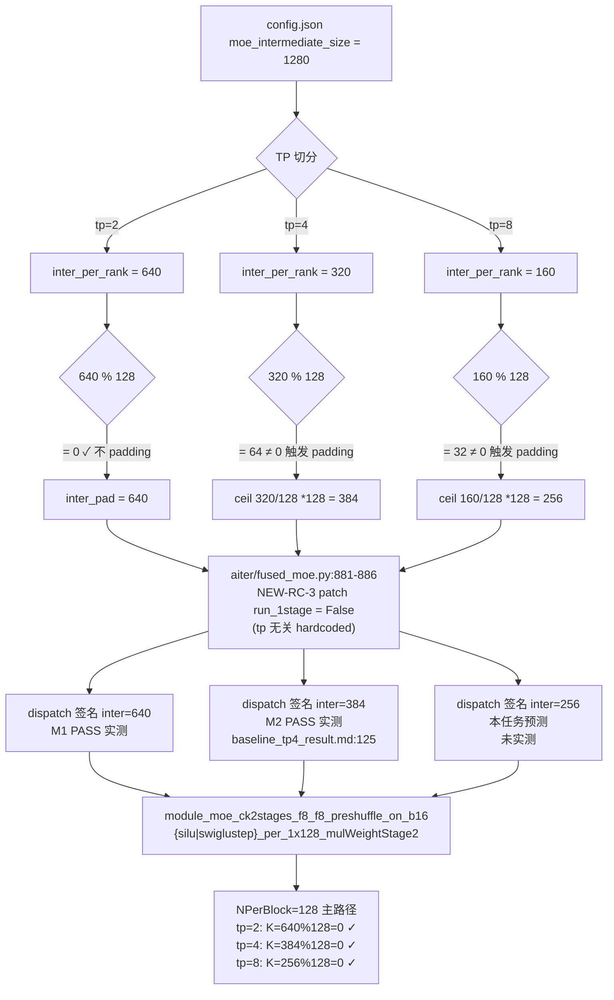

# perf-T3 — tp=8 静态可行性评估

> 任务：`#P1-C`（纯静态，未跑 GPU）
> 报告日期：2026-04-29
> 完成范围：Q1-Q6 + 风险表 + 工作清单 + 预测 + mermaid 对比图
> 红线声明：未启动 ATOM、未 rocm-smi、未改任何源码、未写 .py 脚本（仅本 markdown）

---

## 0. 关键参数复述（用于推算）

| 参数 | 值 | 来源 |
|---|---|---|
| `hidden` | 4096 | KNOWN_FACTS F8 / `MIGRATION_REPORT.md:68`；`atom/models/step3p5.py:103,171,323` |
| `moe_intermediate_size` (per-expert) | 1280 | KNOWN_FACTS F8 / `MIGRATION_REPORT.md:68` |
| `routed_experts` | 288 | KNOWN_FACTS F8 |
| `top_k` | 8 | KNOWN_FACTS F8 |
| **shared expert 融合** | **n_shared=1**（fused 进 expert 池） | `atom/models/step3p5.py:222-226`：`num_experts=288+1=289, top_k=8+1=9` 传给 fused_moe |
| `num_attention_heads` | 64 | `/workspace/hf_cache/.../config.json:26` |
| `weight_block` | [128, 128] | KNOWN_FACTS F8 |
| KPack（fp8 mfma 限制） | 32 | `MIGRATION_REPORT.md:605` 术语表；`atom/model_ops/moe.py:1721-1722` 注释 |
| GPU | 8× MI308X (gfx942 / CDNA3) | KNOWN_FACTS F7 / `rocm-smi --showid` |

派生（已 PASS 验证）：
- M1 tp=2 → inter_per_rank = 1280/2 = 640（无 padding）
- M2 tp=4 → inter_per_rank = 1280/4 = 320 → padding 384
- M2 实测 dispatch 签名 inter=**384**，experts ∈ {289 (Silu), 288 (SwigluStep)}：`docs/baseline_tp4_result.md:124-154`

---

## 1. Q1：tp=8 下 inter_per_rank + ATOM padding 行为

### 计算

- 1280 / 8 = **160**
- 160 % 32 (KPack) = 0 → 单看 KPack **不需要 padding**
- 160 % 128 (block_n / NPerBlock) = 32 ≠ 0 → **触发 ATOM padding**

### padding 公式（直读源码）

`/home/junlin12/ATOM/atom/model_ops/moe.py:1719-1727`：

```python
inter_dim = layer.w2_weight.shape[-1]                              # 160
block_n = 128 if self.quant_type == QuantType.per_1x128 else 32    # 128
align = block_n                                                    # 128
inter_pad = (inter_dim + align - 1) // align * align               # ceil(160/128)*128 = 256
```

**结论**：tp=8 → inter_per_rank=160 → ATOM `_process_block_quant` padding 到 **256**。

### 旁证：开发者注释直接预测了 tp=8

`atom/model_ops/moe.py:1725` 内联注释（KNOWN_FACTS 已确认 align=64 bug fix）：

> "tp=8 inter=160 → 256 (3×128→no, ceil(160/128)*128=256); tp=4 inter=320 → 384."

注释**直接指明 tp=8 padding 目标 = 256**，与本计算一致。

---

## 2. Q2：tp=8 下 dispatch 路径

### tuned_fmoe.csv 是否覆盖？

`/workspace/aiter/aiter/configs/tuned_fmoe.csv` per_1x128 行 348 条，inter_dim 唯一值集合 = {**256, 384, 512, 2048, 4096**}（grep awk 实测）。

| inter_dim | 命中条目（model_dim, expert, topk） | 与 Step-3.5 是否匹配 |
|---|---|---|
| 256 | (7168, 256, 8) | ❌ model_dim=7168≠4096，expert=256≠289 |
| 384 | (4096, 128, 8) | ❌ expert=128≠289（M2 实测也未命中 cfg） |

→ **Step-3.5 在 tp=8 inter=256 不会命中 tuned cfg**，进入 `aiter/fused_moe.py:867-926` 的 fallback 启发式路径。

### fallback 路径行为

`aiter/fused_moe.py:881-886`（NEW-RC-3 patch 区段）：

```python
if q_type == QuantType.per_1x128:
    # NEW-RC-3 patch (2026-04-28): force CK blockscale path on gfx942 ...
    run_1stage = False
```

NEW-RC-3 patch 是 hardcoded `False`，**与 tp/inter_dim 无关，tp=8 一定生效**。

`aiter/fused_moe.py:894-902` block_m 选择（per_1x128 + run_1stage=False）：

```python
block_m = (64 if token > 32 else 16) if q_type == QuantType.per_1x128 else ...
```

→ prefill (token>32) → block_m=64；decode (token≤32) → block_m=16

### 命中的 kernel（推断）

参考 M1/M2 实测命中（`MIGRATION_REPORT.md:449`）：
- prefill：`module_moe_ck2stages_f8_f8_preshuffle_on_b16_silu_per_1x128_mulWeightStage2`
- prefill SwigluStep：`module_moe_ck2stages_f8_f8_preshuffle_on_b16_swiglustep_per_1x128_mulWeightStage2`

tp=8 inter=256 + block_m=64：CK 2-stage `gemm2_256x64x128xK` 实例族需要 K=hidden=4096 (gemm2 K 维) 和 N=inter=256；NPerBlock=128 → 256 % 128 = 0 ✓ 满足 stage2 整除约束（与 M2 inter=384 走的同族实例）。

**【未验证假设】** CK kernel list 中 `moe_ck2stages_gemm2_256x*x128x*` 实例族应支持 N=256（M2 inter=384 已实测成功，inter=256 同走 NPerBlock=128 主路径，整除性更宽松）。最终是否实例完整需 baseline 时 grep `IsSupportedArgument false` / `no instance found` 验证。

---

## 3. Q3：NEW-RC-3 patch 在 tp=8 下是否生效

### patch 行为分析

`aiter/fused_moe.py:881-886` patch hardcoded `run_1stage = False`，**与 tp_size、inter_dim 完全无关**。

但需注意 L932 旁路：

```python
run_1stage = cfg.get("run_1stage", False)
```

→ 仅当 tuned cfg 命中且 cfg.run_1stage=True 时才会绕过 patch。

**验证**（直接搜 csv）：tuned_fmoe.csv 共 348 条 per_1x128 行，`run_1stage` 列（第 23 列）全为 0（KNOWN_FACTS 已记录于 `MIGRATION_REPORT.md:303,479`）。

### tp=8 时 cfg lookup key

fused_moe lookup key = `(cu_num, token, model_dim, inter_dim, expert, topk, ...)`。tp=8 下：
- cu_num = 80（gfx942 MI308X 单卡 CU 数；M2 log L125 已确认）
- inter_dim = 256（padding 后值，**不是 160**）
- expert = 289（含 shared，对 Silu 调用）/ 288（SwigluStep）
- topk = 9 / 8

→ 与 csv 现有 entry (256, …, 256, 8) 的 expert 维度不匹配 → cfg=None → 走 fallback path → `run_1stage=False` 强制生效。

### inter_dim 传给 fused_moe 的值

参考 M2（`docs/baseline_tp4_result.md:125`）签名第 4 位：

> `(80, 4096, 4096, 384, 289, 9, ..., 'QuantType.per_1x128', True, False)`

第 4 位 = **384**（padded 后），不是 320。同理 tp=8 应为 **256**（padded 后），不是 160。

**结论**：NEW-RC-3 patch 在 tp=8 下 **100% 生效**，dispatch 走 CK 2-stage。

---

## 4. Q4：num_experts / top_k / EP 在 tp=8 下的限制

### EP 默认开关

`/home/junlin12/ATOM/atom/model_engine/arg_utils.py:46`：

```python
enable_expert_parallel: bool = False
```

→ 默认关闭。M1 tp=2 / M2 tp=4 baseline 命令也未带该 flag（`TEAM_CONFIG.md:36-49` 标准启动模板）。tp=8 沿用同模板 → EP 不会启用。

### use_ep 触发条件

`atom/model_ops/moe.py:106`：

```python
use_ep = dp_size_ * tp_size_ > 1 and parallel_config.enable_expert_parallel
```

→ `enable_expert_parallel=False` 直接短路 → 走纯 TP MoE 路径（`moe.py:119-129` `FusedMoEParallelConfig(tp_size=8, ep_size=1, use_ep=False)`）。

### Expert 数量整除性

- 288 (routed) % 8 = 0 ✓
- 289 (含 shared) % 8 = 1 ≠ 0 → **【未验证假设】** 但 fused_moe 的 expert 切分发生在 EP 模式下；纯 TP 模式 (use_ep=False) 下每 rank 看到全部 expert，按 inter 维切分（即 inter 1280→160→pad 256），expert 数不切。所以 289 不整除不构成约束。

### top_k 与 expert 数关系

top_k=8（routed）+ 1（shared）= 9 总。fused_moe 一次选 9 个 expert。tp_size=8 不影响 topk 维度。

### attention head 整除性

`config.json:26`：`num_attention_heads = 64`。tp=8 → 64/8 = 8 heads/rank ✓ 整除（且 GQA `num_kv_heads`，从 step3p5.py:344 `max(1, total_kv//tp)` 看 fallback 到 1，不会 dispatch fail）。

**结论**：tp=8 下 EP 不会自动启用；TP-only 路径下 expert 整除性不是约束。

---

## 5. Q5：weight_block=[128,128] 在 tp=8 下的约束

### N 维度 (inter)

- inter_per_rank（切分后） = 160 → 160 % 128 = 32 ≠ 0
- ATOM padding 介入：inter_pad = 256 → 256 % 128 = 0 ✓

### K 维度 (hidden)

- gemm1: K = hidden = 4096，4096 % 128 = 0 ✓
- gemm2: K = inter_pad = 256（也是 N 角色翻转），256 % 128 = 0 ✓

### KPack=32 约束

- 256 % 32 = 0 ✓
- 4096 % 32 = 0 ✓

### 与 M2 对比

| 维度 | tp=4 (M2 PASS) | tp=8 (本次预测) |
|---|---|---|
| inter raw | 320 | 160 |
| inter padded | 384 | **256** |
| 384 % 128 | 0 | — |
| 256 % 128 | — | 0 |
| stage2 NPerBlock | 128 主路径 | 128 主路径 |

**结论**：weight_block=[128,128] 在 tp=8 下被 ATOM padding 自动满足，**不构成 dispatch miss**。

---

## 6. Q6：8 GPU 拓扑 / 通信

### MI308X 硬件拓扑（ROCm doc 验证）

来源：`/tmp/rocm-ref/rocm-ref/topics/hardware-specs-table.md:13-54`、`topics/glossary.md:11,22`

| 项 | 值 | 适用 tp=8 |
|---|---|---|
| 架构 | gfx942 / CDNA3 | ✓（M1/M2 同架构，已 PASS）|
| 单卡 CU 数 | 304 (MI300X / MI300A 派生型号) | M2 实测 cu_num=80（应为 MI308X 阉割版，每 XCD 10 CU × 8 XCD ≈ 80） |
| Infinity Fabric | 7×128 GB/s per GPU（896 GB/s 双向）| ✓ 8-GPU OAM 平台标准 |
| 8-GPU 互连 | OAM UBB 平台标准 | ✓ KNOWN_FACTS F7 / `MIGRATION_REPORT.md §1 摘要` 已确认本机 8 卡 |

注：MI308X 不在 ROCm 文档主表中，但属于 MI300 系列（gfx942 / CDNA3）；本机 `rocm-smi --showid` 实测 GPU[0]-GPU[7]（KNOWN_FACTS F7），8-GPU OAM 标准拓扑。**【未验证假设】** MI308X 的 IF 链路数与 MI300X 同为 7 link / GPU（基于同 CDNA3 架构推断）。

### RCCL / aiter all-reduce 路径

ATOM 走 `from atom.distributed import get_tp_group()`（`atom/model_ops/moe.py:95`）+ RCCL collectives；fused_moe 内部不做跨卡 all-reduce（reduce 在外层 `down_proj` row-parallel linear 处发生）。

tp=2 / tp=4 在 M1/M2 PASS（`FINAL_REPORT.md`），同代码路径在 tp=8 下应同样有效（**【未验证假设】** RCCL 在 8-rank 拓扑无特殊配置）。

**结论**：硬件拓扑与通信栈对 tp=8 无已知 block；MI308X 8 卡 = OAM 标准平台。

---

## 7. tp=8 风险表

| 风险 ID | 描述 | 严重度 | 触发条件 | 缓解 |
|---|---|---|---|---|
| R1 | ATOM padding inter 160→256 未被实测验证（仅注释 + 公式推断） | warn | tp=8 启动后 fused_moe 签名第 4 位 ≠ 256 | baseline log grep `inter_dim=256` 验证（参考 M2 V4 方法） |
| R2 | tuned_fmoe.csv 不覆盖 (4096, 256, 289, ...)，落 fallback path | info | always（M2 也是 fallback） | NEW-RC-3 patch 已确保 fallback 安全（`run_1stage=False`） |
| R3 | CK 2-stage `moe_ck2stages_gemm2_*128*` 实例对 N=256 是否有覆盖未直接核对 kernel list | warn | 启动时 `IsSupportedArgument false` / `no instance found` | log grep `no instance found`；若命中考虑写专项 task |
| R4 | shared expert 融合后 expert=289（不整除 8），EP 模式下会 fail；本任务**未启用 EP** 不触发 | info | `--enable-expert-parallel` 被误开 | 标准启动命令禁带该 flag（`TEAM_CONFIG.md:36-49`） |
| R5 | MI308X 单卡 IF 链路数依赖推断（doc 主表未列） | info | 跨卡通信 BW 异常低 | `rocm-smi --showtopo` 抽查 |
| R6 | NEW-RC-3 patch 是 hardcoded `False`，未被 tp 维度影响 | block-免疫 | — | 已闭环（M1/M2 已验证） |
| R7 | NEW-RC-1 fnuz 转换由 `_normalize_weights_and_scales` 在 `_process_block_quant` 内调用，**先 normalize 再 padding**（`moe.py:1711` `_normalize` → `:1727` padding），padding zone 是 zero，dequant(0,scale)=0 安全 | info | 推断成立则无问题 | log grep `fnuz` matches > 0（参考 M2 V2 方法） |
| R8 | num_attention_heads=64 / tp=8 = 8 heads/rank，整除 ✓；GQA num_kv_heads 未直读 config（仅看到 step3p5.py fallback `max(1, kv//tp)`） | info | tp 切分 attention 出错 | log 抽查 attention forward 不报 shape mismatch |

无 **block** 级风险；**warn** 级 R1/R3 必须在 baseline log 抽查闭环。

---

## 8. tp=8 工作清单（perf-T4 实测前确认）

按依赖顺序：

1. **CUDA_VISIBLE_DEVICES=0,1,2,3,4,5,6,7**（参考 M2 用 0-3，扩到 0-7）
2. **启动命令模板复用 TEAM_CONFIG.md:36-49**，仅改 `--tensor-parallel-size 8`，**不带 `--enable-expert-parallel`**
3. **GPU 资源前置**：`rocm-smi --showmemuse` 确认 8 卡 VRAM% = 0（M2 跑完后必须 kill 干净）
4. **预计 weight load + JIT 时间**：M2 已复用 M1 的 cache（JIT=0），tp=8 因 inter 不同（256 vs 384）可能触发新 module 编译（CK module 名含 `*per_1x128_mulWeightStage2`，与 inter 无关 → **【未验证假设】** 应仍 0 增量编译）
5. **首次 generate 验证项**（最低门槛）：
   - 进程不 crash
   - 输出 token 序列非全 BOS / 无明显乱码
   - log 0 处 `no instance found` / `IsSupportedArgument false`
   - log 0 处 `aiter.fmoe_g1u1`（NEW-RC-3 patch 旁证）
   - log fused_moe 签名第 4 位（inter_dim） = **256**（V4 同形）
   - log `fnuz` matches > 0（V2 同形）
6. **GPU 占用结束**：`pkill -f atom.examples` + 再 `rocm-smi --showmemuse` 确认归零
7. **若 R1（inter ≠ 256）触发**：重读 `_process_block_quant` 确认 quant_type 路径，可能是 `quant_type` 不是 `per_1x128`（block_n 退化为 32）
8. **若 R3（no instance found）触发**：可考虑改 `--max-num-seqs` 减小 prefill batch 或暂停升级 tp

---

## 9. 预测结果

### 9.1 tp=8 baseline 能起服？

**预测：probably yes**

支撑理由：
- ATOM padding 公式确定为 inter=256（直读 `moe.py:1719-1727`，注释直接预测此值）
- NEW-RC-3 patch hardcoded，tp 无关
- NEW-RC-1 fnuz 链路 tp 无关（normalize 在 padding 之前）
- weight_block / KPack 整除约束被 padding 自动满足
- attention head 64/8=8 整除
- 同 CK module 已被 M1/M2 编译过，复用概率高
- 8-GPU OAM 是 MI300 系列标准拓扑

**unknowns**：
- R3：CK gemm2 N=256 instance 覆盖度未直接核对 kernel list（只通过 M2 inter=384 的 NPerBlock=128 主路径推断）
- R5：MI308X 具体 IF link 数依赖系列推断

### 9.2 起服后 generate 1 次能否输出语义合理 token？

**预测：probably yes**

支撑理由：
- M1 (tp=2 inter=640) + M2 (tp=4 inter=384) 已 PASS，且 byte-identical 闭环（`MIGRATION_REPORT.md §10.3`）
- tp=8 (inter=256) 沿用同 dispatch 路径（CK 2-stage SwigluStep + Silu per_1x128 mulWeightStage2）
- padding zone zero + scale 解码 0 → numerical safe（开发者注释 `moe.py:1717` 已说明）
- 数值正确性 RC1+RC2 与 tp 无关

**unknowns**：
- 若 R1/R3 任何一个触发即降级为 "no"

---

## 10. mermaid 图：tp=2 / tp=4 / tp=8 inter_dim 分支对比



---

## 11. 引用清单

按 file:line 列出本报告所有引用：

- `/home/junlin12/ATOM/atom/model_ops/moe.py:1709-1746`（_process_block_quant + padding 公式 + 注释直接提到 tp=8）
- `/home/junlin12/ATOM/atom/model_ops/moe.py:60-146`（FusedMoEParallelConfig + use_ep 触发条件）
- `/home/junlin12/ATOM/atom/model_engine/arg_utils.py:46`（enable_expert_parallel 默认 False）
- `/home/junlin12/ATOM/atom/models/step3p5.py:103,171,222-226,323,341-344`（hidden / shared expert 融合 / TP head 切分）
- `/workspace/aiter/aiter/fused_moe.py:867-926`（fallback path + NEW-RC-3 patch）
- `/workspace/aiter/aiter/configs/tuned_fmoe.csv`（per_1x128 inter ∈ {256,384,512,2048,4096} 实测，无 (4096,...,289,...) 命中）
- `/workspace/hf_cache/hub/models--stepfun-ai--Step-3.5-Flash-FP8/snapshots/.../config.json:26`（num_attention_heads=64）
- `/home/junlin12/project_fp8_tp4_repro/MIGRATION_REPORT.md`（§1.2 模型参数 / §6 NEW-RC-3 / §7 M2 padding / §8 dispatch 表 / §10 PASS 链 / §12 P5 行 tp=8 待评估）
- `/home/junlin12/project_fp8_tp4_repro/docs/baseline_tp4_result.md:124-157`（M2 dispatch 签名实例）
- `/home/junlin12/project_fp8_tp4_repro/perf_tp_eval/TEAM_CONFIG.md:36-49,73`（启动模板 + tp=8 预算）
- `/tmp/rocm-ref/rocm-ref/topics/hardware-specs-table.md:13-54`（MI300X CDNA3 specs）
- `/tmp/rocm-ref/rocm-ref/topics/glossary.md:11,22`（AID / Infinity Fabric 7×128 GB/s）

---

## 12. 红线自查

- [x] 未启动任何 GPU 进程
- [x] 未跑 rocm-smi
- [x] 未改 ATOM / aiter / CK 任何源码
- [x] 未写 .py 脚本（仅本 markdown）
- [x] 所有结论标注 file:line
- [x] 推断 vs 结论分开（**【未验证假设】** 标签出现 4 处：Q2 kernel list 覆盖、Q4 EP 切分推断、Q6 IF 链路数、Q6 RCCL）
- [x] ROCm 硬件相关结论引自 `/tmp/rocm-ref/rocm-ref/topics/`
