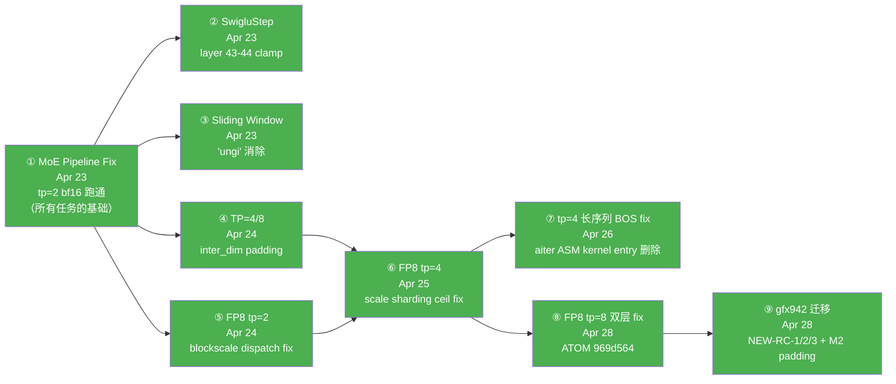
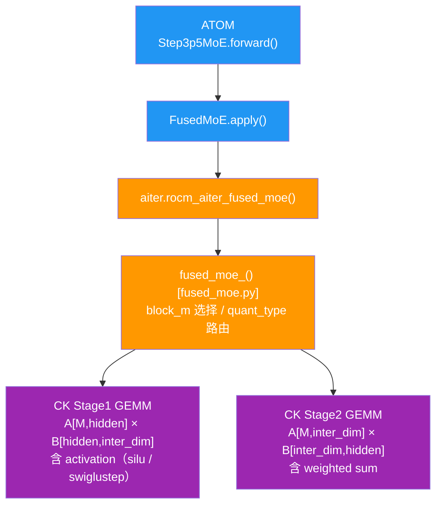

# Step-3.5-Flash 全栈推理支持

> **TL;DR**：在 ATOM + aiter + composable_kernel 三仓上实现 StepFun `Step-3.5-Flash`（BF16）和 `Step-3.5-Flash-FP8`（FP8 blockscale 量化）模型在 AMD MI350X (gfx950) 与 MI308X (gfx942) 上的端到端推理。覆盖 tp=2/4/8 三档 tensor parallel；最终状态 19/20 PASS（gfx950 tp=8 BF16 因 GPU5 硬件异常阻塞）。

---

## 项目概览

| 维度 | 数值 |
|---|---|
| **模型** | `stepfun-ai/Step-3.5-Flash`（BF16）+ `stepfun-ai/Step-3.5-Flash-FP8`（FP8） |
| **架构** | hidden=4096；45 layers（dense 0-2 + MoE 3-44）；288 routed + 1 shared expert / top-8 / sigmoid 路由；moe_intermediate_size=1280；layer 43-44 SwigluStep（clamp ±7）；attention ~1/4 full FMHA + ~3/4 sliding window (window=512) |
| **目标硬件** | 8× AMD MI350X (gfx950)，每卡 252 GB HBM；扩展支持 8× MI308X (gfx942 / UBB 平台)，每卡 192 GB HBM |
| **推理框架** | ATOM (`feat/step3p5-flash-support`) + aiter (`feat/step3p5-moe-swiglustep`) + composable_kernel (`feat/swiglustep-moe-no-quant`) |
| **起始状态** | 模型完全无法跑，首次运行即 crash（MoE 输出全错） |
| **最终状态** | 见下方"最终状态"表 |

---

## 一级文件导航

| 文件 | 用途 | 何时读 |
|---|---|---|
| **`README.md`**（本文件）| 项目入口 + TL;DR + 时间线 + details/ 完整索引 | 第一次接触本项目 |
| **`REPRODUCE.md`** | 端到端复现指南（gfx942 / MI308X / FP8 单路径；gfx950 历史路径见 `details/`） | 想从零跑通推理 |
| **`CODE_CHANGES.md`** | 三仓所有 code 改动总账（per-repo + per-feature 视图） | 想知道改了哪些代码 |
| **`details/`** | 所有详细内容下沉（topics/research/perf/issues/projects/meta/scripts/verification_pipeline 8 类） | 想深入某个 topic |

> **快速开始**：想复现 → `REPRODUCE.md`；想看改了啥 → `CODE_CHANGES.md`；想深入某 topic → 下方 details/ 索引。

---

## 时间线与任务依赖



**说明**：① 是所有后续任务的唯一前置条件。
- ②③④⑤ 在 ① 完成后相互独立并行
- ⑥（FP8 tp=4）依赖 ④（weight padding 方案）和 ⑤（blockscale dispatch 理解）
- ⑦（tp=4 长序列 BOS fix）由 ⑥ 引入新 testcase 后暴露
- ⑧（FP8 tp=8 双层 fix）+ ⑨（gfx942 迁移）扩展硬件 / TP 维度

---

## 最终状态

### gfx950 (MI350X)

| 配置 | 状态 | TTFT | TPOT |
|------|------|------|------|
| tp=2 BF16 | PASS | ~91 ms | ~16 ms |
| tp=4 BF16 | PASS | ~76 ms | ~15 ms |
| tp=8 BF16 | GPU5 硬件阻塞 | — | — |
| tp=2 FP8  | PASS | ~91 ms | ~16 ms |
| tp=4 FP8  | PASS（短序列）；长序列见 `details/topics/07_tp4_longseq_bos_fix.md` | ~93 ms | ~13 ms（比 BF16 快 19%） |

### gfx942 (MI308X)

| 配置 | 状态 | 备注 |
|---|---|---|
| tp=2 FP8 (M1) | PASS | 4/4 prompt coherent |
| tp=4 FP8 (M2) | PASS | 4/4 prompt coherent；与 tp=2 P3 byte-identical 143/143 chars |
| tp=8 FP8 | PASS | 需 ATOM `969d564`（双层 fix）+ aiter NEW-RC-3 working-tree patch |

详见 `REPRODUCE.md` §6 anchors + `details/projects/14_migration_gfx942/MIGRATION_REPORT.md`。

---

## 架构速查

```
Step-3.5-Flash 模型结构：
  45 layers，hidden=4096
  层 0-2:  Dense MLP
  层 3-44: MoE（288 routed + 1 shared expert，top-8，sigmoid 路由）
           moe_intermediate_size=1280
           层 43-44: SwigluStep activation（clamp ±7）

TP 分割后 inter_dim（moe_intermediate_size / TP）：
  tp=2 → 640    tp=4 → 320    tp=8 → 160

Attention 分布：
  ~1/4 层：full attention（FMHA）
  ~3/4 层：sliding window attention（window=512）

推理调用链（MoE）：
  ATOM Step3p5MoE.forward()
    → FusedMoE.apply()
      → aiter.rocm_aiter_fused_moe() / fused_moe()
        → CK 2-stage GEMM（stage1: gate+up projection，stage2: down projection）
```



---

## details/ 完整索引

> 本节列出 `details/` 下所有子项；与重构后实际目录 1:1 对齐，0 dead link。

### details/topics/ — 子任务与 code 改动详述（11 项）

| 文件 | 内容 |
|---|---|
| [`details/topics/01_moe_pipeline.md`](./details/topics/01_moe_pipeline.md) | 子任务 1：MoE GEMM 数值错误根因与修复（ATOM `ec8cbe87` + aiter `68fc7d48b/3771835ac`），所有任务的基础 |
| [`details/topics/02_swiglu_step.md`](./details/topics/02_swiglu_step.md) | 子任务 2：Layer 43-44 SwigluStep 激活函数 wiring（aiter + CK + ATOM 三仓协调）|
| [`details/topics/03_sliding_window.md`](./details/topics/03_sliding_window.md) | 子任务 3：Sliding window attention mask off-by-one 修复（"ungi" 消除）|
| [`details/topics/04_tp_support.md`](./details/topics/04_tp_support.md) | 子任务 4：TP=4/8 MoE kernel alignment（inter_dim 320→384 padding）|
| [`details/topics/05_fp8_inference.md`](./details/topics/05_fp8_inference.md) | 子任务 5：FP8 block-quantized 推理（tp=2 入门，blockscale dispatch fix）|
| [`details/topics/06_fp8_tp4.md`](./details/topics/06_fp8_tp4.md) | 子任务 6：FP8 tp=4 三层 bug（check / padding / scale sharding ceil）|
| [`details/topics/07_tp4_longseq_bos_fix.md`](./details/topics/07_tp4_longseq_bos_fix.md) | tp=4 长序列 prefill 全 BOS 根因与修复（aiter `a2883ab37`，移除 buggy ASM kernel entry）|
| [`details/topics/12_reproduction_guide_fp8_tp4.md`](./details/topics/12_reproduction_guide_fp8_tp4.md) | gfx950 FP8 tp=4 详细复现指南（416 行；REPRODUCE.md "路径 A 完整版"，superseded by REPRODUCE.md，**保留作历史参考**）|
| [`details/topics/18_fp8_tp8_root_cause_and_fix/`](./details/topics/18_fp8_tp8_root_cause_and_fix/) | FP8 tp=8 双层 root cause + fix（ATOM `969d564`）；`TP8_ROOT_CAUSE_AND_FIX.md` + `WAVE_CLOSE.md` |
| [`details/topics/repro_info.md`](./details/topics/repro_info.md) | 三仓代码版本/分支/HEAD 实采（snapshot at 2026-04-28；REPRODUCE.md 来源之一，superseded by REPRODUCE.md，**保留作历史参考**）|
| [`details/topics/code_changes_all_repos.md`](./details/topics/code_changes_all_repos.md) | 三仓 code 改动全记录原版（719 行；CODE_CHANGES.md 来源之一，superseded by CODE_CHANGES.md，**保留作历史参考**）|

### details/research/ — 调研、原理、ISA 约束（5 项）

| 文件 | 内容 |
|---|---|
| [`details/research/08_moe_no_padding_research.md`](./details/research/08_moe_no_padding_research.md) | MoE no-padding 调研（inter_dim=320→384 padding 是否可消除，已审查定稿）|
| [`details/research/09_moe_no_padding_deep_dive.md`](./details/research/09_moe_no_padding_deep_dive.md) | 为什么 FP8 MoE kernel 需要 padding（深度分析）|
| [`details/research/10_fp8_mfma_kpack32_constraint.md`](./details/research/10_fp8_mfma_kpack32_constraint.md) | gfx950 FP8 mfma KPack=32 约束（blockscale MoE 不能去 padding 的 ISA 级根因）|
| [`details/research/11_tensor_parallelism_strategy.md`](./details/research/11_tensor_parallelism_strategy.md) | 张量并行策略：原理 + 每个算子 TP 行为（ATOM 实现）|
| [`details/research/19_kernel_dispatch_report/`](./details/research/19_kernel_dispatch_report/) | Step-3.5-Flash-FP8 kernel dispatch 路径报告（gfx950 tp=2/4 实测验证）|

### details/perf/ — 性能 eval（2 项）

| 文件 | 内容 |
|---|---|
| [`details/perf/15_perf_tp2_tp4_tp8_eval/`](./details/perf/15_perf_tp2_tp4_tp8_eval/) | gfx942 上 TP=2/4/8 性能评估（含 tp=8 起服 evaluation；PERF_REPORT.md + logs/ + progress/）|
| [`details/perf/16_perf_gfx950_verified/`](./details/perf/16_perf_gfx950_verified/) | gfx950 性能基线（统一脚本测；RESULTS.md + logs/ + progress/）|

### details/issues/ — upstream issue draft（1 项）

| 文件 | 内容 |
|---|---|
| [`details/issues/17_atom_moe_tp8_load_crash/`](./details/issues/17_atom_moe_tp8_load_crash/) | ATOM tp=8 weight load crash bug 报告草稿（中英 + WAVE_CLOSE，**未 file upstream**；本地已由 ATOM `969d564` 解）|

### details/projects/ — 整建制子项目（1 项）

| 文件 | 内容 |
|---|---|
| [`details/projects/14_migration_gfx942/`](./details/projects/14_migration_gfx942/) | gfx950 → gfx942 (MI308X) 完整迁移项目；含 `MIGRATION_REPORT.md` (625 行) + `TEAM_CONFIG.md` + `progress/dc-t1-t5.md`；M1 tp=2 + M2 tp=4 PASS；NEW-RC-1/2/3 + M2 padding 四 root cause |

### details/verification_pipeline/ — V01-V07 验证 pipeline

| 文件 | 内容 |
|---|---|
| [`details/verification_pipeline/MASTER_PIPELINE.md`](./details/verification_pipeline/MASTER_PIPELINE.md) | 7 个修复的验证执行计划 |
| [`details/verification_pipeline/V01_moe.md`](./details/verification_pipeline/V01_moe.md) ~ `V07_longseq_bos.md` | 各 fix 的 unit 验证脚本与判定 |
| [`details/verification_pipeline/REVIEW_A.md`](./details/verification_pipeline/REVIEW_A.md) / `REVIEW_B.md` / `REVIEW_C.md` / `PIPELINE_REVIEW_FINAL.md` | 三重交叉审核 + final review |
| [`details/verification_pipeline/QUICKSTART.md`](./details/verification_pipeline/QUICKSTART.md) | 5 分钟入门 |
| [`details/verification_pipeline/phase0_preflight.sh`](./details/verification_pipeline/phase0_preflight.sh) | 环境预检脚本（保留原位，未拆出 scripts/）|
| [`details/verification_pipeline/results/`](./details/verification_pipeline/results/) | V01-V07 + phase0 实测结果汇总（`SUMMARY.md` + 单 V 子文件）|
| [`details/verification_pipeline/TEAM_CONFIG_verification.md`](./details/verification_pipeline/TEAM_CONFIG_verification.md) / `NEXT_TASK_BRIEF.md` | 项目协调元文档 |

### details/meta/ — 工作流元文档（1 项）

| 文件 | 内容 |
|---|---|
| [`details/meta/13_recall_system_analysis.md`](./details/meta/13_recall_system_analysis.md) | Recall 工具实战指南 |

### details/scripts/ — 复现脚本（1 项）

| 文件 | 内容 |
|---|---|
| [`details/scripts/perf_correctness_bench.py`](./details/scripts/perf_correctness_bench.py) | gfx950/gfx942 标准化 perf + correctness 联跑测试脚本（被 `details/perf/16_perf_gfx950_verified/` 引用）|

---

## 环境

```bash
# 平台（参考开发环境）
8× MI350X (gfx950)，ROCm 7.x

# Python（必须 cd /tmp 避免 aiter namespace 问题）
cd /tmp && /opt/venv/bin/python

# 关键路径（开发主机）
ATOM:  /home/hanchang/ATOM
aiter: /home/hanchang/aiter
git:   /home/hanchang/junlin12_repos/{aiter,atom}（author: Jun Lin <junlin12@amd.com>）

# 标准推理命令（tp=2 bf16）
rm -rf /root/.cache/atom/* && cd /tmp && CUDA_VISIBLE_DEVICES=0,1 \
  AITER_LOG_LEVEL=WARNING \
  python -m atom.examples.simple_inference \
  --model stepfun-ai/Step-3.5-Flash --kv_cache_dtype bf16 --trust-remote-code \
  --tensor-parallel-size 2 --level 0 --temperature 0 --max-tokens 128 \
  --max-num-batched-tokens 4096 --max-num-seqs 2048
```

完整端到端复现见 `REPRODUCE.md`。
