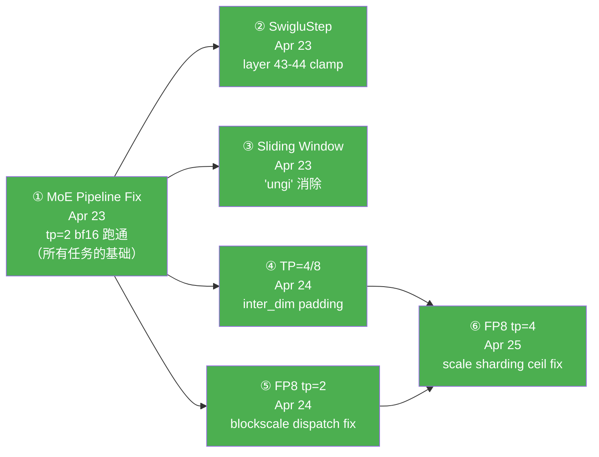
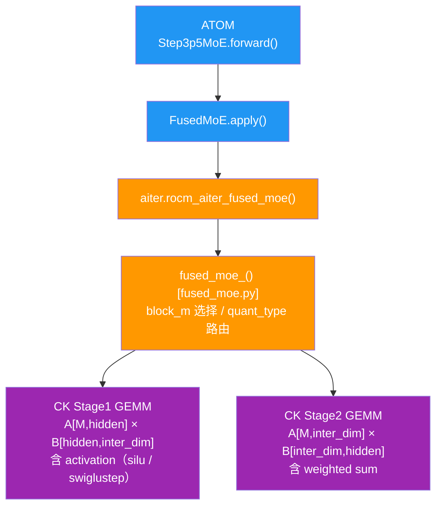

# Step-3.5-Flash 全栈推理支持

## 背景

**模型**：StepFun Step-3.5-Flash（BF16）及 Step-3.5-Flash-FP8（FP8 权重量化）
**硬件**：8× AMD MI350X (gfx950)，每卡 252GB HBM
**目标**：在 ATOM 推理框架上跑通 tp=2/4/8 BF16 推理及 tp=2 FP8 推理
**起始状态**：模型完全无法跑，首次运行即 crash（MoE 输出全错）

---

## 时间线与任务依赖



**说明**：① 是所有后续任务的唯一前置条件。
- ②③④⑤ 在 ① 完成后相互独立并行
- ⑥（FP8 tp=4）依赖 ④（weight padding 方案）和 ⑤（blockscale dispatch 理解）

---

## 最终状态

| 配置 | 状态 | TTFT | TPOT |
|------|------|------|------|
| tp=2 BF16 | ✅ | ~91ms | ~16ms |
| tp=4 BF16 | ✅ | ~76ms | ~15ms |
| tp=8 BF16 | ⚠️ GPU5 硬件阻塞 | — | — |
| tp=2 FP8 | ✅ | ~91ms | ~16ms |
| tp=4 FP8 | ✅（短序列）⚠️ | ~93ms | ~13ms（比 BF16 快 19%） |

---

## 子任务详情

| 文档 | 内容 |
|------|------|
| [01_moe_pipeline.md](./01_moe_pipeline.md) | MoE GEMM 数值错误根因与修复（两个独立 Bug） |
| [02_swiglu_step.md](./02_swiglu_step.md) | Layer 43-44 SwigluStep 激活函数 wiring |
| [03_sliding_window.md](./03_sliding_window.md) | Sliding window attention mask off-by-one |
| [04_tp_support.md](./04_tp_support.md) | TP=4/8 MoE kernel alignment 问题与修复 |
| [05_fp8_inference.md](./05_fp8_inference.md) | FP8 block-quantized 模型推理支持（tp=2） |
| [06_fp8_tp4.md](./06_fp8_tp4.md) | FP8 tp=4：三层 bug（check/padding/scale sharding ceil） |
| [07_tp4_longseq_bos_fix.md](./07_tp4_longseq_bos_fix.md) | tp=4 长序列 prefill 全 BOS 根因与修复 |
| [08_moe_no_padding_research.md](./08_moe_no_padding_research.md) | MoE no-padding 调研（inter_dim=320→384 padding 是否可消除） |
| [09_moe_no_padding_deep_dive.md](./09_moe_no_padding_deep_dive.md) | 为什么 FP8 MoE kernel 需要 padding（深度分析） |
| [10_fp8_mfma_kpack32_constraint.md](./10_fp8_mfma_kpack32_constraint.md) | gfx950 FP8 mfma KPack=32 约束（blockscale MoE 不能去 padding 的 ISA 级根因） |
| [11_tensor_parallelism_strategy.md](./11_tensor_parallelism_strategy.md) | 张量并行策略：原理 + 每个算子 TP 行为 |
| [12_reproduction_guide_fp8_tp4.md](./12_reproduction_guide_fp8_tp4.md) | FP8 tp=4 推理复现指南（TTFT≈86ms / TPOT≈13ms） |
| [13_recall_system_analysis.md](./13_recall_system_analysis.md) | Recall 工具实战指南 |
| [14_migration_gfx942/MIGRATION_REPORT.md](./14_migration_gfx942/MIGRATION_REPORT.md) | gfx950 → gfx942(MI308X) 迁移；M1 tp=2 + M2 tp=4 PASS；NEW-RC-1/2/3 三 RC |
| [15_perf_tp2_tp4_tp8_eval/PERF_REPORT.md](./15_perf_tp2_tp4_tp8_eval/PERF_REPORT.md) | gfx942 上 TP=2/4/8 性能评估（含 tp=8 起服） |
| [16_perf_gfx950_verified/RESULTS.md](./16_perf_gfx950_verified/RESULTS.md) | gfx950 性能基线（统一脚本测） |
| [17_atom_moe_tp8_load_crash/README.md](./17_atom_moe_tp8_load_crash/README.md) | ATOM MoE tp=8 load_w2 / load_w13 narrow size<0 issue draft（未 file upstream） |
| [18_fp8_tp8_root_cause_and_fix/README.md](./18_fp8_tp8_root_cause_and_fix/README.md) | FP8 tp=8 起服双层 root cause + fix（ATOM `969d564`） |
| [19_kernel_dispatch_report/REPORT.md](./19_kernel_dispatch_report/REPORT.md) | FP8 tp=2/4 每类 op 的 torch / CK / ASM kernel 归属（gfx950；rename from 17_kernel_dispatch_report） |

### 跨 topic 资产

| 路径 | 内容 |
|------|------|
| [verification_pipeline/](./verification_pipeline/) | V01-V07 验证 pipeline（覆盖 01-07）；`MASTER_PIPELINE.md` / `PIPELINE_REVIEW_FINAL.md` / `results/SUMMARY.md` / `NEXT_TASK_BRIEF.md` |
| [code_changes_all_repos.md](./code_changes_all_repos.md) | ATOM / aiter / CK 三仓 commit 集中索引（snapshot at 2026-04-29） |
| [repro_info.md](./repro_info.md) | FP8 tp=4 推理复现环境信息 |
| [perf_correctness_bench.py](./perf_correctness_bench.py) | 16_perf_gfx950_verified 引用的 perf + correctness 测试脚本 |

---

## 架构速查

```
Step-3.5-Flash 模型结构：
  45 layers，hidden=4096
  层 0-2:  Dense MLP
  层 3-44: MoE（288 routed + 1 shared expert，top-8，sigmoid 路由）
           moe_intermediate_size=1280
           层 43-44: SwigluStep activation（clamp ±7）

TP 分割后 inter_dim（moe_intermediate_size / TP）：
  tp=2 → 640    tp=4 → 320    tp=8 → 160

Attention 分布：
  ~1/4 层：full attention（FMHA）
  ~3/4 层：sliding window attention（window=512）

推理调用链（MoE）：
  ATOM Step3p5MoE.forward()
    → FusedMoE.apply()
      → aiter.rocm_aiter_fused_moe() / fused_moe()
        → CK 2-stage GEMM（stage1: gate+up projection，stage2: down projection）
```



---

## 环境

```bash
# 平台
8× MI350X (gfx950)，ROCm

# Python（必须 cd /tmp 避免 aiter namespace 问题）
cd /tmp && /opt/venv/bin/python

# 关键路径
ATOM:  /home/hanchang/ATOM
aiter: /home/hanchang/aiter
git:   /home/hanchang/junlin12_repos/{aiter,atom}（author: Jun Lin <junlin12@amd.com>）

# 标准推理命令（tp=2 bf16）
rm -rf /root/.cache/atom/* && cd /tmp && CUDA_VISIBLE_DEVICES=0,1 \
  AITER_LOG_LEVEL=WARNING \
  python -m atom.examples.simple_inference \
  --model stepfun-ai/Step-3.5-Flash --kv_cache_dtype bf16 --trust-remote-code \
  --tensor-parallel-size 2 --level 0 --temperature 0 --max-tokens 128 \
  --max-num-batched-tokens 4096 --max-num-seqs 2048
```
