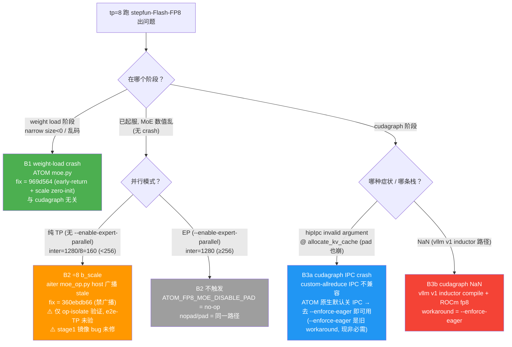

# TP8 / cudagraph 三-bug 辨析（B1 / B2 / B3a / B3b）

> **为什么有这篇**：全仓历史上把 "tp8 crash / tp8 跑不通 / cudagraph 崩" 经常混为一谈，实际是 **4 个相互独立的 bug**（分属 3 层、3 仓、不同触发条件、不同 fix）。本页是唯一的辨析索引；所有 tp8 / cudagraph / nopad 文档应交叉链到本页。
>
> 事实源：`AUDIT_GROUND_TRUTH.md §A` + `NOPAD_TP_HANDOFF.md` + W8_resume `progress/teammate-19b/-21/-22/-23/-24/-25/-26/-29/-30`。

---

## 0. 一句话区分

- **B1** = weight **加载阶段** crash（与 cudagraph 无关）。
- **B2** = MoE **数值** bug（÷8 b_scale），**只在纯 TP 的 nopad(inter=160) 路径触发**，EP / pad 路径不触发。
- **B3a / B3b** = **cudagraph** 相关（IPC crash / NaN），**与 nopad 无关，pad 也会遇到**。

---

## 1. 三-bug 对照表

| bug | 层 / 仓 | 触发条件 | 根因 | fix | 验证状态 | 现有文档 |
|---|---|---|---|---|---|---|
| **B1** weight-load crash | ATOM `atom/model_ops/moe.py` | tp=8 weight load（**与 cudagraph 无关**）| `_load_w2 narrow() size<0`（trailing rank 越界）+ fp32 scale 残留 `torch.ones()` 让 fp8 raw bits 当 bf16 用 → gibberish | ATOM **`969d564`**：trailing rank early-return + scale `.zero_()` 初始化（双层 fix）| ✅ 已修，tp=8 PASS（gfx942 4/4 coherent）| `details/topics/18_fp8_tp8_root_cause_and_fix/` + `details/issues/17_atom_moe_tp8_load_crash/` |
| **B2** ÷8 b_scale | aiter `aiter/ops/moe_op.py`（host）| **纯 TP** 的 nopad：inter_dim = 1280/8 = **160**（`<256` 触发 smalltile，NPerBlock=32）。**EP（inter=1280≥256）/ pad 路径不触发** | host `_maybe_broadcast_w2_scale_for_smalltile` 广播契约 **stale**：把 w2_scale 广播成 per-expert stride **512**（=ceil(N·2,NPerBlock)·ceil(K,SBK)），但 CK e90ecddea kernel 用 stride **64**（=ceil(N,ScaleBlockN)·ceil(K,SBK)）读 per-128 布局 → 512 vs 64（×8）不匹配 → kernel 对所有 expert 读 `floor(e/8)` 的 scale | aiter **`360ebdb66`**：早返回**禁用广播**（kernel 直接消费原始 per-128 w2_scale）；仅 `inter<256` 小 tile 路径生效，pad 路径零影响 | 🟡 **仅 op-isolate（inter=160 真实 dump）验证**：per-expert load-decode 全=self、correct-ref sink cos 0.11→1.00、cos<0.99=0/76（T21 ACCEPT）。🔴 **e2e（TP）未验证**（此前 e2e 误用 EP=inter1280，从未跑到 nopad）。🔴 **stage1 镜像 bug 未修**（须 quant 层 gate/up 分离量化，详 B2 注） | 仅 `NOPAD_TP_HANDOFF.md`（本仓其余文档此前 0 提及）|
| **B3a** cudagraph IPC crash | vllm-direct / plugin 路径 | TP8 + cudagraph（**pad 也崩，非 nopad 特异**）| **custom-allreduce IPC 不兼容**：`hipIpcGetMemHandle invalid argument` @ `allocate_kv_cache` barrier | **ATOM 原生 `simple_inference` / `EngineArgs` 默认全关 IPC-allreduce**（custom-allreduce OFF + quick-reduce NONE，走 RCCL）→ **去掉 `--enforce-eager` 即可用 cudagraph，无需改代码**；仅 custom-allreduce ON 的路径（vllm-direct/plugin）才需显式关 | ✅ ATOM 原生栈下 cudagraph 可用（T26）；EP+cudagraph e2e 跑通（T24）| W8 `progress/teammate-25/-26` + `REPRODUCE.md §6.2-EP` cudagraph 小节 |
| **B3b** cudagraph NaN | vllm-direct（vllm v1 inductor）| tp=8 + cudagraph（vllm v1 路径）| vllm v1 inductor compile / cudagraph + ROCm fp8 互动（**不在 SwigluStep、不在 SWA**，更底层）| workaround = `--enforce-eager`（vllm v1 路径仍需）| 见 integration 教训 5（T67/T71 双证）| `INTEGRATION_PATCHES.md` + `details/integration/03_lessons.md` 教训 5 |

> **B2 注（stage1 镜像 bug，已定性未修）**：stage1 `_maybe_broadcast_w1_scale_for_smalltile` 同契约不匹配，但更复杂——live 实测 incoming w1_scale = `(E,3,32)` 连续，`[E,3,32]` 在 gate/up 边界（inter=160 非 128 对齐）信息丢失，**host 不可重构**，须 **quant 层** gate/up 各自 per-128 量化成 `[E,4,32]`（stride 128）。详 `NOPAD_TP_HANDOFF.md §4.2` / W8 `progress/teammate-22/-23`。

> **B2 vs perf/21 张力**：`details/perf/21_nperblock64_4layer_joint_patch/` 文档的是**相反方向**的修法——**改 kernel（用 ceil(2N,NPerBlock) 布局）+ 保留 per-NPerBlock 广播**；B2 的生产修法是**禁用广播**（让 kernel 读原始 per-128）。perf/21 自标 production 路径 **DEFERRED / 未验证**。两者勿混用；引用 perf/21 前先对账本页 B2 + `NOPAD_TP_HANDOFF.md`。

---

## 2. 决策树：我遇到的是哪个 bug？

---

## 3. 关键不变量（避免再混读）

1. **B2 只活在纯 TP 的 inter=160 路径**。EP（inter=1280）下 `ATOM_FP8_MOE_DISABLE_PAD` 是 no-op，nopad 与 pad 是同一路径 → EP 下测到的 "nopad vs pad 微差" = run-to-run 噪声，**不可解读为 nopad/pad 对比**（T29 坐实）。
2. **B2 的 fix 尚未在 e2e(TP) 闭环验证**：此前所有 e2e/perf（T24/26/27/28）误用 EP，从未触发 inter=160 → fix 在 e2e 中从未执行。接手第一要务见 `NOPAD_TP_HANDOFF.md §5`（纯 TP `simple_inference` 先 revert 复现 garbled、再上 fix 看 coherent）。
3. **B3a/B3b 与 nopad 无关**：cudagraph 崩是 IPC / inductor 层，pad 路径同样会遇到；勿归因到 nopad。
4. **`--enforce-eager` 在 ATOM 原生栈已非必需**（B3a 解法）；仅 vllm-direct（B3b）/ custom-allreduce ON 的路径仍需。

---

## 4. 交叉链

- **EP vs TP / nopad 触发条件 + perf**：`REPRODUCE.md §6.2`（纯 TP anchor）+ `§6.2-EP`（EP anchor + cudagraph + EP 时间线）。
- **nopad(TP inter=160) bug/fix 全貌 + 接手 plan**：`NOPAD_TP_HANDOFF.md`。
- **B1 root cause + fix**：`details/topics/18_fp8_tp8_root_cause_and_fix/TP8_ROOT_CAUSE_AND_FIX.md` + `details/issues/17_atom_moe_tp8_load_crash/`。
- **B3b NaN + 集成 patch**：`INTEGRATION_PATCHES.md` + `details/integration/03_lessons.md`。
- **perf/21 反向修法张力**：`details/perf/21_nperblock64_4layer_joint_patch/`（引用前先对账本页 B2）。
