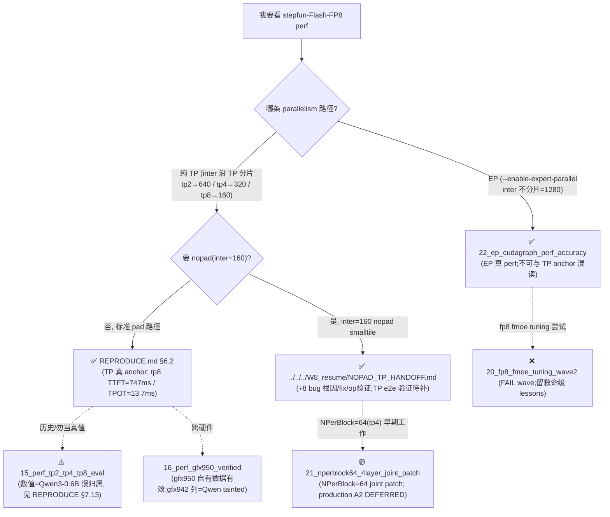
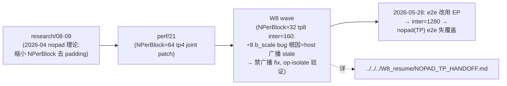

# details/perf/ — 导航(读哪个 perf 文档?)

> Step-3.5-Flash-FP8 性能文档索引。**本目录历史跨度大、配置易混(EP vs TP / Qwen-tainted / FAIL / nopad)**,先看下方决策树再进具体文件。
> 权威事实基准:`AUDIT_GROUND_TRUTH.md`;真 perf anchor:`REPRODUCE.md §6.2`(纯 TP)/ `22_ep_*.md`(EP)。

## 决策树:我要看什么 perf?

## 文件一览

| 文件 | 状态 | 硬件 | 一句话 |
|---|---|---|---|
| `22_ep_cudagraph_perf_accuracy_2026-06-03.md` | ✅ 有效(EP) | gfx942 | EP(inter=1280) cudagraph perf + cudagraph 修复 + EP 精度弱验证;**不可与 TP anchor 混读** |
| `16_perf_gfx950_verified/` | ⚠️ 部分有效 | gfx950 | §一 gfx950 自有数据(428.7/382.9ms)有效;跨 gfx942 对比列=Qwen tainted(已 strikethrough) |
| `21_nperblock64_4layer_joint_patch/` | 🟡 DEFERRED | gfx942 | tp4 inter=320 NPerBlock=64 joint patch;correctness bit-exact;**production A2 未验证 + 与 W8 禁广播张力(见其 §10/§11)** |
| `20_fp8_fmoe_tuning_wave2/` | ❌ FAIL | gfx942 | fp8 fmoe OPT-1 tuning wave-level 证伪;保留 3 条救命级 lessons |
| `15_perf_tp2_tp4_tp8_eval/` | ⚠️ Qwen-tainted | gfx942 | 全文数值=Qwen3-0.6B 误归属(非 stepfun);系 pure-TP-pad-256 历史报告;真值见 REPRODUCE §6.2 |

## 关键概念:EP vs TP(本目录最大混淆源)

| | 纯 TP | EP(`--enable-expert-parallel`) |
|---|---|---|
| MoE inter 切分 | 沿 TP 切(tp8→160) | 按 expert 切,**inter 不切=1280** |
| nopad smalltile(inter=160) | tp8 **触发** | **不触发**(1280≥256,`ATOM_FP8_MOE_DISABLE_PAD` no-op) |
| perf 文档 | REPRODUCE §6.2 / 15(Qwen) / 16 | 22 |

→ **EP 与 TP 不同 parallelism,perf 数字不可直接比**。详 `22_*.md` §4 / `AUDIT_GROUND_TRUTH.md` §A2。

## nopad fix 时间线(理论→实现→bug)

