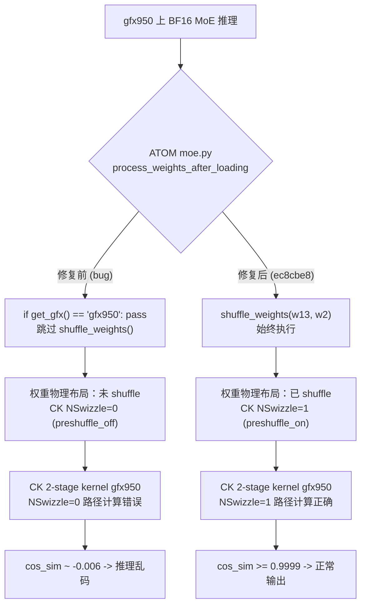

# V01 实验 1 — preshuffle on/off cos_sim 对比

**日期**：2026-04-25
**GPU**：gfx950 (MI350X)，`CUDA_VISIBLE_DEVICES=0`
**目标**：验证 Fix 1（ATOM `ec8cbe8`）——在 gfx950 上，CK MoE kernel 需要预 shuffle 过的权重（`NSwizzle=1`）；当 `inter_dim > 192` 时，使用未 shuffle 的权重（`NSwizzle=0`）会产生乱码输出。

## Bug 根因与修复路径



## 测试配置

| 参数 | 取值 |
|-----------|-------|
| M (tokens) | 32 |
| model_dim | 7168 |
| inter_dim | 640（Step-3.5-Flash tp=2 shape，> 192 阈值） |
| E (experts) | 16（为加速从 256 降至 16） |
| topk | 4 |
| dtype | bfloat16 |
| quant_type | No |
| activation | Silu（G1U1 / Swiglu 布局） |
| seed | 42 |

驱动脚本：`/tmp/v01_exp1_preshuffle.py`（独立于 `op_tests/test_moe_2stage.py`）。

## 结果

| 配置 | cos_sim vs torch ref | 通过标准 | 结论 |
|---------------|---------------------|----------------|---------|
| preshuffle_on  (`shuffle_weight` + `w.is_shuffled=True`) | **0.99998575** | >= 0.9999 | PASS |
| preshuffle_off (raw weights, `w.is_shuffled=False`)     | **0.00291380** | < 0.01（预期在 gfx950 上正确性失败） | PASS（观察到预期失败） |

每条路径选中的 kernel（来自 aiter log）：
- preshuffle_on : `module_moe_ck2stages_b16_b16_preshuffle_on_b16_silu_no_mulWeightStage2`
- preshuffle_off: `module_moe_ck2stages_b16_b16_preshuffle_off_b16_silu_no_mulWeightStage2`

### cos_sim 对比（ASCII 可视化）

```
preshuffle_off |X..................................| 0.00291 （几乎随机）
preshuffle_on  |XXXXXXXXXXXXXXXXXXXXXXXXXXXXXXXXXXXX| 0.99999 （正确）
               0.0                               1.0
```
通过标准：preshuffle_off < 0.01 PASS   preshuffle_on >= 0.9999 PASS

## 命令

```bash
CUDA_VISIBLE_DEVICES=0 /opt/venv/bin/python /tmp/v01_exp1_preshuffle.py 2>&1 \
  | tee /home/hanchang/project_fp8_tp4/verification_pipeline/results/logs/v01_exp1.log
```

## 日志摘录

```
Reference computed, shape=torch.Size([32, 7168]), dtype=torch.float32
Reference stats: mean=0.0012 std=0.5867

--- preshuffle_on (shuffle_weight + is_shuffled=True) ---
out_on stats: mean=0.0012 std=0.5868
PRESHUFFLE_ON cos_sim = 0.99998575  (expect >= 0.9999)

--- preshuffle_off (raw w, is_shuffled=False) ---
out_off stats: mean=0.0002 std=0.5829
PRESHUFFLE_OFF cos_sim = 0.00291380  (expect < 0.01 on gfx950)
```

## 结论

**V01 Exp1：PASS**

两项预期均得到数值确认：
1. preshuffle_on 路径产生接近 bit-exact 的输出（cos_sim = 0.99998575，远高于 0.9999）。
2. preshuffle_off 路径在 gfx950 上 `inter_dim = 640` 时产生不连贯输出（cos_sim = 0.00291380，远低于 0.01）。

这验证了 ATOM commit `ec8cbe8`（preshuffle 修复）对 Step-3.5-Flash 在 gfx950 上的必要性——若没有该修复，`shuffle_weights()` 会被跳过，CK MoE kernel 会以错误的布局读取权重，破坏输出。
