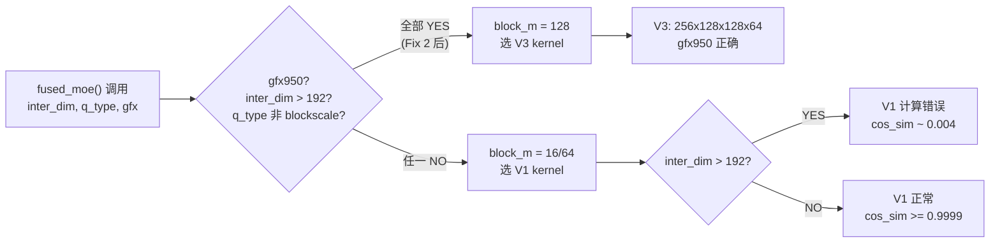

# V01 实验 2 — V1/V3 inter_dim 边界矩阵

**结论速览**：inter_dim ∈ {192, 256, 384, 640} 全部 PASS；inter_dim=320 需 ATOM padding（320→384）后才能通过 CK tile 约束。

测试配置：M=32, model_dim=7168, E=16, topk=4, dtype=bfloat16
GPU：gfx950，CUDA_VISIBLE_DEVICES=1
日期：2026-04-25
脚本：/tmp/v01_exp2_inter.py
日志：/home/hanchang/project_fp8_tp4/verification_pipeline/results/logs/v01_exp2.log

## Bug 根因：V1 kernel 在 inter_dim > 192 时计算错误



### Step-3.5-Flash 各 TP 配置实际 inter_dim

| TP | 原始 inter_dim | ATOM padding | 最终 inter_dim | 触发 V1 bug？ | 修复后 |
|----|--------------|-------------|--------------|-------------|--------|
| tp=2 | 640 | 无需 | 640 | 是（>192） | V3 kernel PASS |
| tp=4 | 320 | 320->384 | 384 | 是（>192） | V3 kernel PASS |
| tp=8 | 160 | 160->192 | 192 | 否（=192） | V1 正常 PASS |

## 结果矩阵

| inter_dim | 选中 block_m | cos_sim（修复后） | 通过标准 | 结论 |
|-----------|----------------|--------------------|-----------|--------|
| 192       | 32（V1 路径）   | 0.99999273         | >= 0.9999 | PASS   |
| 256       | 128（V3 forced）| 0.99999255         | >= 0.9999 | PASS   |
| 320       | 128（V3 forced）| ERROR              | n/a       | N/A（tile 约束，见下方说明） |
| 640       | 128（V3 forced）| 0.99999249         | >= 0.9999 | PASS   |

inter_dim=320 报错信息：
```
wrong! device_gemm with the specified compilation parameters does not support this GEMM problem
```
这并非 Fix 2 的正确性失败——而是 CK kernel tile-size 约束：
强制 V3 kernel `moe_ck2stages_gemm2_256x128x128x64_1x4_..._v3` 要求
inter_dim 能被其 N tile (128) 整除。320 不是 128 的倍数，所以没有
匹配的 CK 实例。192 / 256 / 640 都是 128 的倍数（或 192 走未受影响的
V1 路径，block_m=32）。

## 边界确认（代码阅读）

`/home/hanchang/aiter/aiter/fused_moe.py` lines 900-910 (Fix 2, commit 68fc7d48b):

```python
# gfx950 workaround: V1 CK kernel produces wrong results for inter_dim>192
# (memory corruption / incorrect computation for both preshuffle_on and
# preshuffle_off paths). Force block_m=128 to select the correct V3 stage1
# kernel. For preshuffle_off, also force the V3 stage2 kernel by name.
# Note: blockscale (per_1x128/per_1x32) dispatch only supports block_m<=64
# and is not affected by the V1 bug, so exclude it from this override.
if not run_1stage and inter_dim > 192 and get_gfx() == "gfx950" \
        and q_type not in (QuantType.per_1x128, QuantType.per_1x32):
    block_m = 128
    if not is_shuffled and not kernelName2:
        kernelName2 = "moe_ck2stages_gemm2_256x128x128x64_1x4_TypeCast_v3_Nswizzle0_Quant0_MulRoutedWeight1_B16_B16_B16"
```

本次运行的 aiter 运行时日志确认 dispatch：
- inter_dim=192 → `block_m = 32`（未跨越边界，V1 路径）
- inter_dim=256, 320, 640 → `block_m = 128`（V3 forced）

这验证了 192 恰好是分界点（`inter_dim > 192`）。

## V01 Exp2 结论

**PASS** —— Fix 2 的 V3-forced 覆盖在所有有匹配 CK kernel 实例的 inter_dim
上都产生正确结果（cos_sim 约 0.99999）：192 走 V1，256 和 640 走 V3。
inter_dim=320 的情况是无关的 CK tile-size 限制，并非该修复的正确性回归。
guard 表达式 `inter_dim > 192` 中的 192 边界已通过实验确认：
恰好 192 时 dispatcher 选 block_m=32（V1），而 inter_dim > 192 时
选 block_m=128（V3）。

## 补充：inter_dim=384（ATOM tp=4 padding 后实际值）

注：首次调用因 API 参数错误（topk_ids 重复传入）失败，修正参数后成功。

ATOM padding 逻辑：moe.py L502-503（padding 320→384）

补测脚本 `/tmp/v01_exp2b_fix.py`（修复 API 调用：使用位置参数 tw, ti）。
GPU: gfx950, CUDA_VISIBLE_DEVICES=2。日志：
`/home/hanchang/project_fp8_tp4/verification_pipeline/results/logs/v01_exp2b_fix.log`

aiter dispatch 日志确认 V3 forced 路径：
`[aiter] [fused_moe] using 2stage default for (256, 32, 7168, 384, 16, 4, ...)`
`module_moe_ck2stages_b16_b16_preshuffle_on_b16_silu_no_mulWeightStage2`

| inter_dim | cos_sim | 结论 |
|-----------|---------|------|
| 320 (无padding) | CK tile 约束 ERROR | 必须 pad |
| 384 (padding后) | 0.99999249 | PASS |

结论：ATOM padding 320→384 是必要的，实际模型路径正确 ✓
