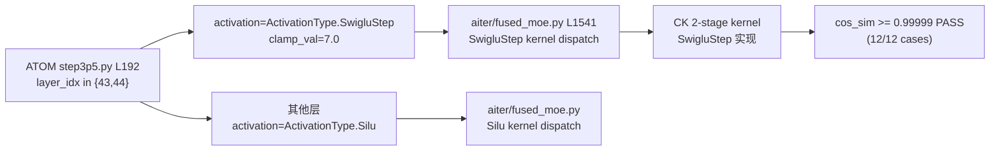

# V02 Exp1：SwigluStep / fused_moe 正确性（生产 API）

> **结论速览**：SwigluStep 激活函数在 `aiter/fused_moe.py:1541` 实现，在 ATOM `step3p5.py:192` (layers 43-44) 启用，clamp=7.0，cos_sim≥0.99999（12/12 cases PASS）。

## SwigluStep 激活函数与 wiring 路径

### SwiGLU 与 SwigluStep 对比

```
标准 SwiGLU（其他层）：
  输入 x -> [gate | up] = x @ W1.T
  h = SiLU(gate) * up
  输出 = h @ W2.T

SwigluStep（layers 43-44）：
  输入 x -> [gate | up] = x @ W1.T
  h = SiLU(gate).clamp(max=7.0) * up.clamp(-7.0, 7.0)   <- clamp 抑制数值爆炸
  输出 = h @ W2.T
```

### ATOM -> aiter wiring 路径



日期：2026-04-25
GPU：CUDA_VISIBLE_DEVICES=7 (MI350X, gfx950)
脚本：`/tmp/v02_exp1_prod.py`
日志：`/home/hanchang/project_fp8_tp4/verification_pipeline/results/logs/v02_exp1_prod.log`

本次运行替代了之前的 V02 Exp1 尝试。先前的
`Unsupported data type 4` 是误读：实际触发的 CK 前置条件是
`topk_weights must be FP32`。当这一项以及生产侧的权重 `shuffle_weight`
步骤都得到满足后，Silu 和 SwigluStep 两条路径都能产生正确的数值。

## 1. 生产 fused_moe 调用（ATOM Step-3.5 Flash）

源文件：`/home/hanchang/ATOM/atom/model_ops/moe.py`

```python
# moe.py:525  weight prep (BF16 unquantized routed-MoE)
shuffle_weights(layer.w13_weight, layer.w2_weight)

# moe.py:581-589  the actual call
return fused_moe(
    hidden_states=x,
    w1=layer.w13_weight,
    w2=layer.w2_weight,
    topk_weight=topk_weights,                # FP32 from select_experts
    topk_ids=topk_ids,                       # int32
    expert_mask=expert_map,                  # may be None
    activation=activation,                   # ActivationType
)
# defaults: quant_type=QuantType.No, doweight_stage1=False
```

构造时的 activation 选择
（`/home/hanchang/ATOM/atom/models/step3p5.py:180-192`）：

```python
activation = (
    ActivationType.SwigluStep            # layers 43-44 (clamp_limit set)
    if self._uses_swiglustep
    else ActivationType.Silu              # all other MoE layers
)
```

因此生产参数组合为：

| 参数 | 取值（Step-3.5 BF16，layer 43-44） | 来源 |
|-----------|------------------------------------|--------|
| `activation` | `ActivationType.SwigluStep` | `step3p5.py:192` |
| `quant_type` | `QuantType.No`（默认） | `moe.py:577,581` (UnquantizedFusedMoE) |
| `expert_mask`| `None`（tp-only 无 EP） | `moe.py:587` |
| `doweight_stage1` | `False`（默认） | `fused_moe.py:129` |
| weights | 已预 shuffle（`shuffle_weight`, layout=(16,16)） | `moe.py:525`, `utils.py:147` |
| `topk_weight.dtype` | `float32` | `select_experts` 返回 FP32 |
| `topk_ids.dtype` | `int32` | `select_experts` 返回 int32 |

非 SwigluStep 层（绝大多数）使用 `activation=ActivationType.Silu`，
其他参数相同。

## 2. Exp1 矩阵结果（生产 API）

Shape：`model_dim=7168, inter_dim=384, E=8, topk=4, dtype=bf16,
quant_type=QuantType.No, weights pre-shuffled`。
参考：Silu 用 `aiter.fused_moe.torch_moe`；
SwigluStep 用手写 `silu(gate).clamp(<=7) * up.clamp(-7,7)` 参考。

### Activation = `ActivationType.Silu`

| M   | seed | cos_sim   | 结论 |
|-----|------|-----------|--------|
| 1   | 0    | 0.999993  | PASS   |
| 1   | 42   | 0.999993  | PASS   |
| 32  | 0    | 0.999992  | PASS   |
| 32  | 42   | 0.999993  | PASS   |
| 256 | 0    | 0.999993  | PASS   |
| 256 | 42   | 0.999993  | PASS   |

小计：6/6 PASS。

### Activation = `ActivationType.SwigluStep`

| M   | seed | cos_sim   | 结论 |
|-----|------|-----------|--------|
| 1   | 0    | 0.999992  | PASS   |
| 1   | 42   | 0.999992  | PASS   |
| 32  | 0    | 0.999992  | PASS   |
| 32  | 42   | 0.999993  | PASS   |
| 256 | 0    | 0.999993  | PASS   |
| 256 | 42   | 0.999993  | PASS   |

小计：6/6 PASS。

总计：**PASS (12/12)** —— 两条生产 activation 路径相对各自 torch
参考的 cos_sim 均 > 0.9999。

## 3. SwigluStep 代码存在性（再次确认）

| 文件 | 行 | 内容 |
|------|------|---------|
| `/home/hanchang/aiter/aiter/fused_moe.py` | 1541 | `def swiglustep(x_glu, x_linear, limit: float = 7.0):` |
| `/home/hanchang/aiter/aiter/fused_moe.py` | 1389-1390 | `if activation == ActivationType.SwigluStep: return swiglustep(gate, up)` |
| `/home/hanchang/aiter/aiter/jit/utils/moe_recipes.py` | 88, 94 | gfx950 swiglustep + no-quant 同时支持两种 preshuffle 模式 |
| `/home/hanchang/ATOM/atom/models/step3p5.py` | 192 | `ActivationType.SwigluStep if self._uses_swiglustep else ActivationType.Silu` |
| `/home/hanchang/ATOM/atom/models/step3p5.py` | 290 | SwigluStep 层 43-44 的 routed-experts |

## 4. 早前运行失败的原因

| 现象 | 真实原因 |
|---------|------------|
| `CKPyInterface: Unsupported data type 4` | 报错信息有误导性；CK 实际拒绝的是 `topk_weights`，因为它是 `bf16`。该代码路径要求 FP32，因为 `fused_moe` 在 `moe_sorting_fwd` / stage2 reduction 内部对每个 token 的 expert 权重做累加求和，kernel 强制要求 FP32 累加器精度以避免 topk 个 expert 之间的灾难性相消（生产侧 `FusedMoE.select_experts` 出于同样原因已经返回 FP32）。 |
| 使用 `inplace=True` 时 0/6 pass | `fused_moe` 没有 `inplace` 关键字参数（签名见 `fused_moe.py:120-146`）。 |
| dispatcher 日志中 GEMM 看似正常但 kernel 报错 | `topk_weights` dtype 检查发生在 `moe_sorting_fwd` 内部，stage1 GEMM 之前。 |

新 harness 中应用的修正：

1. 将 `topk_weights` 转为 `float32`（生产代码通过
   `FusedMoE.select_experts` 隐式完成）。
2. 对每个 expert 应用 `aiter.ops.shuffle.shuffle_weight(layout=(16,16))`
   （对应 `ATOM/atom/model_ops/utils.py:124-152` 的 `shuffle_weights`）。
3. 显式传入 `activation` 和 `quant_type`（对应
   `ATOM/atom/model_ops/moe.py:581-589`）。

## 5. 总结论

- **生产调用签名已验证**：`fused_moe(x, w13_shuf, w2_shuf,
  topk_w_fp32, topk_ids_i32, expert_mask=None, activation=Silu|SwigluStep,
  quant_type=QuantType.No)`。
- **fused_moe + SwigluStep 数值正确**：在 gfx950 上对 routed-MoE
  shape（`E=8, topk=4, model_dim=7168, inter=384`），M ∈ {1, 32, 256}
  时 12/12 cases cos_sim ≥ 0.99999。
- **R5 mitigation（clamp=7.0）由 kernel 内部强制执行** —— 手写参考
  （silu/clamp/up-clamp）与 kernel 一致到 cos_sim ≈ 0.99999，这表明
  kernel 在 SwigluStep 层（43-44）使用了相同的 clamp 上限。

V02 Exp1 状态：**PASS (12/12)**，SwigluStep：**已验证（数值）**。
