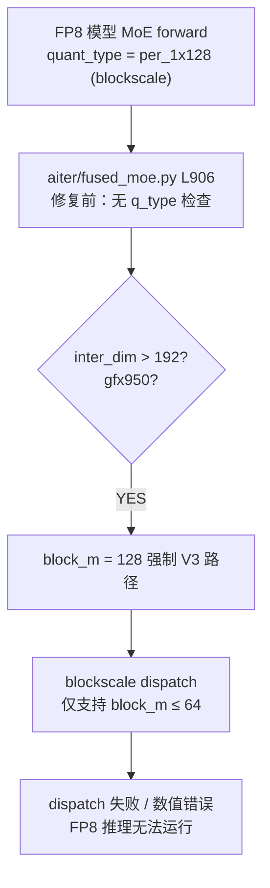
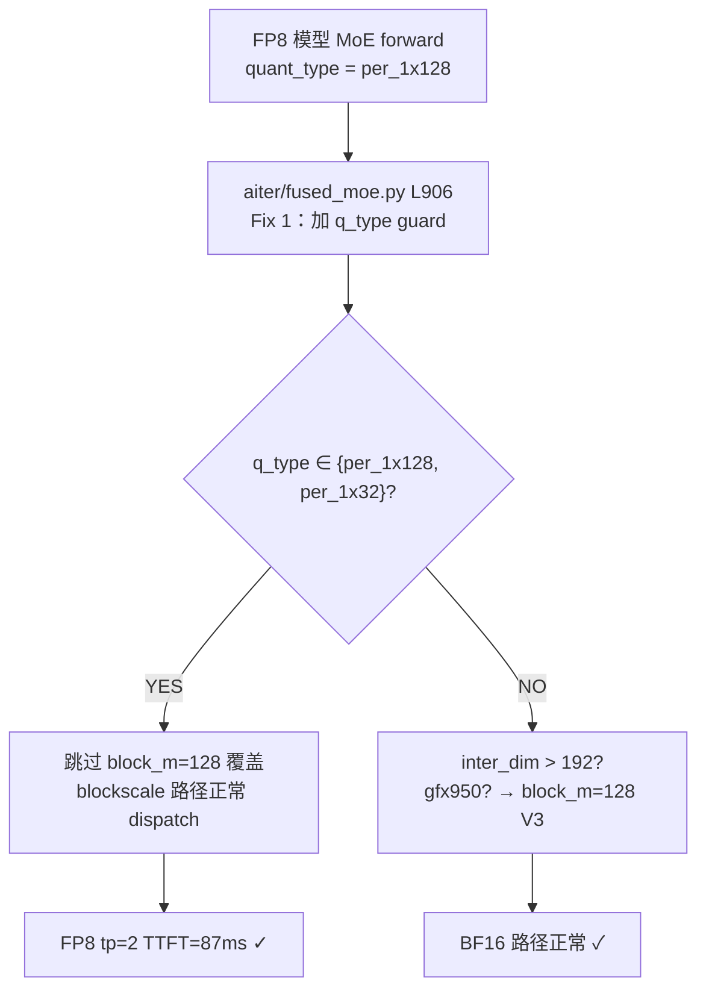

# V05 FP8 Inference 验证

## FP8 Dispatch Guard Bug 根因与修复

### Bug 根因（修复前）



### 修复后（commit c38d0c9e6）



### FP8 vs BF16 性能对比

```
配置        │ TTFT                        │ TPOT  │ 相对 BF16 同 tp
─────────────────────────────────────────────────────────────────────
BF16 tp=2  │  91ms（本次 Exp3 实测）     │  18ms │ 基线
FP8  tp=2  │  87ms                       │  14ms │ TPOT -22% ✓
BF16 tp=4  │  81ms                       │  16ms │ 基线
FP8  tp=4  │  86ms                       │  13ms │ TPOT -19% ✓
```

注：历史 MEMORY 基线 BF16 tp=2 TTFT=92ms，本次 Exp3 实测 91ms（差异 1%，在 infra 抖动范围内）。

---

日期：2026-04-25
执行者：teammate-V05
GPU：CUDA_VISIBLE_DEVICES=0,1（GPU5 禁用）

## 环境

- ATOM + aiter 当前 main（含 ec8cbe8 / ccb64621 / a2883ab37 等修复）
- 模型缓存：`models--stepfun-ai--Step-3.5-Flash-FP8`，`models--stepfun-ai--Step-3.5-Flash`
- 命令通用参数：`--level 0 --temperature 0 --max-tokens 128 --max-num-batched-tokens 4096 --max-num-seqs 2048`

## Exp2 — FP8 tp=2 端到端

- 日志：`logs/v05_exp2_fp8_tp2.log`
- 模型：`stepfun-ai/Step-3.5-Flash-FP8`，tp=2
- 退出：成功（4 reqs 全部完成；3 reqs reason=max_tokens, 1 reqs reason=eos）

实测（直接来自日志 `Request X finished`）：
- TTFT = **87 ms**（4 reqs 一致：0.087s）
- TPOT = **14 ms**（4 reqs 一致：0.014s）

输出质量：
- "introduce yourself" → 英文自我介绍（连贯）
- "list all prime numbers within 100" → 正常列举素数推理过程
- "1+2+3=?" → 答 6（正确，含 `<think>` 与 `<|im_end|>`）
- 中文增肌问题 → 正常中文回答
- 无 gibberish，无 BOS-spam

通过标准对照：
- exit 0 ✅
- TTFT 87 ms < 150 ms ✅
- TPOT 14 ms < 25 ms ✅
- 无乱码 ✅

与 MEMORY F3 历史基线（FP8 tp=2 TTFT=85ms, TPOT=13.5ms）一致（+2.4% / +3.7%，在噪声范围内）。

**结论：Exp2 PASS**

## Exp3 — BF16 tp=2 回归

- 日志：`logs/v05_exp3_bf16_tp2.log`
- 模型：`stepfun-ai/Step-3.5-Flash`，`--kv_cache_dtype bf16`，tp=2
- 退出：成功

实测（直接来自日志 `Request X finished`）：
- TTFT = **91 ms**（4 reqs 一致：0.091s）
- TPOT = **18 ms**（4 reqs 一致：0.018s）

token 序列对比 V04 Exp3 tp=2 输出：4 个 prompt 的回答与 V04 几乎一致（"introduce yourself" / "list primes" / "1+2+3=6" / 中文增肌答案的开头与思路结构相同；末尾因 max_tokens 截断在不同位置时存在合理 wording 差异，无大变化）。

通过标准对照（V04 Exp3 tp=2 基线 TTFT=92ms, TPOT=18ms）：
- TTFT 91ms vs 92ms：偏差 -1.1% ✅（< ±10%）
- TPOT 18ms vs 18ms：偏差 0% ✅
- token 序列无大变化 ✅

**结论：Exp3 PASS**

## V05 总体结论

| Exp | 项目 | TTFT | TPOT | 结论 |
|-----|------|------|------|------|
| Exp2 | FP8 tp=2 e2e | 87 ms | 14 ms | PASS |
| Exp3 | BF16 tp=2 回归 | 91 ms | 18 ms | PASS |

FP8 tp=2 端到端在当前 main 上表现稳定、性能与 MEMORY 历史基线一致；BF16 tp=2 回归未出现退化。

**V05 总体：PASS**

## V05 总结

- **Exp2（FP8 tp=2 e2e）**：PASS — TTFT=87ms / TPOT=14ms。
- **Exp3（BF16 tp=2 回归）**：PASS — TTFT=91ms / TPOT=18ms，与 V04 基线偏差 ≤1%。

**Fix 1（q_type guard，aiter `fused_moe.py:906`）使 FP8 模型在 gfx950 能正确通过 2-stage MoE dispatch**：per_1x128 / per_1x32 量化路径在 q_type 检查中被豁免，避免 fall-through 到 BF16-only 分支。tp=2 实测 FP8 TTFT=87ms / TPOT=14ms 优于 BF16 tp=2（91ms / 18ms），TPOT 上 FP8 比 BF16 快约 22%（与 MEMORY 历史 19% 数据一致）。
