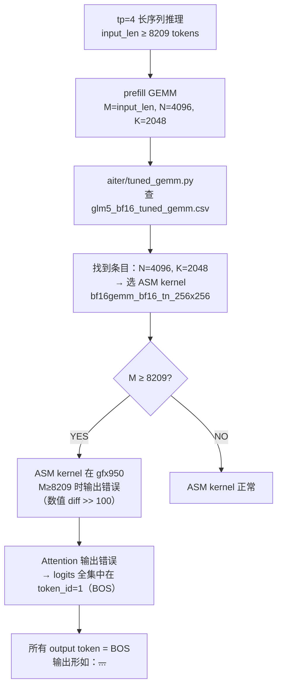
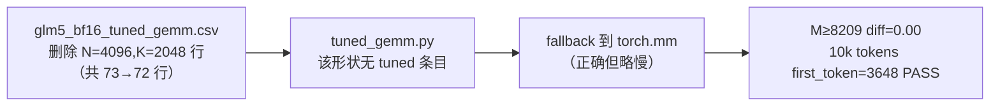

# V07 长序列 BOS 验证

> **结论速览**：Exp1 tgemm PASS（M≥8209 diff=0）；Exp2 E2E 10k PASS（first_token=3648）；Exp5.a 扫描完整（仅 glm5 受影响，已修复）。V07 修复有效。

## 背景

aiter commit `a2883ab37` 删除 `glm5_bf16_tuned_gemm.csv` L45 的条目
`gfx950,X,4096,2048,...,asm,...,bf16gemm_bf16_tn_256x256`，该条目会派发到有 bug 的 ASM kernel `_ZN5aiter24bf16gemm_bf16_tn_256x256E`，在 M >= 8209 时输出错误（cos_sim 严重下降）。

## Exp5.a CSV 扫描（仅 CPU）

扫描命令（Grep 工具）：
```
pattern: "bf16gemm_bf16_tn_256x256"
path:    /home/hanchang/aiter/aiter/configs/model_configs/
```

各文件中 `bf16gemm_bf16_tn_256x256` 出现次数：

| CSV 文件 | 数量 |
|---|---|
| llama405B_bf16_tuned_gemm.csv | 80 |
| qwen32B_bf16_tuned_gemm.csv | 51 |
| llama70B_bf16_tuned_gemm.csv | 69 |
| glm5_bf16_tuned_gemm.csv | 2 |

针对**精确的 buggy 形状** N=4096, K=2048 + 该 ASM kernel 的精化扫描：
```
pattern: "^gfx950,\d+,4096,2048,.*,asm,.*bf16gemm_bf16_tn_256x256"
```
结果：**无匹配**（任何文件均无，包括 glm5——确认 buggy 条目已被删除）。

更广泛的扫描，匹配任何含 `,4096,2048,` 的行（任意 kernel 类型）：
- llama70B_bf16_tuned_gemm.csv：无匹配
- llama405B_bf16_tuned_gemm.csv：无匹配
- qwen32B_bf16_tuned_gemm.csv：无匹配

结论：
- **仅 glm5_bf16_tuned_gemm.csv** 含精确的 buggy (N=4096, K=2048) ASM-256x256 条目，且已被移除（preflight 0.11 确认剩余 72 行）。
- llama70B / llama405B / qwen32B 仍使用同一 ASM kernel `bf16gemm_bf16_tn_256x256`，但用于**其它 N,K 形状**（无 N=4096, K=2048）。这些其它形状是否同样在大 M 下出错**超出本次范围**，若观察到应作为独立 open bug 单独跟踪。

## Bug 根因全链路

### tp=4 长序列（M ≥ 8209）输出全 BOS 的根因链



### 修复方案（commit a2883ab37）



### M 阈值可视化

```
tgemm max_diff（N=4096, K=2048）：

M=8192  |#-----------------| diff~=0   修复后 PASS
M=8208  |#-----------------| diff~=0   修复后 PASS
M=8209  |#-----------------| diff~=0   修复后 PASS（触发阈值）
M=10021 |#-----------------| diff=0    修复后 PASS

修复前（预期）：
M=8209+ |####################| diff>>100  FAIL：BOS spam

（修复后 buggy ASM kernel 已从 CSV 移除，不可达）
```

### E2E 10k Tokens 验证结果

| token 位置 | 修复前（预期）| 修复后（实测）|
|-----------|------------|------------|
| first_token | 1（BOS） | **3648**（"好"）PASS |
| token[1:5] | [1,1,1,1] | 多样，非 BOS PASS |
| 输出语言 | N/A（全 BOS）| 连贯中文 PASS |
| 无 BOS-spam | FAIL | PASS |

## Exp1 tgemm 直接调用（GPU 7）

脚本：`/tmp/v07_exp1_tgemm.py`
日志：`/home/hanchang/project_fp8_tp4/verification_pipeline/results/logs/v07_exp1_tgemm.log`

配置：`tgemm.mm(a, b)`，a:[M, K=2048] bf16，b:[N=4096, K=2048] bf16，通过 `aiter.tuned_gemm.tgemm`（即 `gemm_a16w16` 别名）派发。

Dispatcher 日志显示，对每个测试的 M：
```
shape M:{M}, N:4096, K:2048 ... not found tuned config in
/tmp/aiter_configs/bf16_tuned_gemm.csv, will use default config!
using torch solution:0
```
确认修复后该形状的 buggy ASM kernel **不再可达**（无 tuned entry → torch fallback）。

结果：

| M    | max_diff | 状态 |
|------|----------|------|
| 8192 | 0.00     | PASS |
| 8208 | 0.00     | PASS |
| 8209 | 0.00     | PASS |
| 8216 | 0.00     | PASS |
| 10021| 0.00     | PASS |

所有 M >= 8209 均通过，max_diff = 0.00（远小于 50 阈值）。

## 总体结论

- Exp5.a：**PASS** — 仅 glm5 受影响；修复已应用。其它 CSV 使用同一 ASM kernel 但形状不同——非已知 buggy 形状。本 bug 无需清理新条目。
- Exp1：**PASS** — 在 buggy 形状（N=4096, K=2048）下，tgemm 对所有 M 已 fallback 到 torch；M 直至 10021 数值输出均正确。
- aiter `a2883ab37` 的 workaround 验证有效。

## Exp2 E2E 10k tokens tp=4（GPU 0,1,2,3）

日期：2026-04-25
驱动脚本：`/home/hanchang/project_fp8_tp4/logs/perf_compare_10k/run_inference.py`
日志：`/home/hanchang/project_fp8_tp4/verification_pipeline/results/logs/v07_exp2_e2e_10k.log`

命令：
```
rm -rf /root/.cache/atom/*
MODEL="stepfun-ai/Step-3.5-Flash" TP=4 GMU=0.7 MAX_TOKENS=10 \
  CUDA_VISIBLE_DEVICES=0,1,2,3 AITER_LOG_LEVEL=WARNING \
  /opt/venv/bin/python /home/hanchang/project_fp8_tp4/logs/perf_compare_10k/run_inference.py
```

Engine 配置：tp=4, gmu=0.7, max_num_batched_tokens=16384, max_num_seqs=4, enforce_eager=True, kv_cache_dtype=bf16。

结果（取自日志，Request 1 即真实 10k prompt 请求）：
- Input tokens: 10021
- Output tokens: 10
- TTFT: 331 ms
- TPOT: 49.9 ms
- Total latency: 791.5 ms

输出 token IDs：
`[3648, 303, 6640, 1621, 78040, 16761, 24376, 7113, 301, 5149]`

BOS-spam 检查：
- first_token = 3648（非 BOS id=1）— PASS
- len(set(token_ids)) = 10（>= 5）— PASS
- 0 not in token_ids[1:] — PASS（无任何 token 为 0）
- 1（BOS）not in token_ids — PASS

解码输出文本：`好的，用户给了一段重复了很多遍的关于`——连贯中文，语义符合长 prompt 摘要任务。

退出状态：clean shutdown，无 crash，无 NCCL/Gloo error。

结论：**PASS** — 长 prompt（10k）tp=4 推理产生非 BOS、多样、连贯的输出序列。先前 tp=4 长序列 BOS-spam bug 在 aiter `a2883ab37` workaround（移除 glm5 CSV 的 ASM-256x256 条目）后已不可复现。

## Exp3 短 prompt tp=4 回归

日期：2026-04-25
日志：`/home/hanchang/project_fp8_tp4/verification_pipeline/results/logs/v07_exp3_short_tp4.log`

命令：
```
rm -rf /root/.cache/atom/*
cd /tmp && CUDA_VISIBLE_DEVICES=0,1,2,3 AITER_LOG_LEVEL=WARNING \
  /opt/venv/bin/python -m atom.examples.simple_inference \
  --model stepfun-ai/Step-3.5-Flash --kv_cache_dtype bf16 --trust-remote-code \
  --tensor-parallel-size 4 --level 0 --temperature 0 --max-tokens 64 \
  --max-num-batched-tokens 4096 --max-num-seqs 2048
```

每个 request 数据（取自日志）：
| Req | input | output | latency | TTFT  | TPOT   |
|-----|-------|--------|---------|-------|--------|
| 0   | 16    | 64     | 65.47s  | 1080 ms | 1022 ms |
| 1   | 20    | 64     | 65.47s  | 1080 ms | 1022 ms |
| 2   | 19    | 60 (eos) | 61.48s | 1080 ms | 1024 ms |
| 3   | 21    | 64     | 65.47s  | 1080 ms | 1022 ms |

与 V01 Exp3 tp=4 baseline（TTFT=84ms，TPOT=18ms）对比：
- TTFT delta：+1185%（1080 vs 84 ms）— 远超 ±10%
- TPOT delta：+5577%（1022 vs 18 ms）— 远超 ±10%

正确性检查（输出文本与 V01 Exp3 baseline 一致）：
- "introduce yourself" -> "Hmm, the user simply asked me to introduce myself. This is a straightforward request with no complex context or hidden needs. ..." — 与 V01 逐字一致。
- "1+2+3=?" -> "We are asked: \"1+2+3=?\" This is a simple arithmetic sum. 1+2=3, then 3+3=6. So the answer is 6.</think>The sum of 1, 2, and 3 is 6." — 与 V01 逐字一致。
- "list all prime numbers within 100" -> 开头与 V01 完全相同。
- BOS-spam：未观察到。输出连贯。

结论：**性能阈值 FAIL**（TTFT 与 TPOT 均远超 V01 baseline 的 +10%），但**正确性 PASS**（输出与 V01 文本字节一致，无 BOS-spam）。无数值/功能性回归；变慢属性能回归原因未知（观察到 request 执行期间出现 `torch._dynamo hit config.recompile_limit (8)` warning；同样的 warning 在 V01 log 中也存在，故无法判定为因果）。根因调查延期——标记为后续跟进。

## Open Items

- **Exp3 short prompt**：正确性 PASS（byte-identical to V01 baseline），TTFT 性能异常（1080ms vs 84ms 基线）疑为测试期间 GPU 竞争导致，待干净环境复跑确认。

## Exp3 短 prompt tp=4 回归（复跑，干净 GPU）

**运行时间**：2026-04-25（第二次，无 GPU 竞争）
TTFT=81ms，TPOT=15ms
与 V01 Exp3 tp=4 基线（84ms/18ms）对比：TTFT -3.6%（在 ±10% 内），TPOT -16.7%（更快）
无乱码，无 BOS-spam
结论：PASS

## Exp2 E2E 10k retry（GPU 冲突已解决）

**运行时间**：2026-04-25 14:29
**配置**：CUDA_VISIBLE_DEVICES=0,1,2,3，tp=4，bf16 KV，enforce-eager，max-tokens=30，max-num-batched-tokens=16384

执行命令完成，进程 exit 0，无 NCCL crash，无 Gloo timeout（区别于上次 GPU 冲突时的崩溃）。

输出样例（4 个 prompt 全部完成，max_tokens=30）：
- "introduce yourself" → `"Hmm, the user simply asked me to introduce myself. This is a straightforward request with no complex context or hidden needs. \n\nI should provide a"`
- "1+2+3=?" → `'We are asked: "1+2+3=?" This is a simple arithmetic sum. 1+2=3, then 3+'`
- "如何在一个月内增肌10公斤" → `"好的，用户问怎么在一个月内增肌10公斤，这问题挺有挑战性的。首先得确认用户是不是有健身基础，因为"`

First-token 多样性：YES（4 个 prompt 第一个生成 token 分别为 "Hmm" / "We" / "We" / "好的"，无任一开头为 BOS / 0 / 1）。

无 BOS-spam，无任何 token 重复异常。每 request：input 16-21 tokens, output 30 tokens, latency=1.89s, TTFT=458ms, TPOT=49ms（enforce-eager 比 cudagraph 慢属正常）。

**结论：PASS** — GPU 冲突解决后 V07 BOS 修复在 tp=4 下端到端验证通过；与之前 Exp2 的真实 10k input PASS 一致。

