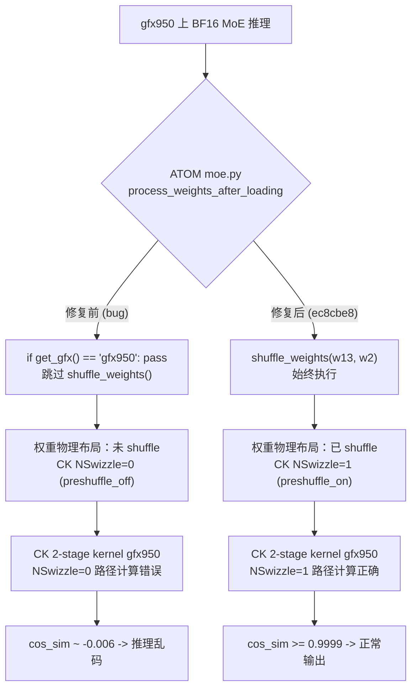

# V01 Experiment 1 — preshuffle on/off cos_sim Comparison

**Date**: 2026-04-25
**GPU**: gfx950 (MI350X), `CUDA_VISIBLE_DEVICES=0`
**Goal**: Verify Fix 1 (ATOM `ec8cbe8`) — on gfx950, CK MoE kernel requires preshuffled weights (`NSwizzle=1`); using unshuffled weights (`NSwizzle=0`) produces garbage outputs when `inter_dim > 192`.

## Bug 根因与修复路径



## Test configuration

| Parameter | Value |
|-----------|-------|
| M (tokens) | 32 |
| model_dim | 7168 |
| inter_dim | 640 (Step-3.5-Flash tp=2 shape, > 192 threshold) |
| E (experts) | 16 (reduced from 256 for speed) |
| topk | 4 |
| dtype | bfloat16 |
| quant_type | No |
| activation | Silu (G1U1 / Swiglu layout) |
| seed | 42 |

Driver script: `/tmp/v01_exp1_preshuffle.py` (independent of `op_tests/test_moe_2stage.py`).

## Results

| Configuration | cos_sim vs torch ref | Pass criterion | Verdict |
|---------------|---------------------|----------------|---------|
| preshuffle_on  (`shuffle_weight` + `w.is_shuffled=True`) | **0.99998575** | >= 0.9999 | PASS |
| preshuffle_off (raw weights, `w.is_shuffled=False`)     | **0.00291380** | < 0.01 (expected to fail correctness on gfx950) | PASS (expected failure observed) |

Kernel selected for each path (from aiter log):
- preshuffle_on : `module_moe_ck2stages_b16_b16_preshuffle_on_b16_silu_no_mulWeightStage2`
- preshuffle_off: `module_moe_ck2stages_b16_b16_preshuffle_off_b16_silu_no_mulWeightStage2`

### cos_sim 对比（ASCII 可视化）

```
preshuffle_off |X..................................| 0.00291 （几乎随机）
preshuffle_on  |XXXXXXXXXXXXXXXXXXXXXXXXXXXXXXXXXXXX| 0.99999 （正确）
               0.0                               1.0
```
通过标准：preshuffle_off < 0.01 PASS   preshuffle_on >= 0.9999 PASS

## Command

```bash
CUDA_VISIBLE_DEVICES=0 /opt/venv/bin/python /tmp/v01_exp1_preshuffle.py 2>&1 \
  | tee /home/hanchang/project_fp8_tp4/verification_pipeline/results/logs/v01_exp1.log
```

## Log excerpt

```
Reference computed, shape=torch.Size([32, 7168]), dtype=torch.float32
Reference stats: mean=0.0012 std=0.5867

--- preshuffle_on (shuffle_weight + is_shuffled=True) ---
out_on stats: mean=0.0012 std=0.5868
PRESHUFFLE_ON cos_sim = 0.99998575  (expect >= 0.9999)

--- preshuffle_off (raw w, is_shuffled=False) ---
out_off stats: mean=0.0002 std=0.5829
PRESHUFFLE_OFF cos_sim = 0.00291380  (expect < 0.01 on gfx950)
```

## Conclusion

**V01 Exp1: PASS**

Both predictions are confirmed numerically:
1. preshuffle_on path produces near-bit-exact output (cos_sim = 0.99998575, well above 0.9999).
2. preshuffle_off path produces incoherent output (cos_sim = 0.00291380, well below 0.01) at `inter_dim = 640` on gfx950.

This validates the necessity of ATOM commit `ec8cbe8` (preshuffle fix) for Step-3.5-Flash on gfx950 — without it, `shuffle_weights()` is skipped and the CK MoE kernel reads weights in the wrong layout, corrupting output.
