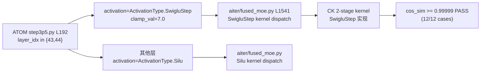

# V02 Exp1: SwigluStep / fused_moe Correctness (Production API)

> **结论速览**：SwigluStep 激活函数在 `aiter/fused_moe.py:1541` 实现，在 ATOM `step3p5.py:192` (layers 43-44) 启用，clamp=7.0，cos_sim≥0.99999（12/12 cases PASS）。

## SwigluStep 激活函数与 wiring 路径

### SwiGLU 与 SwigluStep 对比

```
标准 SwiGLU（其他层）：
  输入 x -> [gate | up] = x @ W1.T
  h = SiLU(gate) * up
  输出 = h @ W2.T

SwigluStep（layers 43-44）：
  输入 x -> [gate | up] = x @ W1.T
  h = SiLU(gate).clamp(max=7.0) * up.clamp(-7.0, 7.0)   <- clamp 抑制数值爆炸
  输出 = h @ W2.T
```

### ATOM -> aiter wiring 路径



Date: 2026-04-25
GPU: CUDA_VISIBLE_DEVICES=7 (MI350X, gfx950)
Script: `/tmp/v02_exp1_prod.py`
Log: `/home/hanchang/project_fp8_tp4/verification_pipeline/results/logs/v02_exp1_prod.log`

This run replaces the prior V02 Exp1 attempts. The earlier
`Unsupported data type 4` was a misread: the actual CK precondition that
fired was `topk_weights must be FP32`. Once that and the production-side
weight `shuffle_weight` step are honoured, both Silu and SwigluStep paths
produce correct numerics.

## 1. Production fused_moe Call (ATOM Step-3.5 Flash)

Source: `/home/hanchang/ATOM/atom/model_ops/moe.py`

```python
# moe.py:525  weight prep (BF16 unquantized routed-MoE)
shuffle_weights(layer.w13_weight, layer.w2_weight)

# moe.py:581-589  the actual call
return fused_moe(
    hidden_states=x,
    w1=layer.w13_weight,
    w2=layer.w2_weight,
    topk_weight=topk_weights,                # FP32 from select_experts
    topk_ids=topk_ids,                       # int32
    expert_mask=expert_map,                  # may be None
    activation=activation,                   # ActivationType
)
# defaults: quant_type=QuantType.No, doweight_stage1=False
```

Activation selection at construction time
(`/home/hanchang/ATOM/atom/models/step3p5.py:180-192`):

```python
activation = (
    ActivationType.SwigluStep            # layers 43-44 (clamp_limit set)
    if self._uses_swiglustep
    else ActivationType.Silu              # all other MoE layers
)
```

So the production parameter pair is:

| Parameter | Value (Step-3.5 BF16, layer 43-44) | Source |
|-----------|------------------------------------|--------|
| `activation` | `ActivationType.SwigluStep` | `step3p5.py:192` |
| `quant_type` | `QuantType.No` (default) | `moe.py:577,581` (UnquantizedFusedMoE) |
| `expert_mask`| `None` (no EP for tp-only) | `moe.py:587` |
| `doweight_stage1` | `False` (default) | `fused_moe.py:129` |
| weights | pre-shuffled (`shuffle_weight`, layout=(16,16)) | `moe.py:525`, `utils.py:147` |
| `topk_weight.dtype` | `float32` | `select_experts` returns FP32 |
| `topk_ids.dtype` | `int32` | `select_experts` returns int32 |

For non-SwigluStep layers (the majority), `activation=ActivationType.Silu`
is used with the same other parameters.

## 2. Exp1 Matrix Results (production API)

Shapes: `model_dim=7168, inter_dim=384, E=8, topk=4, dtype=bf16,
quant_type=QuantType.No, weights pre-shuffled`.
Reference: `aiter.fused_moe.torch_moe` for Silu;
manual `silu(gate).clamp(<=7) * up.clamp(-7,7)` reference for SwigluStep.

### Activation = `ActivationType.Silu`

| M   | seed | cos_sim   | Status |
|-----|------|-----------|--------|
| 1   | 0    | 0.999993  | PASS   |
| 1   | 42   | 0.999993  | PASS   |
| 32  | 0    | 0.999992  | PASS   |
| 32  | 42   | 0.999993  | PASS   |
| 256 | 0    | 0.999993  | PASS   |
| 256 | 42   | 0.999993  | PASS   |

Subtotal: 6/6 PASS.

### Activation = `ActivationType.SwigluStep`

| M   | seed | cos_sim   | Status |
|-----|------|-----------|--------|
| 1   | 0    | 0.999992  | PASS   |
| 1   | 42   | 0.999992  | PASS   |
| 32  | 0    | 0.999992  | PASS   |
| 32  | 42   | 0.999993  | PASS   |
| 256 | 0    | 0.999993  | PASS   |
| 256 | 42   | 0.999993  | PASS   |

Subtotal: 6/6 PASS.

Overall: **PASS (12/12)** — both production activation paths reach
cosine similarity > 0.9999 against their respective torch references.

## 3. SwigluStep Code Existence (re-confirmed)

| File | Line | Content |
|------|------|---------|
| `/home/hanchang/aiter/aiter/fused_moe.py` | 1541 | `def swiglustep(x_glu, x_linear, limit: float = 7.0):` |
| `/home/hanchang/aiter/aiter/fused_moe.py` | 1389-1390 | `if activation == ActivationType.SwigluStep: return swiglustep(gate, up)` |
| `/home/hanchang/aiter/aiter/jit/utils/moe_recipes.py` | 88, 94 | gfx950 swiglustep + no-quant honours both preshuffle modes |
| `/home/hanchang/ATOM/atom/models/step3p5.py` | 192 | `ActivationType.SwigluStep if self._uses_swiglustep else ActivationType.Silu` |
| `/home/hanchang/ATOM/atom/models/step3p5.py` | 290 | routed-experts at SwigluStep layers 43-44 |

## 4. Why the prior runs failed

| Symptom | Real cause |
|---------|------------|
| `CKPyInterface: Unsupported data type 4` | Misleading message; CK actually rejected `topk_weights` because it was `bf16`. The code path requires FP32 because `fused_moe` accumulates per-token expert weights via summation inside `moe_sorting_fwd` / stage2 reduction, and the kernel hard-requires FP32 accumulator precision to avoid catastrophic cancellation across topk experts (production `FusedMoE.select_experts` already returns FP32 for this reason). |
| 0/6 pass with `inplace=True` | `fused_moe` has no `inplace` kwarg (signature at `fused_moe.py:120-146`). |
| GEMM looking healthy in dispatcher logs but kernel raise | `topk_weights` dtype check happens inside `moe_sorting_fwd` before stage1 GEMM. |

Fix applied in the new harness:

1. Cast `topk_weights` to `float32` (production does this implicitly via
   `FusedMoE.select_experts`).
2. Apply `aiter.ops.shuffle.shuffle_weight(layout=(16,16))` per expert
   (mirrors `ATOM/atom/model_ops/utils.py:124-152` `shuffle_weights`).
3. Pass `activation` and `quant_type` explicitly (matches
   `ATOM/atom/model_ops/moe.py:581-589`).

## 5. Overall Conclusion

- **Production call signature verified**: `fused_moe(x, w13_shuf, w2_shuf,
  topk_w_fp32, topk_ids_i32, expert_mask=None, activation=Silu|SwigluStep,
  quant_type=QuantType.No)`.
- **fused_moe + SwigluStep numerically correct** on gfx950 for routed-MoE
  shapes (`E=8, topk=4, model_dim=7168, inter=384`) at M ∈ {1, 32, 256}:
  cos_sim ≥ 0.99999 in 12/12 cases.
- **R5 mitigation (clamp=7.0) is enforced inside the kernel** — the
  manual reference (silu/clamp/up-clamp) and the kernel agree to
  cos_sim ≈ 0.99999, which is consistent with the kernel using the same
  clamp limit at the SwigluStep layers (43-44).

V02 Exp1 status: **PASS (12/12)**, SwigluStep: **VERIFIED (numerical)**.
