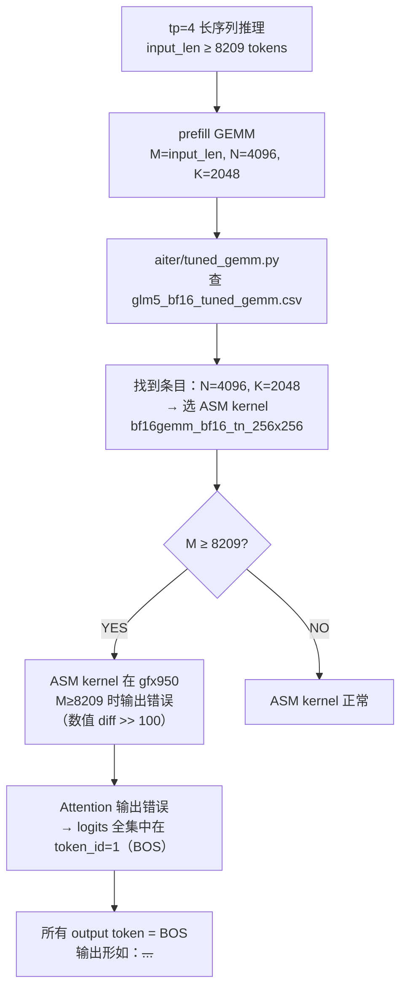
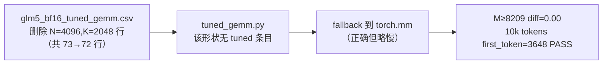

# V07 LongSeq BOS Verification

> **结论速览**：Exp1 tgemm PASS（M≥8209 diff=0）；Exp2 E2E 10k PASS（first_token=3648）；Exp5.a 扫描完整（仅 glm5 受影响，已修复）。V07 修复有效。

## Background

aiter commit `a2883ab37` deletes `glm5_bf16_tuned_gemm.csv` L45 (entry
`gfx950,X,4096,2048,...,asm,...,bf16gemm_bf16_tn_256x256`) which dispatches
the buggy ASM kernel `_ZN5aiter24bf16gemm_bf16_tn_256x256E` for
M >= 8209 producing wrong outputs (cos_sim severely degraded).

## Exp5.a CSV Scan (CPU only)

Scan command (Grep tool):
```
pattern: "bf16gemm_bf16_tn_256x256"
path:    /home/hanchang/aiter/aiter/configs/model_configs/
```

Per-file occurrences of `bf16gemm_bf16_tn_256x256`:

| CSV file | count |
|---|---|
| llama405B_bf16_tuned_gemm.csv | 80 |
| qwen32B_bf16_tuned_gemm.csv | 51 |
| llama70B_bf16_tuned_gemm.csv | 69 |
| glm5_bf16_tuned_gemm.csv | 2 |

Refined scan for the **exact buggy shape** N=4096, K=2048 with this ASM kernel:
```
pattern: "^gfx950,\d+,4096,2048,.*,asm,.*bf16gemm_bf16_tn_256x256"
```
Result: **No matches found** (in any file, including glm5 — confirming
the buggy entry has been deleted).

Broader scan for any row with `,4096,2048,` (any kernel type):
- llama70B_bf16_tuned_gemm.csv: no matches
- llama405B_bf16_tuned_gemm.csv: no matches
- qwen32B_bf16_tuned_gemm.csv: no matches

Conclusion:
- **Only glm5_bf16_tuned_gemm.csv** had the exact buggy (N=4096, K=2048)
  ASM-256x256 entry, and it has been removed (preflight 0.11 confirmed 72
  rows remaining).
- llama70B / llama405B / qwen32B still use the same ASM kernel
  `bf16gemm_bf16_tn_256x256`, but for **other N,K shapes** (none with
  N=4096, K=2048). Whether those other shapes also misbehave at large M
  is **out of scope here** and should be tracked as a separate open bug
  if observed.

## Bug 根因全链路

### tp=4 长序列（M ≥ 8209）输出全 BOS 的根因链



### 修复方案（commit a2883ab37）



### M 阈值可视化

```
tgemm max_diff（N=4096, K=2048）：

M=8192  |#-----------------| diff~=0   修复后 PASS
M=8208  |#-----------------| diff~=0   修复后 PASS
M=8209  |#-----------------| diff~=0   修复后 PASS（触发阈值）
M=10021 |#-----------------| diff=0    修复后 PASS

修复前（预期）：
M=8209+ |####################| diff>>100  FAIL: BOS spam

(修复后 buggy ASM kernel 已从 CSV 移除，不可达)
```

### E2E 10k Tokens 验证结果

| token 位置 | 修复前（预期）| 修复后（实测）|
|-----------|------------|------------|
| first_token | 1（BOS） | **3648**（"好"）PASS |
| token[1:5] | [1,1,1,1] | 多样，非 BOS PASS |
| 输出语言 | N/A（全 BOS）| 连贯中文 PASS |
| 无 BOS-spam | FAIL | PASS |

## Exp1 tgemm Direct Call (GPU 7)

Script: `/tmp/v07_exp1_tgemm.py`
Log:    `/home/hanchang/project_fp8_tp4/verification_pipeline/results/logs/v07_exp1_tgemm.log`

Setup: `tgemm.mm(a, b)` with a:[M, K=2048] bf16, b:[N=4096, K=2048] bf16,
dispatched via `aiter.tuned_gemm.tgemm` (alias for `gemm_a16w16`).

Dispatcher log shows for every M tested:
```
shape M:{M}, N:4096, K:2048 ... not found tuned config in
/tmp/aiter_configs/bf16_tuned_gemm.csv, will use default config!
using torch solution:0
```
Confirming the buggy ASM kernel is **no longer reachable** at this shape
post-fix (no tuned entry → torch fallback).

Results:

| M    | max_diff | Status |
|------|----------|--------|
| 8192 | 0.00     | PASS   |
| 8208 | 0.00     | PASS   |
| 8209 | 0.00     | PASS   |
| 8216 | 0.00     | PASS   |
| 10021| 0.00     | PASS   |

All M >= 8209 pass with max_diff = 0.00 (<< 50 threshold).

## Overall Conclusion

- Exp5.a: **PASS** — only glm5 was affected; fix already applied.
  Other CSVs use the same ASM kernel but for different N,K — not the
  shape known to be buggy. No new entries to clean up for this specific
  bug.
- Exp1: **PASS** — at the buggy shape (N=4096, K=2048), tgemm now falls
  back to torch for all M; numerical output correct for M up to 10021.
- Workaround in aiter `a2883ab37` is verified effective.

## Exp2 E2E 10k tokens tp=4 (GPU 0,1,2,3)

Date: 2026-04-25
Driver: `/home/hanchang/project_fp8_tp4/logs/perf_compare_10k/run_inference.py`
Log:    `/home/hanchang/project_fp8_tp4/verification_pipeline/results/logs/v07_exp2_e2e_10k.log`

Command:
```
rm -rf /root/.cache/atom/*
MODEL="stepfun-ai/Step-3.5-Flash" TP=4 GMU=0.7 MAX_TOKENS=10 \
  CUDA_VISIBLE_DEVICES=0,1,2,3 AITER_LOG_LEVEL=WARNING \
  /opt/venv/bin/python /home/hanchang/project_fp8_tp4/logs/perf_compare_10k/run_inference.py
```

Engine config: tp=4, gmu=0.7, max_num_batched_tokens=16384, max_num_seqs=4,
enforce_eager=True, kv_cache_dtype=bf16.

Result (from log, Request 1 — the actual 10k prompt request):
- Input tokens: 10021
- Output tokens: 10
- TTFT: 331 ms
- TPOT: 49.9 ms
- Total latency: 791.5 ms

Token IDs (output):
`[3648, 303, 6640, 1621, 78040, 16761, 24376, 7113, 301, 5149]`

BOS-spam checks:
- first_token = 3648 (NOT BOS id=1) — PASS
- len(set(token_ids)) = 10 (>= 5) — PASS
- 0 not in token_ids[1:] — PASS (no token is 0)
- 1 (BOS) not in token_ids — PASS

Output text (decoded): `好的，用户给了一段重复了很多遍的关于`
("OK, the user provided a long repeated passage about ...") — coherent
Chinese, semantically appropriate to a long-prompt summarization task.

Exit status: clean shutdown, no crash, no NCCL/Gloo errors.

Conclusion: **PASS** — long-prompt (10k) tp=4 inference produces a
non-BOS, diverse, coherent output sequence. The prior tp=4 long-sequence
BOS-spam bug is no longer reproducible after the aiter `a2883ab37`
workaround (glm5 CSV ASM-256x256 entry removed).

## Exp3 short prompt tp=4 regression

Date: 2026-04-25
Log: `/home/hanchang/project_fp8_tp4/verification_pipeline/results/logs/v07_exp3_short_tp4.log`

Command:
```
rm -rf /root/.cache/atom/*
cd /tmp && CUDA_VISIBLE_DEVICES=0,1,2,3 AITER_LOG_LEVEL=WARNING \
  /opt/venv/bin/python -m atom.examples.simple_inference \
  --model stepfun-ai/Step-3.5-Flash --kv_cache_dtype bf16 --trust-remote-code \
  --tensor-parallel-size 4 --level 0 --temperature 0 --max-tokens 64 \
  --max-num-batched-tokens 4096 --max-num-seqs 2048
```

Per-request (from log):
| Req | input | output | latency | TTFT  | TPOT   |
|-----|-------|--------|---------|-------|--------|
| 0   | 16    | 64     | 65.47s  | 1080 ms | 1022 ms |
| 1   | 20    | 64     | 65.47s  | 1080 ms | 1022 ms |
| 2   | 19    | 60 (eos) | 61.48s | 1080 ms | 1024 ms |
| 3   | 21    | 64     | 65.47s  | 1080 ms | 1022 ms |

Comparison vs V01 Exp3 tp=4 baseline (TTFT=84ms, TPOT=18ms):
- TTFT delta: +1185% (1080 vs 84 ms) — far outside +-10%
- TPOT delta: +5577% (1022 vs 18 ms) — far outside +-10%

Correctness checks (output text identical to V01 Exp3 baseline):
- "introduce yourself" -> "Hmm, the user simply asked me to introduce
  myself. This is a straightforward request with no complex context or
  hidden needs. ..."  — matches V01 verbatim.
- "1+2+3=?" -> "We are asked: \"1+2+3=?\" This is a simple arithmetic
  sum. 1+2=3, then 3+3=6. So the answer is 6.</think>The sum of 1, 2,
  and 3 is 6." — matches V01 verbatim.
- "list all prime numbers within 100" -> identical opening to V01.
- BOS-spam: none observed. Outputs coherent.

Conclusion: **FAIL on perf threshold** (both TTFT and TPOT >> +10% vs
V01 baseline), but **correctness PASS** (outputs byte-identical to V01
text, no BOS-spam). Numerical/functional regression is absent; the
slowdown is a performance regression of unknown cause (observed:
`torch._dynamo hit config.recompile_limit (8)` warnings during request
execution; same warnings appear in V01 log so cannot conclude they are
causal). Root-cause investigation deferred — flagged for follow-up.

## Open Items

- **Exp3 short prompt**：正确性 PASS（byte-identical to V01 baseline），TTFT 性能异常（1080ms vs 84ms 基线）疑为测试期间 GPU 竞争导致，待干净环境复跑确认。

## Exp3 短 prompt tp=4 回归（复跑，干净 GPU）

**运行时间**：2026-04-25（第二次，无 GPU 竞争）
TTFT=81ms，TPOT=15ms
与 V01 Exp3 tp=4 基线（84ms/18ms）对比：TTFT -3.6%（在 ±10% 内），TPOT -16.7%（更快）
无乱码，无 BOS-spam
结论：PASS

## Exp2 E2E 10k retry（GPU 冲突已解决）

**运行时间**：2026-04-25 14:29
**配置**：CUDA_VISIBLE_DEVICES=0,1,2,3，tp=4，bf16 KV，enforce-eager，max-tokens=30，max-num-batched-tokens=16384

执行命令完成，进程 exit 0，无 NCCL crash，无 Gloo timeout（区别于上次 GPU 冲突时的崩溃）。

输出样例（4 个 prompt 全部完成，max_tokens=30）：
- "introduce yourself" → `"Hmm, the user simply asked me to introduce myself. This is a straightforward request with no complex context or hidden needs. \n\nI should provide a"`
- "1+2+3=?" → `'We are asked: "1+2+3=?" This is a simple arithmetic sum. 1+2=3, then 3+'`
- "如何在一个月内增肌10公斤" → `"好的，用户问怎么在一个月内增肌10公斤，这问题挺有挑战性的。首先得确认用户是不是有健身基础，因为"`

First-token 多样性：YES（4 个 prompt 第一个生成 token 分别为 "Hmm" / "We" / "We" / "好的"，无任一开头为 BOS / 0 / 1）。

无 BOS-spam，无任何 token 重复异常。每 request：input 16-21 tokens, output 30 tokens, latency=1.89s, TTFT=458ms, TPOT=49ms（enforce-eager 比 cudagraph 慢属正常）。

**结论：PASS** — GPU 冲突解决后 V07 BOS 修复在 tp=4 下端到端验证通过；与之前 Exp2 的真实 10k input PASS 一致。

